Differential distribution analysis of single-cell gene expression using
`waddR` and `permApprox`
================
Compiled at 2026-02-27 08:11:50 UTC

## Description

Single-cell RNA sequencing (scRNA-seq) data often exhibit complex
distributional differences between experimental conditions. Standard
differential expression methods can miss these patterns, especially when
they involve changes in the shape or spread of the distribution, not
just the mean.

The `waddR` package provides a semi-parametric test based on the
2-Wasserstein distance, designed to detect such differences. However,
its permutation-based p-values can be inaccurate when the number of
permutations is limited, leading to zero p-values.

In this application study, we analyze a subset of the Vento-Tormo et
al. (2018) dataset to demonstrate how `permApprox` can be used to
accurately approximate small permutation p-values from the `waddR`
method, particularly addressing zero p-values and improving inference
robustness.

In `waddR`, the one-stage (OS) approach compares the complete
distributions between groups in a single step, using the squared
Wasserstein distance on all observed values, including zeros. In
contrast, the two-stage (TS) approach separates sparsity from magnitude
differences: in the first stage it tests for differences in the
proportion of zero values between groups, and in the second stage it
computes the Wasserstein distance only on the non-zero values. The
evidence from both stages is then combined into one permutation-based
p-value.

We concentrate on the two-stage (TS) approach here.

## Own waddR implementation

We needed to adapt the waddR package to export the permutation test
statistics.

## Data and Preprocessing

We analyze decidua and blood samples from a normalized replicate of the
Vento-Tormo dataset. The gene expression data are available as two
`SingleCellExperiment` objects.

We select the 1000 most prevalent genes for our analysis.

    ## Dimensions of blood counts:  19001 569

    ## 
    ## Dimensions of decidua counts:  19001 3249

To eliminate potential effects of different sample sizes, we subsample
from the data set with the larger number of samples (decidua) so that
both data sets have the same number of cells.

    ## [1] 1000  569

    ## [1] 1000  569

    ##             used   (Mb) gc trigger   (Mb)  max used   (Mb)
    ## Ncells   9370042  500.5   16462957  879.3  16462957  879.3
    ## Vcells 350786567 2676.3  593924520 4531.3 469492331 3582.0

## Exploratory Analysis

We visualize selected genes to explore differences in expression
distributions between conditions.

### Heatmap

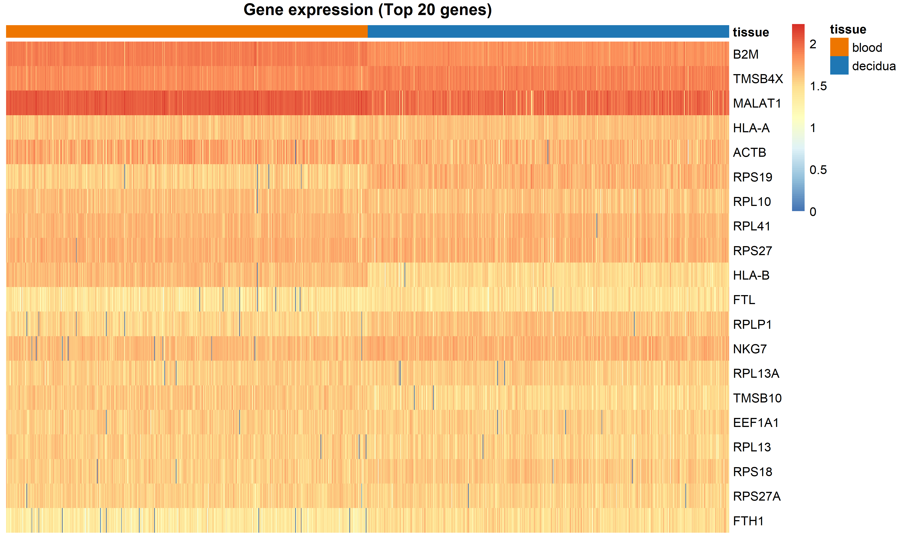<!-- -->

### Density plots

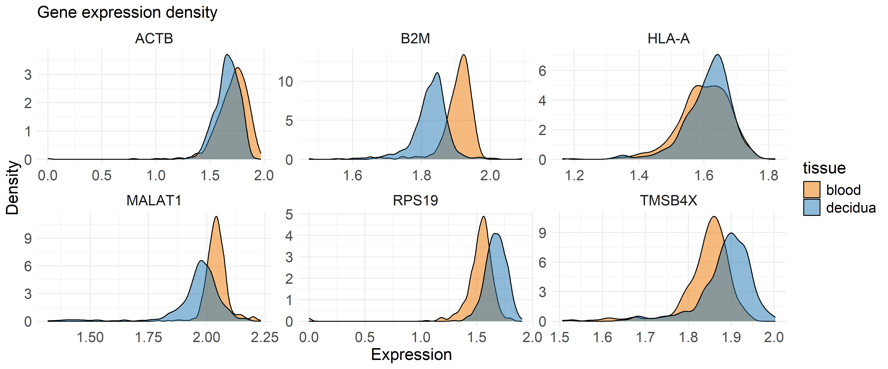<!-- -->

### Histograms

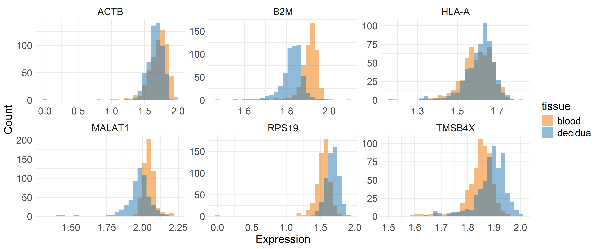<!-- -->

### Quantile plot

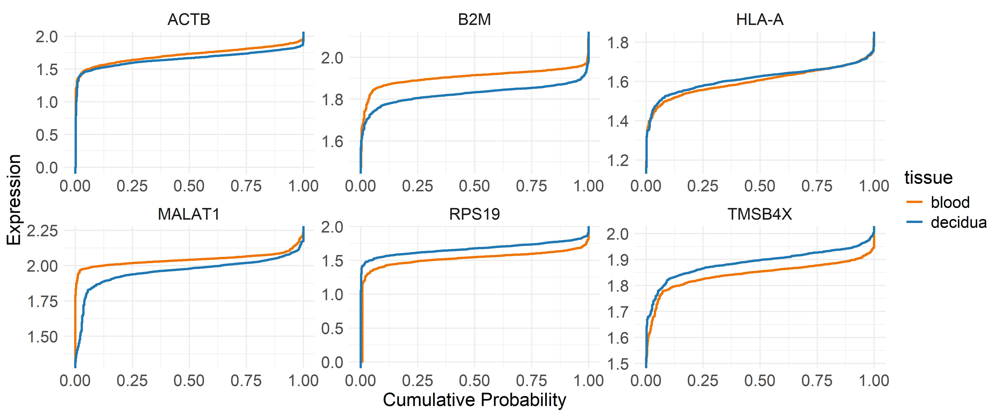<!-- -->

## Differential Testing (two-stage approach)

### waddR - 1000 permutations

We apply the two-stage (`TS`) approach in `waddR`, which separately
tests for differences in non-zero expression values and in the
proportion of zero values.

    ## # A tibble: 10 × 23
    ##      idx gene  d.wass `d.wass^2` `d.comp^2` d.comp location    size   shape   rho      pval p.ad.gpd N.exc
    ##    <int> <chr>  <dbl>      <dbl>      <dbl>  <dbl>    <dbl>   <dbl>   <dbl> <dbl>     <dbl>    <dbl> <dbl>
    ##  1     1 B2M   0.524     0.274      0.274   0.524   2.68e-1 1.47e-4 0.00655 0.966   0          0.332   250
    ##  2     2 TMSB… 0.295     0.0872     0.0871  0.295   8.42e-2 5.91e-4 0.00232 0.991   0          0.508   250
    ##  3     3 MALA… 0.713     0.509      0.509   0.713   3.23e-1 1.32e-1 0.0537  0.897   0          0.535   250
    ##  4     4 HLA-A 0.0808    0.00652    0.00655 0.0809  3.82e-3 6.33e-4 0.00209 0.992   5.01e-3    0.805   250
    ##  5     5 ACTB  0.345     0.119      0.119   0.345   1.04e-1 9.38e-3 0.00554 0.993   0          0.486   250
    ##  6     6 RPS19 0.673     0.453      0.453   0.673   4.46e-1 2.33e-3 0.00463 0.990 NaN          0.199   250
    ##  7     7 RPL10 0.142     0.0200     0.0200  0.142   1.80e-2 7.33e-4 0.00130 0.997   8.89e-4    0.947   250
    ##  8     8 RPL41 0.0560    0.00314    0.00322 0.0567  1.90e-5 4.97e-4 0.00270 0.993   4.94e-1   NA        NA
    ##  9     9 RPS27 0.140     0.0197     0.0198  0.141   4.57e-3 1.28e-2 0.00240 0.995   4.03e-3    0.237   250
    ## 10    10 HLA-B 0.706     0.498      0.498   0.706   4.92e-1 2.89e-3 0.00333 0.989   0          0.427   250
    ## # ℹ 10 more variables: gpd.shape <dbl>, perc.loc <dbl>, perc.size <dbl>, perc.shape <dbl>,
    ## #   decomp.error <dbl>, p.zero <dbl>, p.combined <dbl>, p.adj.nonzero <dbl>, p.adj.zero <dbl>,
    ## #   p.adj.combined <dbl>

    ## Number of zero p-values with waddR:  328

    ## 
    ## Number of non-NA p-values:  987

    ## 
    ## Proportion of zero p-values with waddR:  0.3323202

    ## 
    ## Number of significant tests (unadjusted):  959

    ## 
    ## Proportion of significant tests (unadjusted):  0.9716312

    ## 
    ## Number of significant tests (adjusted):  959

    ## 
    ## Proportion of significant tests (adjusted):  0.9716312

### waddR - 10000 permutations

We repeat the waddR run with 10000 permutations to compare the accuracy
with the 1000 permuations later.

    ## Number of zero p-values with waddR:  392

    ## 
    ## Number of non-NA p-values:  984

    ## 
    ## Proportion of zero p-values with waddR:  0.398374

    ## 
    ## Number of significant tests (unadjusted):  956

    ## 
    ## Proportion of significant tests (unadjusted):  0.9715447

    ## 
    ## Number of significant tests (adjusted):  956

    ## 
    ## Proportion of significant tests (adjusted):  0.9715447

### waddR - 50000 permutations

We repeat the waddR run with 50000 permutations to compare the accuracy
with the 1000 permuations later.

    ## Number of zero p-values with waddR:  399

    ## 
    ## Number of non-NA p-values:  982

    ## 
    ## Proportion of zero p-values with waddR:  0.4063136

    ## 
    ## Number of significant tests (unadjusted):  955

    ## 
    ## Proportion of significant tests (unadjusted):  0.9725051

    ## 
    ## Number of significant tests (adjusted):  955

    ## 
    ## Proportion of significant tests (adjusted):  0.9725051

### waddR - 100000 permutations

We repeat the waddR run with 100000 permutations to compare the accuracy
with the 1000 permuations later.

    ## Number of zero p-values with waddR:  440

    ## 
    ## Number of non-NA p-values:  985

    ## 
    ## Proportion of zero p-values with waddR:  0.4467005

    ## 
    ## Number of significant tests (unadjusted):  958

    ## 
    ## Proportion of significant tests (unadjusted):  0.9725888

    ## 
    ## Number of significant tests (adjusted):  958

    ## 
    ## Proportion of significant tests (adjusted):  0.9725888

### Empirical p-values

### permApprox - unconstrained

    ## Summary of permApprox result
    ## ----------------------------
    ## Number of tests             : 1000
    ## Approximation method        : GPD tail approximation
    ## Approximation threshold     : p-values <   1
    ## Multiple testing adjustment : BH
    ## 
    ## Fit status counts:
    ##   Successful fits          : 985
    ##   GOF rejections           : 0
    ##   Fit failed               : 0
    ##   No threshold found       : 5
    ##   Discrete distributions   : 0
    ##   Not selected for fitting : 10
    ## 
    ## GPD parameter summary (successful fits)
    ## --------------------------------------
    ##   shape:
    ##     min = -0.171, median = 0.0359, mean = 0.0323, max = 0.23
    ##   scale:
    ##     min = 0.000922, median = 0.00251, mean = 0.00368, max = 0.149
    ##   n_exceed:
    ##     min =  140, median =  250, mean =  248, max =  250
    ## 
    ## Goodness-of-fit p-values (all fitted tests)
    ## ------------------------------------------
    ##   GOF p-values:
    ##     min = 0.0504, median = 0.536, mean = 0.526, max = 0.999
    ## 
    ## P-value summary
    ## ---------------
    ## Empirical p-values:
    ##   empirical:
    ##     min = 0.000999, median = 0.000999, mean = 0.00855, max = 0.903
    ## 
    ## Final p-values (unadjusted):
    ##   unadjusted:
    ##     min = 0, median = 0.0000000000082, mean = 0.00753, max = 0.903
    ## 
    ## Final p-values (adjusted, BH):
    ##   adjusted:
    ##     min = 0, median = 0.0000000000164, mean = 0.00761, max = 0.903
    ##   Rejections at alpha = 0.05: 967

    ## Summary of permApprox result
    ## ----------------------------
    ## Number of tests             : 1000
    ## Approximation method        : GPD tail approximation
    ## Approximation threshold     : p-values <   1
    ## Multiple testing adjustment : BH
    ## 
    ## Fit status counts:
    ##   Successful fits          : 986
    ##   GOF rejections           : 0
    ##   Fit failed               : 0
    ##   No threshold found       : 3
    ##   Discrete distributions   : 0
    ##   Not selected for fitting : 11
    ## 
    ## GPD parameter summary (successful fits)
    ## --------------------------------------
    ##   shape:
    ##     min = -0.133, median = 0.0416, mean = 0.0401, max = 0.115
    ##   scale:
    ##     min = 0.000886, median = 0.0025, mean = 0.00369, max = 0.134
    ##   n_exceed:
    ##     min =  760, median = 2500, mean = 2492, max = 2500
    ## 
    ## Goodness-of-fit p-values (all fitted tests)
    ## ------------------------------------------
    ##   GOF p-values:
    ##     min = 0.0516, median = 0.54, mean = 0.537, max = 0.998
    ## 
    ## P-value summary
    ## ---------------
    ## Empirical p-values:
    ##   empirical:
    ##     min = 0.0001, median = 0.0001, mean = 0.0076, max = 0.902
    ## 
    ## Final p-values (unadjusted):
    ##   unadjusted:
    ##     min = 0, median = 0.000000000000971, mean = 0.0075, max = 0.902
    ## 
    ## Final p-values (adjusted, BH):
    ##   adjusted:
    ##     min = 0, median = 0.00000000000194, mean = 0.00758, max = 0.902
    ##   Rejections at alpha = 0.05: 968

### permApprox - constrained

We use the `permApprox` package to approximate p-values from permutation
distributions of `waddR` test statistics.

    ## Final tuning parameter:

    ## [1] 29.75402

    ## Summary of permApprox result
    ## ----------------------------
    ## Number of tests             : 1000
    ## Approximation method        : GPD tail approximation
    ## Approximation threshold     : p-values <   1
    ## Multiple testing adjustment : BH
    ## 
    ## Fit status counts:
    ##   Successful fits          : 976
    ##   GOF rejections           : 9
    ##   Fit failed               : 0
    ##   No threshold found       : 5
    ##   Discrete distributions   : 0
    ##   Not selected for fitting : 10
    ## 
    ## GPD parameter summary (successful fits)
    ## --------------------------------------
    ##   shape:
    ##     min = -0.0614, median = 0.0365, mean = 0.0441, max = 0.23
    ##   scale:
    ##     min = 0.000922, median = 0.00247, mean = 0.00365, max = 0.149
    ##   n_exceed:
    ##     min =  140, median =  250, mean =  248, max =  250
    ## 
    ## Goodness-of-fit p-values (all fitted tests)
    ## ------------------------------------------
    ##   GOF p-values:
    ##     min = 0.0168, median = 0.512, mean = 0.507, max = 0.999
    ## 
    ## P-value summary
    ## ---------------
    ## Empirical p-values:
    ##   empirical:
    ##     min = 0.000999, median = 0.000999, mean = 0.00855, max = 0.903
    ## 
    ## Final p-values (unadjusted):
    ##   unadjusted:
    ##     min = 0.0000000000000000000000000000000000000000000000000000000000000000000000000000000000000000000000000000000000000000000000000000000000000000000000000000000000000000000000000000000000000000000000000000000000000000000000000000000000000000000000000000000000000000000000000000000000000000000000000000000000000000000273, median = 0.0000000000197, mean = 0.00754, max = 0.903
    ## 
    ## Final p-values (adjusted, BH):
    ##   adjusted:
    ##     min = 0.0000000000000000000000000000000000000000000000000000000000000000000000000000000000000000000000000000000000000000000000000000000000000000000000000000000000000000000000000000000000000000000000000000000000000000000000000000000000000000000000000000000000000000000000000000000000000000000000000000000000000000272, median = 0.0000000000395, mean = 0.00762, max = 0.903
    ##   Rejections at alpha = 0.05: 967

    ## Final tuning parameter:

    ## [1] 8.296875

    ## Summary of permApprox result
    ## ----------------------------
    ## Number of tests             : 1000
    ## Approximation method        : GPD tail approximation
    ## Approximation threshold     : p-values <   1
    ## Multiple testing adjustment : BH
    ## 
    ## Fit status counts:
    ##   Successful fits          : 982
    ##   GOF rejections           : 4
    ##   Fit failed               : 0
    ##   No threshold found       : 3
    ##   Discrete distributions   : 0
    ##   Not selected for fitting : 11
    ## 
    ## GPD parameter summary (successful fits)
    ## --------------------------------------
    ##   shape:
    ##     min = -0.0412, median = 0.0417, mean = 0.0408, max = 0.115
    ##   scale:
    ##     min = 0.000886, median = 0.0025, mean = 0.00368, max = 0.134
    ##   n_exceed:
    ##     min = 1640, median = 2500, mean = 2494, max = 2500
    ## 
    ## Goodness-of-fit p-values (all fitted tests)
    ## ------------------------------------------
    ##   GOF p-values:
    ##     min = 0.0000000251, median = 0.536, mean = 0.535, max = 0.998
    ## 
    ## P-value summary
    ## ---------------
    ## Empirical p-values:
    ##   empirical:
    ##     min = 0.0001, median = 0.0001, mean = 0.0076, max = 0.902
    ## 
    ## Final p-values (unadjusted):
    ##   unadjusted:
    ##     min = 0.000000000000000000000000000000000000000000000000000000000000000000000000000000000000000000000000000000000000000000000000000000000000000000000000000000000000000000000000000000000000000000000000000000000000000000000000000000000000000000000000000000000000000000000000000000000000000000000000000000000000000000028, median = 0.00000000000125, mean = 0.0075, max = 0.902
    ## 
    ## Final p-values (adjusted, BH):
    ##   adjusted:
    ##     min = 0.0000000000000000000000000000000000000000000000000000000000000000000000000000000000000000000000000000000000000000000000000000000000000000000000000000000000000000000000000000000000000000000000000000000000000000000000000000000000000000000000000000000000000000000000000000000000000000000000000000000000000000278, median = 0.0000000000025, mean = 0.00758, max = 0.902
    ##   Rejections at alpha = 0.05: 968

## Combine results

## Plots

### Simple p-value plots

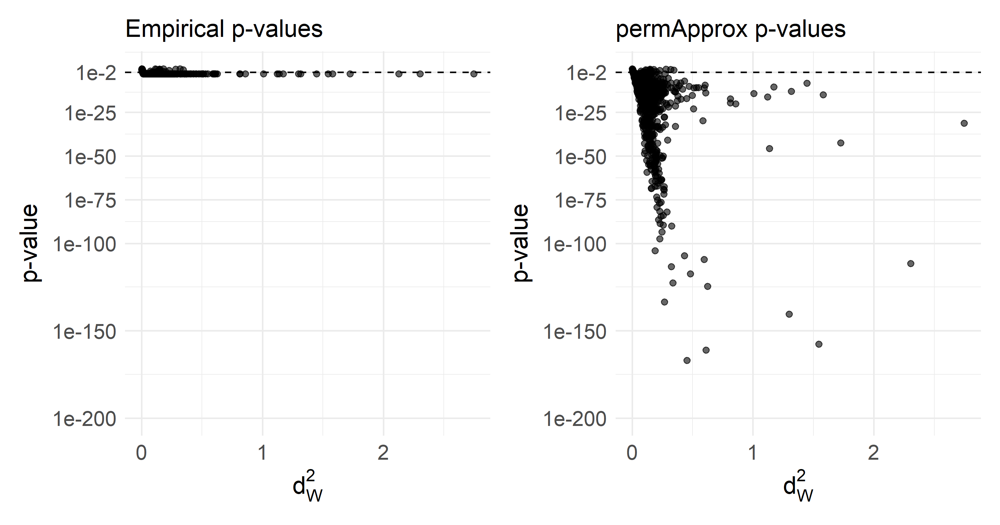<!-- -->

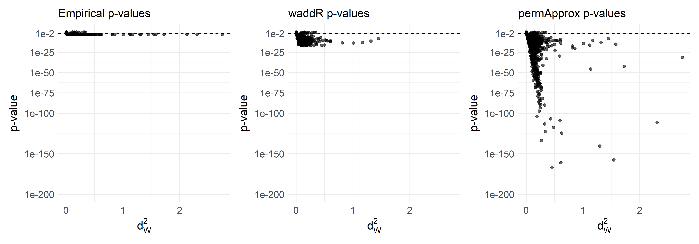<!-- -->

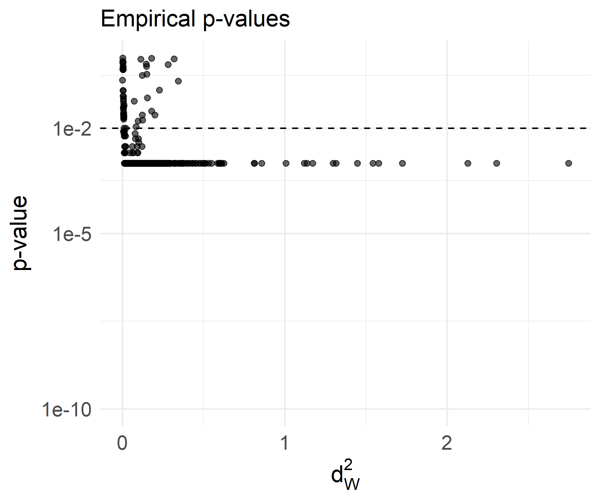<!-- -->

### P-values (waddR vs. permApprox)

#### B = 1000

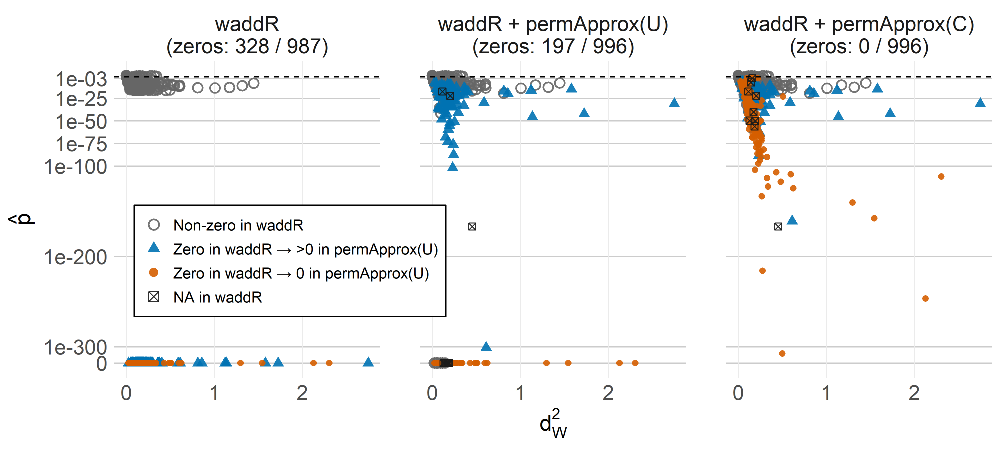<!-- -->

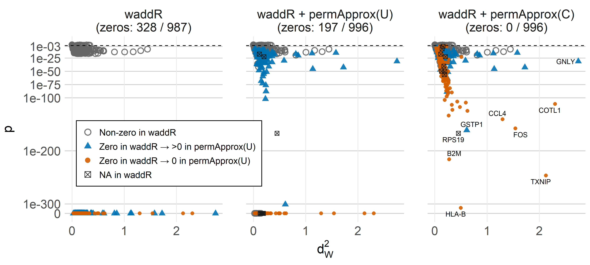<!-- -->

<table class="table" style="color: black; width: auto !important; ">

<caption>

Counts for B = 1k
</caption>

<thead>

<tr>

<th style="text-align:left;">

method
</th>

<th style="text-align:right;">

n_tests
</th>

<th style="text-align:right;">

n_zero
</th>

<th style="text-align:right;">

α = 0.05
</th>

<th style="text-align:right;">

α = 0.01
</th>

<th style="text-align:right;">

α = 0.001
</th>

</tr>

</thead>

<tbody>

<tr>

<td style="text-align:left;">

waddR (B = 1k)
</td>

<td style="text-align:right;">

987
</td>

<td style="text-align:right;">

328
</td>

<td style="text-align:right;">

959
</td>

<td style="text-align:right;">

940
</td>

<td style="text-align:right;">

915
</td>

</tr>

<tr>

<td style="text-align:left;">

waddR + permApprox(U) (B = 1k)
</td>

<td style="text-align:right;">

996
</td>

<td style="text-align:right;">

197
</td>

<td style="text-align:right;">

967
</td>

<td style="text-align:right;">

949
</td>

<td style="text-align:right;">

923
</td>

</tr>

<tr>

<td style="text-align:left;">

waddR + permApprox(C) (B = 1k)
</td>

<td style="text-align:right;">

996
</td>

<td style="text-align:right;">

0
</td>

<td style="text-align:right;">

967
</td>

<td style="text-align:right;">

949
</td>

<td style="text-align:right;">

922
</td>

</tr>

</tbody>

</table>

#### B = 10000

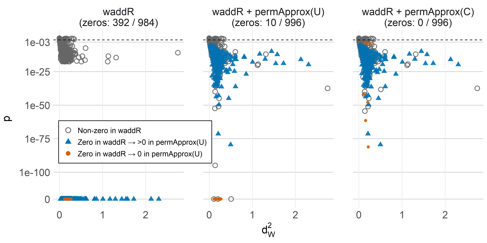<!-- -->

<table class="table" style="color: black; width: auto !important; ">

<caption>

Counts for B = 10k
</caption>

<thead>

<tr>

<th style="text-align:left;">

method
</th>

<th style="text-align:right;">

n_tests
</th>

<th style="text-align:right;">

n_zero
</th>

<th style="text-align:right;">

α = 0.05
</th>

<th style="text-align:right;">

α = 0.01
</th>

<th style="text-align:right;">

α = 0.001
</th>

</tr>

</thead>

<tbody>

<tr>

<td style="text-align:left;">

waddR (B = 10k)
</td>

<td style="text-align:right;">

984
</td>

<td style="text-align:right;">

392
</td>

<td style="text-align:right;">

956
</td>

<td style="text-align:right;">

937
</td>

<td style="text-align:right;">

914
</td>

</tr>

<tr>

<td style="text-align:left;">

waddR + permApprox(U) (B = 10k)
</td>

<td style="text-align:right;">

996
</td>

<td style="text-align:right;">

10
</td>

<td style="text-align:right;">

969
</td>

<td style="text-align:right;">

949
</td>

<td style="text-align:right;">

923
</td>

</tr>

<tr>

<td style="text-align:left;">

waddR + permApprox(C) (B = 10k)
</td>

<td style="text-align:right;">

996
</td>

<td style="text-align:right;">

0
</td>

<td style="text-align:right;">

969
</td>

<td style="text-align:right;">

949
</td>

<td style="text-align:right;">

923
</td>

</tr>

</tbody>

</table>

### P-values with annotations

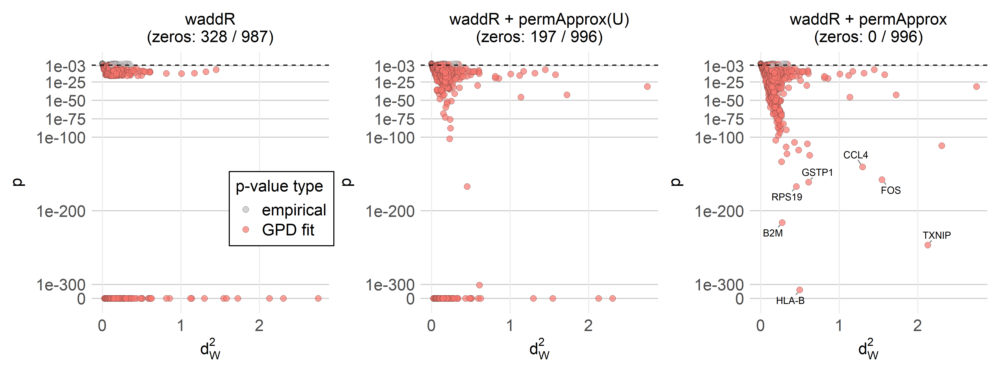<!-- -->

### P-values vs. ranked tests

#### 1,000 vs. 10,000 permutations

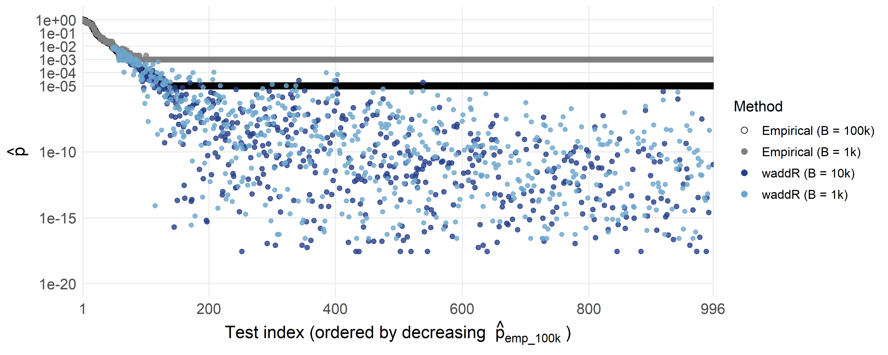<!-- -->

Since the Empirical p-values with B = 100k are constant from approx
index 130 on, we plot only up to this test in the following.

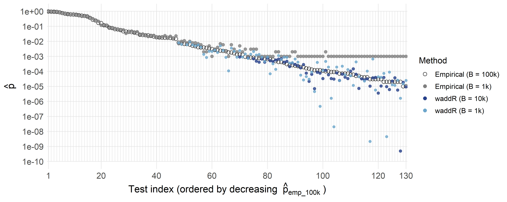<!-- -->

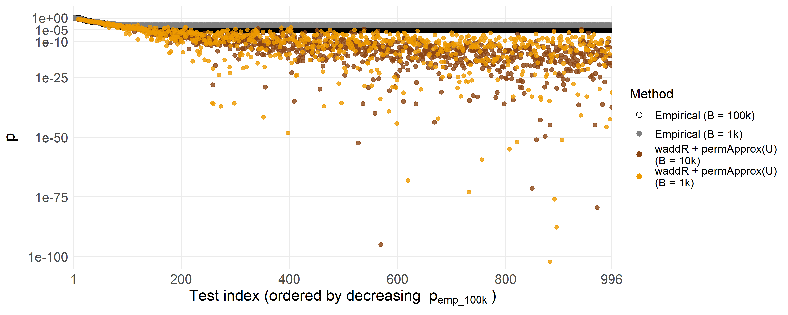<!-- -->

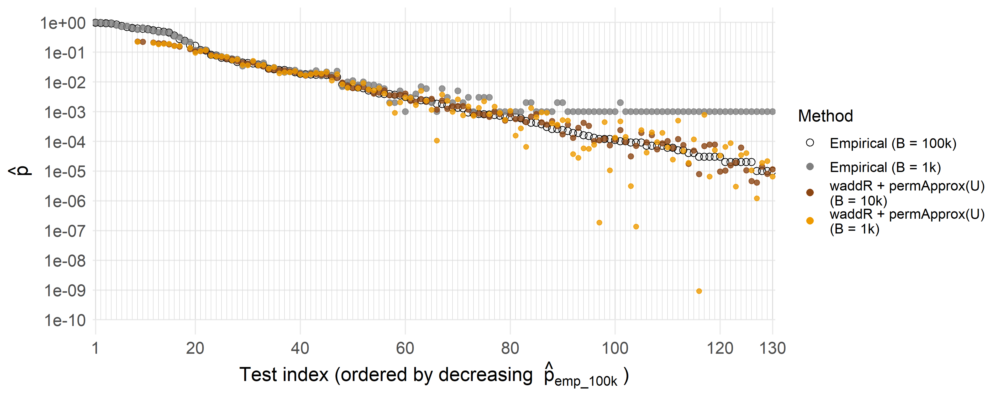<!-- -->

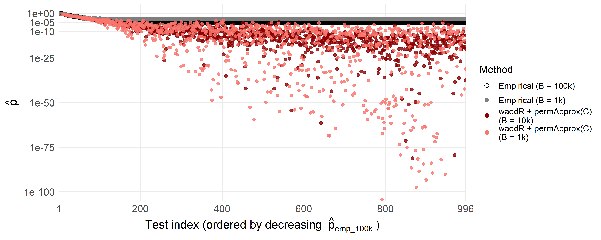<!-- -->

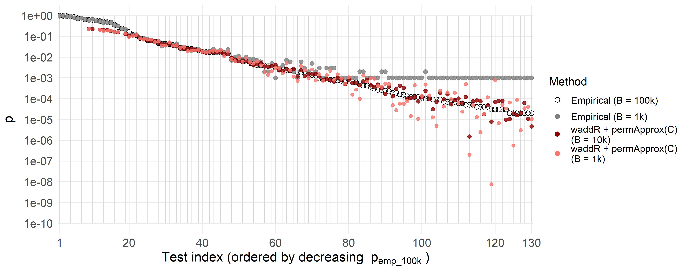<!-- -->

#### waddR vs. permApprox (B = 1,000)

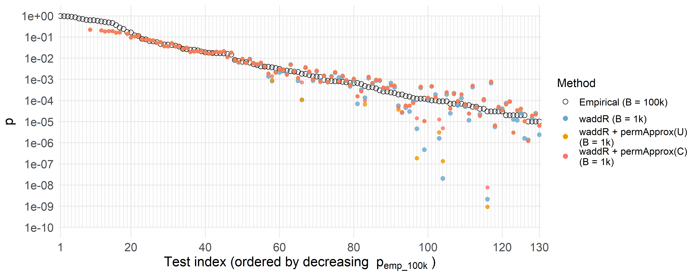<!-- -->

#### waddR vs. permApprox (B = 10,000)

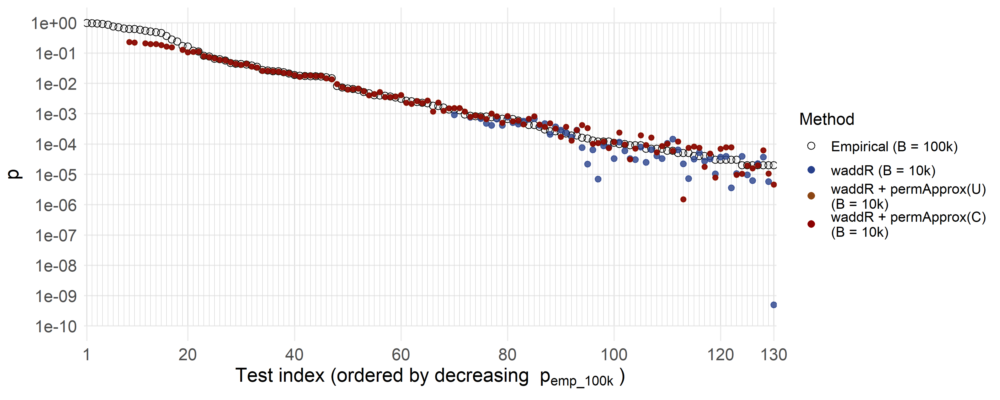<!-- -->

### Ratio of p-values (vs. empirical with B = 100k)

#### 1,000 vs. 10,000 permutations

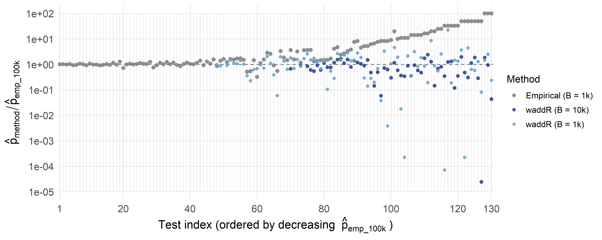<!-- -->

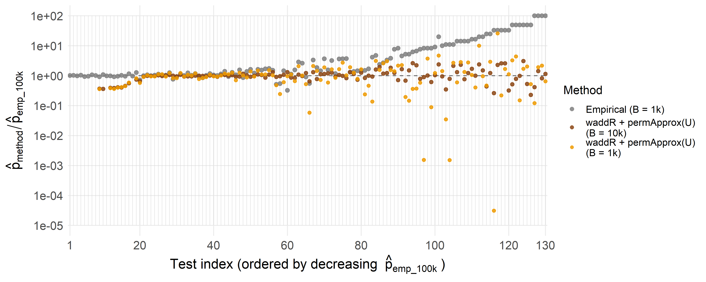<!-- -->

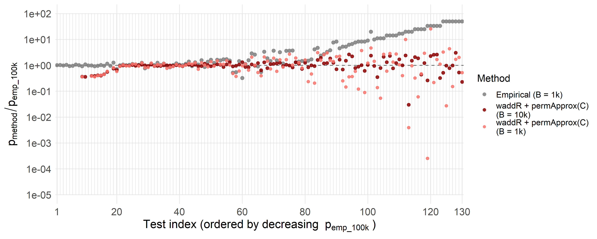<!-- -->

#### waddR vs. permApprox (B = 1,000)

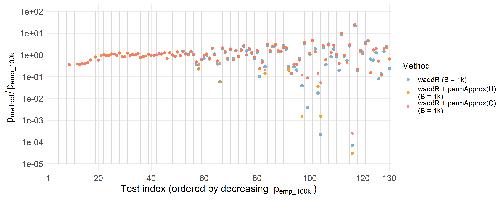<!-- -->

#### waddR vs. permApprox (B = 10,000)

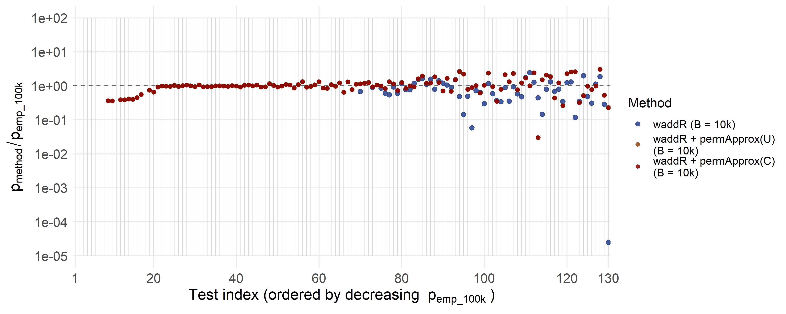<!-- -->

## P-values vs. ordered test statistics

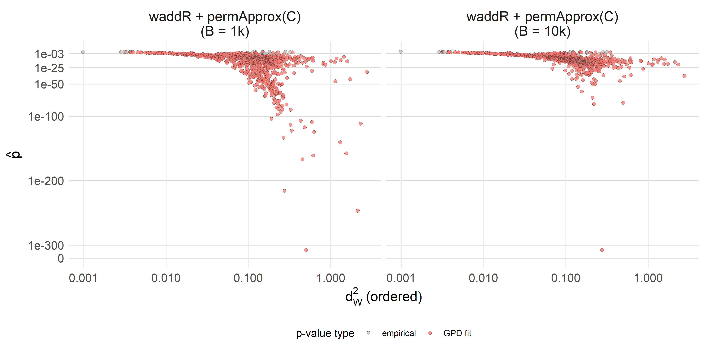<!-- -->

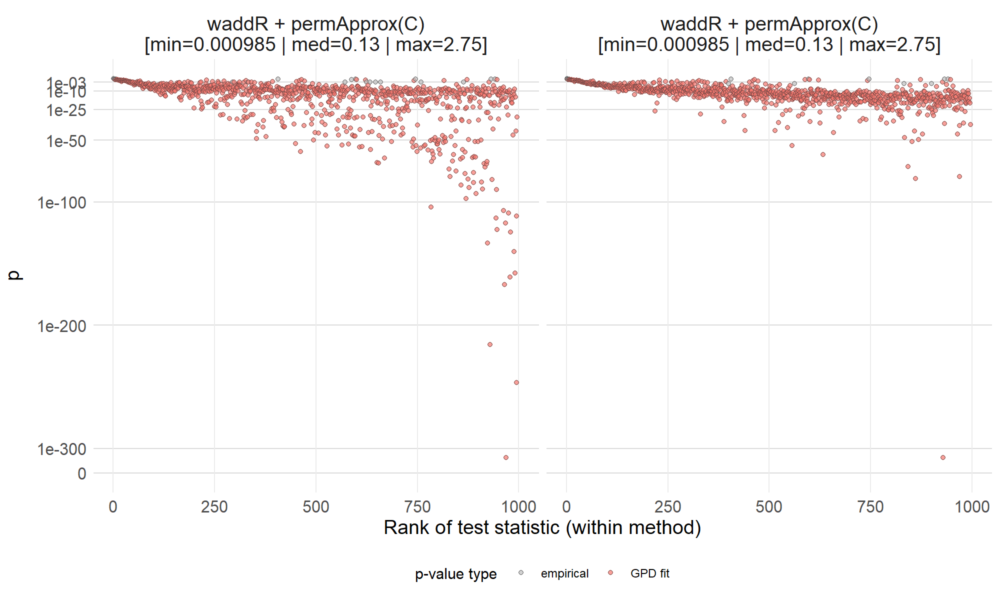<!-- -->

## Visualization of genes

### Genes with waddR p = 0

| idx | gene | d.wass | d.wass^2 | d.comp^2 | d.comp | location | size | shape.waddR | rho | p.waddR | p.ad.gpd | N.exc | gpd.shape | perc.loc | perc.size | perc.shape | decomp.error | p.zero | p.combined | p.adj.nonzero | p.adj.zero | p.adj.combined | p.pApp.unconstr | shape.pApp.unconstr | p.pApp.constr | shape.pApp.constr |
|---:|:---|---:|---:|---:|---:|---:|---:|---:|---:|---:|---:|---:|---:|---:|---:|---:|---:|---:|---:|---:|---:|---:|---:|---:|---:|---:|
| 10 | HLA-B | 0.7059154 | 0.4983166 | 0.4984233 | 0.7059910 | 0.4922076 | 0.0028883 | 0.0033274 | 0.9890469 | 0 | 0.4272298 | 250 | -0.0471959 | 98.75 | 0.58 | 0.67 | 0.0002142 | 0.4488946 | 0 | 0 | 0.5235351 | 0 | 0 | -0.0179395 | 0 | -0.0033413 |
| 667 | TXNIP | 1.4583349 | 2.1267408 | 2.1265256 | 1.4582611 | 2.0930685 | 0.0118570 | 0.0216000 | 0.9612357 | 0 | 0.6694438 | 250 | -0.0312136 | 98.43 | 0.56 | 1.02 | 0.0001012 | 0.0000000 | 0 | 0 | 0.0000000 | 0 | 0 | -0.0285427 | 0 | -0.0041115 |
| 1 | B2M | 0.5236419 | 0.2742008 | 0.2744338 | 0.5238643 | 0.2677384 | 0.0001470 | 0.0065484 | 0.9657035 | 0 | 0.3321214 | 250 | -0.0403112 | 97.56 | 0.05 | 2.39 | 0.0008497 | NA | 0 | 0 | NA | 0 | 0 | -0.0723810 | 0 | -0.0042987 |
| 127 | GSTP1 | 0.7819993 | 0.6115229 | 0.6115654 | 0.7820264 | 0.5491258 | 0.0378275 | 0.0246120 | 0.9575007 | 0 | 0.9678317 | 250 | -0.0068447 | 89.79 | 6.19 | 4.02 | 0.0000694 | 0.0000000 | 0 | 0 | 0.0000000 | 0 | 0 | -0.0061192 | 0 | -0.0053421 |
| 148 | FOS | 1.2425410 | 1.5439082 | 1.5441966 | 1.2426571 | 1.2078147 | 0.2935138 | 0.0428681 | 0.9522921 | 0 | 0.1646854 | 250 | -0.0937740 | 78.22 | 19.01 | 2.78 | 0.0001867 | 0.0000000 | 0 | 0 | 0.0000000 | 0 | 0 | -0.0924760 | 0 | -0.0056029 |
| 85 | CCL4 | 1.1393340 | 1.2980819 | 1.2981195 | 1.1393505 | 1.1734127 | 0.0964646 | 0.0282422 | 0.9818417 | 0 | 0.3945084 | 140 | -0.1700500 | 90.39 | 7.43 | 2.18 | 0.0000289 | 0.0000031 | 0 | 0 | 0.0000112 | 0 | 0 | -0.1693666 | 0 | -0.0062480 |

#### Expression densities

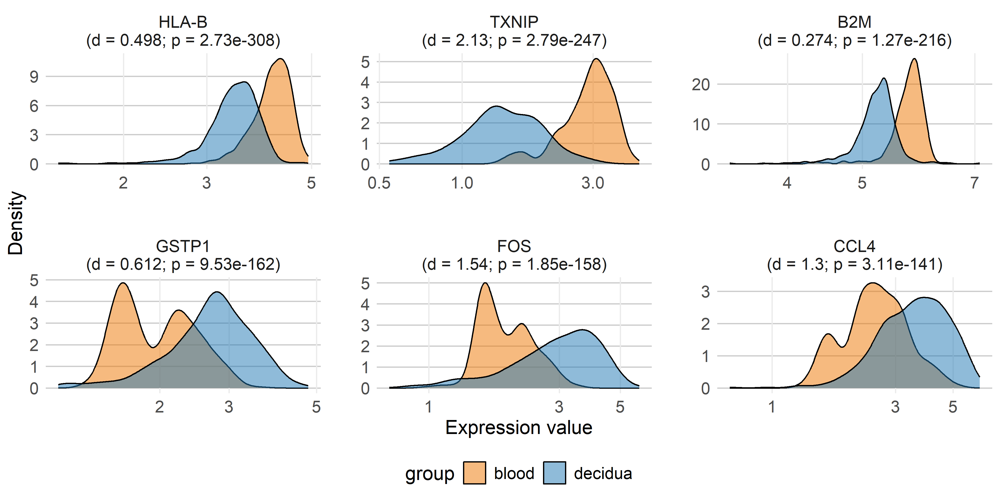<!-- -->

#### Histograms

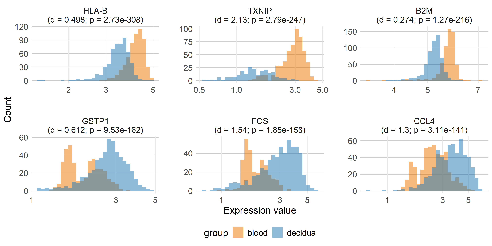<!-- -->

#### Quantile plots

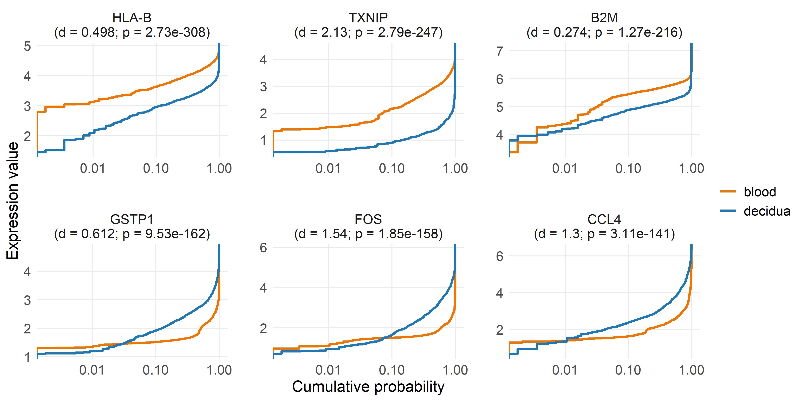<!-- -->

#### Permutation histograms (B = 1000)

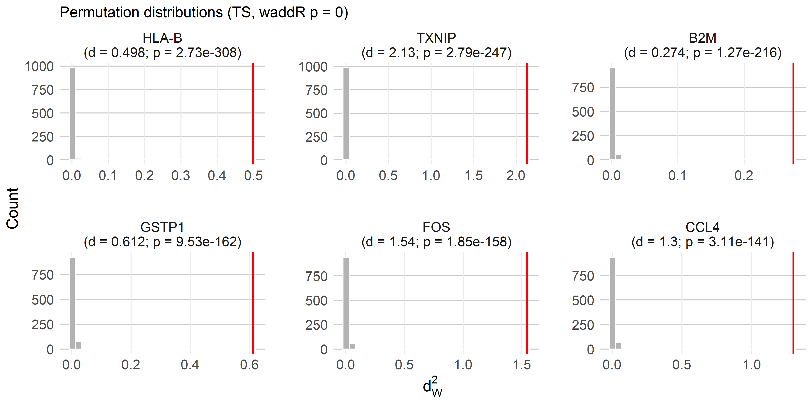<!-- -->

### Further significant genes (TS, B = 1000)

Now the “top non-zero” genes, ordered by constrained permApprox
p-values.

#### Expression densities

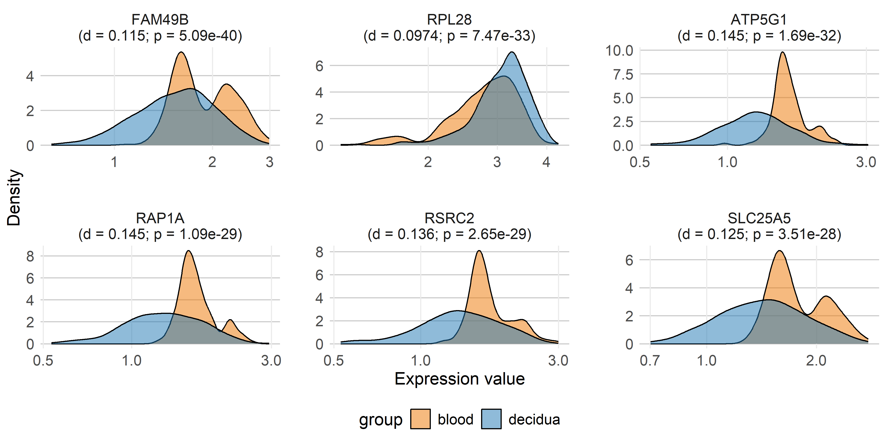<!-- -->

#### Histograms

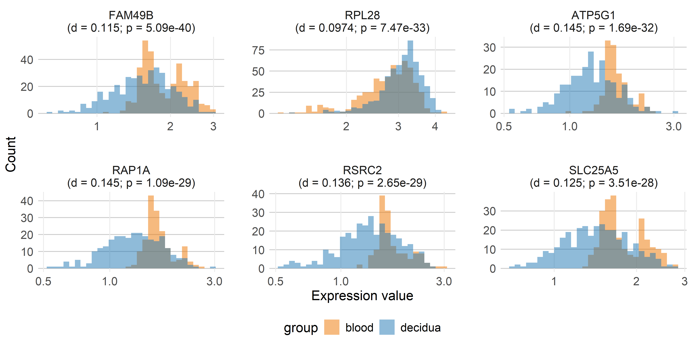<!-- -->

#### Quantile plots

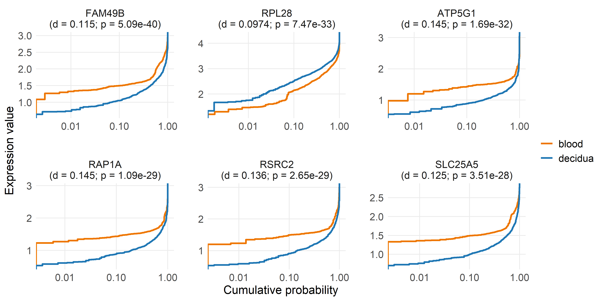<!-- -->

#### Permutation histograms (TS, significant genes)

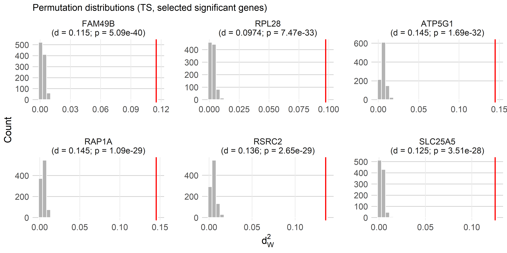<!-- -->

### Top significant genes

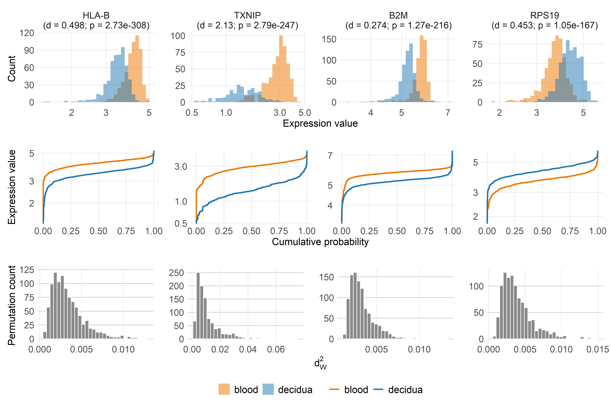<!-- -->

## LaTeX tables for TS (B = 1000)

### Top genes (raw p-values)

### Top genes (BH-adjusted p-values)

## Summary

This application study demonstrates the benefit of applying `permApprox`
to improve the robustness of p-value estimation in permutation-based
differential tests. Especially for extreme test statistics, `permApprox`
avoids zero p-values and thus enables more accurate and reproducible
results.

## References

- Vento-Tormo,R. et al. (2018) Reconstructing the human first trimester
  fetal– maternal interface using single cell transcriptomics. Nature,
  563, 347–353.

## Files written

These files have been written to the target directory,
`data/01_sc_diff_distr`:

    ## # A tibble: 17 × 4
    ##    path                                            type         size modification_time  
    ##    <fs::path>                                      <fct> <fs::bytes> <dttm>             
    ##  1 permapprox_results_ts_constr_10k.rds            file       17.67M 2025-12-19 13:23:07
    ##  2 permapprox_results_ts_constr_1k.rds             file        1.81M 2025-12-19 13:18:18
    ##  3 permapprox_results_ts_emp_100k.rds              file        4.17K 2025-12-01 08:56:41
    ##  4 permapprox_results_ts_emp_10k.rds               file        3.38K 2025-12-01 08:56:41
    ##  5 permapprox_results_ts_emp_1k.rds                file        2.56K 2025-12-01 08:56:41
    ##  6 permapprox_results_ts_emp_50k.rds               file        3.96K 2025-12-01 08:56:41
    ##  7 permapprox_results_ts_unconstr_10k.rds          file       17.72M 2025-12-19 13:16:44
    ##  8 permapprox_results_ts_unconstr_1k.rds           file        1.81M 2025-12-19 13:07:54
    ##  9 permApprox_waddr_TS_top_effects_BH_sc_table.tex file        3.73K 2026-02-27 08:13:21
    ## 10 permApprox_waddr_TS_top_effects_sc_table.tex    file        3.68K 2026-02-27 08:13:21
    ## 11 waddr_results_os.rds                            file        7.32M 2025-07-22 13:20:56
    ## 12 waddr_results_os_same_n.rds                     file        7.32M 2025-07-22 14:29:32
    ## 13 waddr_results_ts.rds                            file        7.32M 2025-07-22 10:12:12
    ## 14 waddr_results_ts_1000.rds                       file        7.32M 2025-09-01 09:36:28
    ## 15 waddr_results_ts_10000.rds                      file       71.96M 2025-09-01 10:07:57
    ## 16 waddr_results_ts_100000.rds                     file      718.32M 2025-09-02 13:48:57
    ## 17 waddr_results_ts_50000.rds                      file      359.23M 2025-09-02 09:45:27
