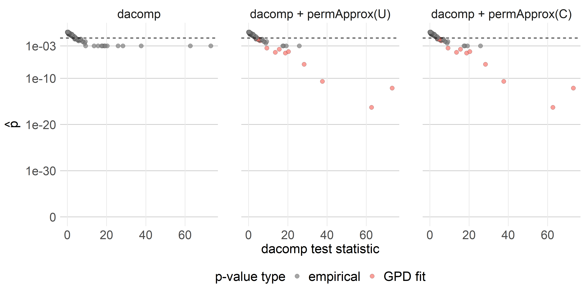
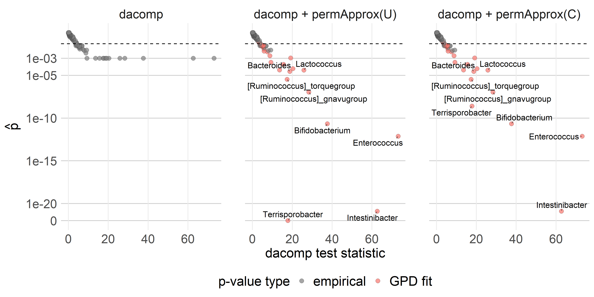
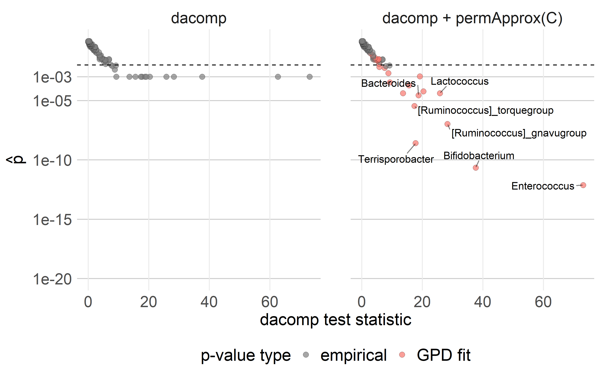
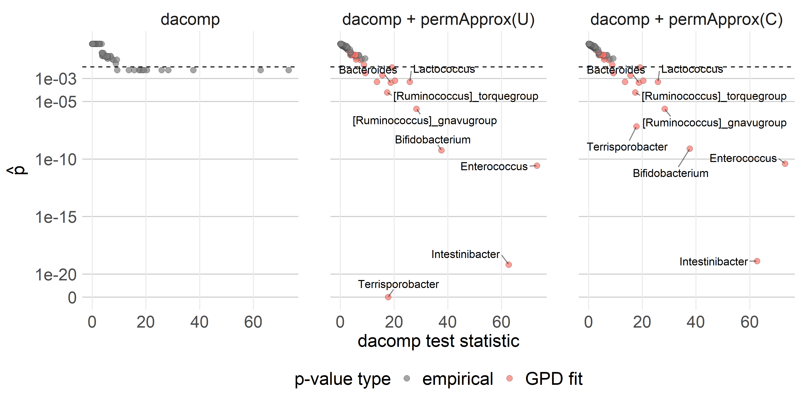
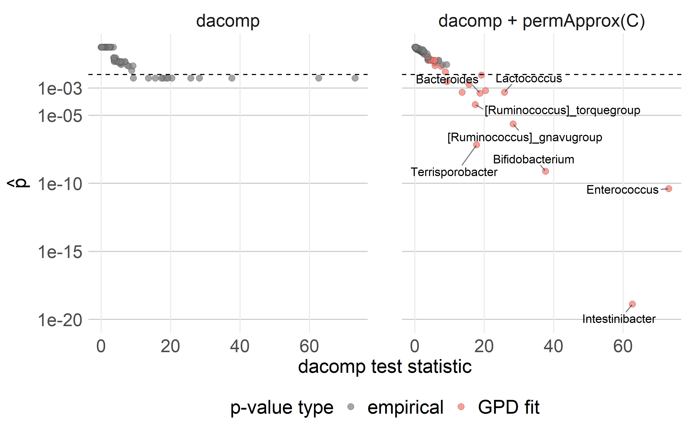
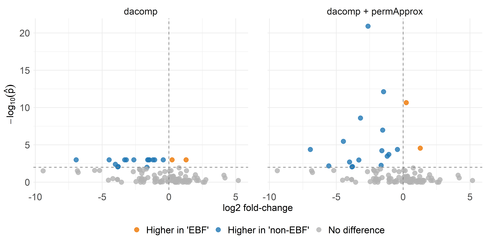
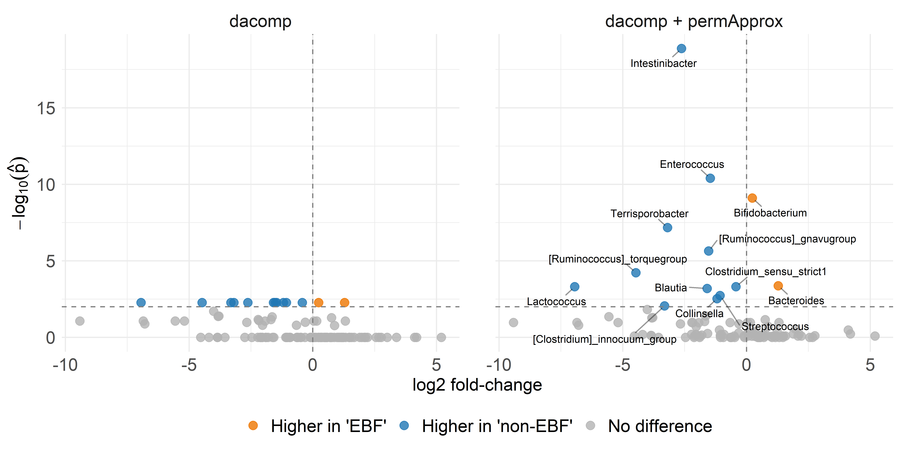
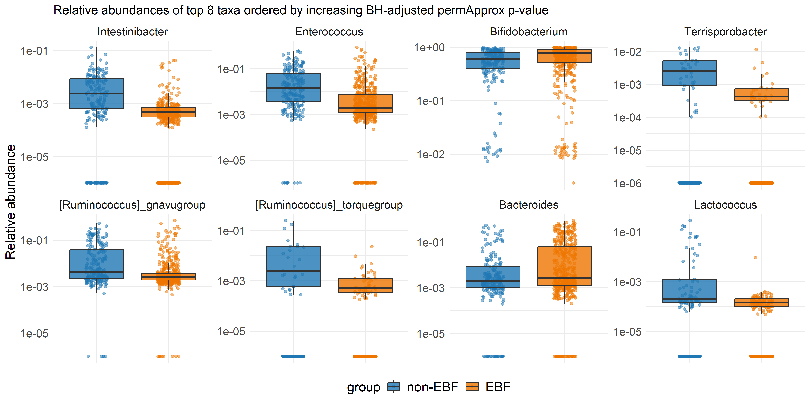
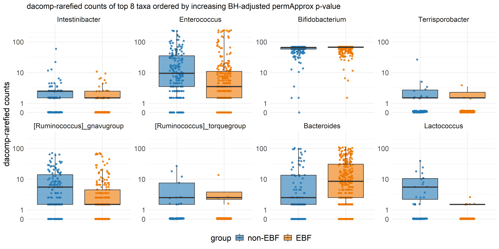
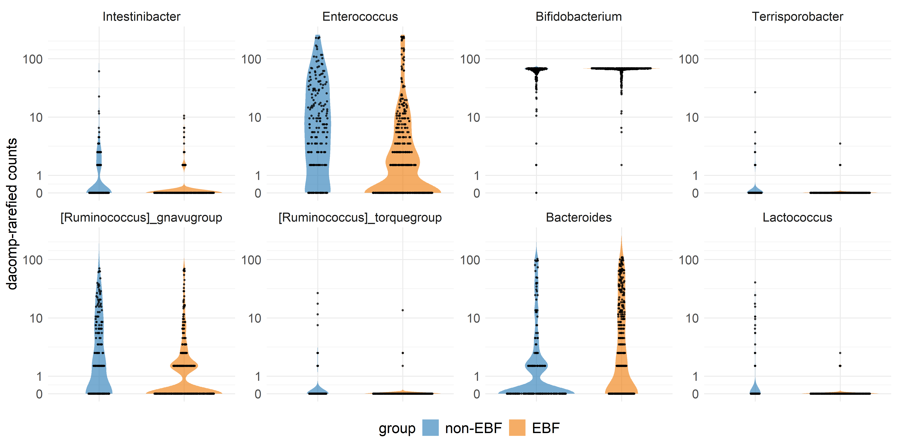

Differential abundance analysis with `dacomp` - EBF vs non-EBF
================
Compiled at 2025-12-19 16:07:28 UTC

This notebook demonstrates how to perform **differential abundance
analysis** of microbiome count data using the **`dacomp`** package.

We use genus-level profiles from the **PASTURE** cohort (2-month
samples). After basic prevalence filtering and defining two comparison
groups (here, breastfeeding categories), we visualize the data
(heatmaps, densities, histograms, ECDFs) and then apply **dacomp**:

1.  **Select a stable reference set of non-DA taxa**,  
2.  **Test all remaining taxa for differential abundance** using a
    Wilcoxon-based two-sample test with permutation p-values and DS-FDR
    correction.

The example uses the **raw count data** for inference (as required by
dacomp), while relative abundances are used only for visualization.

In this notebook, we compare two breast feeding groups: ‘EBF’ (exclusive
breast feeding until age 2 months) vs. ‘non-EBF’.

## Global options and packages

## Load data & set parameters

    ## phyloseq-class experiment-level object
    ## otu_table()   OTU Table:         [ 367 taxa and 740 samples ]
    ## sample_data() Sample Data:       [ 740 samples by 517 sample variables ]
    ## tax_table()   Taxonomy Table:    [ 367 taxa by 7 taxonomic ranks ]

## Data preprocessing

### Taxa prevalence (including zero counts)

<!-- -->

### Prevalence threshold

<!-- -->

### Taxa filtering

We keep only taxa with a non-zero count in at least 1% of the samples.

    ## phyloseq-class experiment-level object
    ## otu_table()   OTU Table:         [ 118 taxa and 740 samples ]
    ## sample_data() Sample Data:       [ 740 samples by 517 sample variables ]
    ## tax_table()   Taxonomy Table:    [ 118 taxa by 7 taxonomic ranks ]

### Define comparison groups

    ## breast_excl_cat1:

    ## 
    ##   0   1 >=2 
    ## 212   3 485

    ## 
    ## New variable:

    ## 
    ##     EBF non-EBF 
    ##     485     212

<!-- -->

    ## Samples in group 1: 212

    ## Samples in group 2: 485

### Relative abundance transformation

## Data exploration

### Library sizes

<!-- -->

### Prevalence vs mean relative abundance

<!-- -->

### Alpha diversity

    ##    sample Observed   Shannon InvSimpson GiniSimpson   group
    ## 1 s025647       38 1.7827696   4.011017   0.7506867 non-EBF
    ## 2 s023779       28 0.6113565   1.274869   0.2156056 non-EBF
    ## 3 s026625       26 0.3563376   1.126464   0.1122662 non-EBF
    ## 4 s022898       21 0.5109628   1.308248   0.2356186     EBF
    ## 5 s022897       25 0.4977167   1.210089   0.1736147     EBF
    ## 6 s028386       22 1.2379658   2.541923   0.6065971     EBF

#### Richness (Observed genera)

<!-- -->

#### Shannon diversity

<!-- -->

#### Gini–Simpson index

<!-- -->

#### Alpha diversity combined

<!-- -->

### Heatmap

<!-- -->

<!-- -->

### Mean composition - Phylum level

<!-- -->

Firmucutes are increased in non-EBF, which is in line with other
studies.

### Mean composition - Genus level

<!-- -->

## dacomp - Differential abundance analysis

### Build count matrix and phenotype vector

    ## [1] 697 118

    ## y_groups
    ## non-EBF     EBF 
    ##     212     485

### Select reference taxa

    ## DACOMP reference selection object 
    ## Thereshold for selecting reference taxa: 0
    ## For dacomp.select_references(), threshold given in units of medianSD score 
    ## Nr. Selected references: 93
    ## Minimal number of counts observed in reference taxa (across subjects): 68
    ## 

    ## [1] 93

    ## Reference taxa:

    ##  [1] "Blastococcus"                        "Stenotrophomonas"                    "Porphyromonas"                      
    ##  [4] "Family_XIII_AD3011_group"            "Anaeroglobus"                        "Lachnoanaerobaculum"                
    ##  [7] "Christensenellaceae_R-7_group"       "Fenollaria"                          "Megamonas"                          
    ## [10] "Pseudomonas"                         "Lachnospiraceae_ND3007_group"        "8_Comamonadaceae(F)"                
    ## [13] "Brevundimonas"                       "Lachnospira"                         "Halomonas"                          
    ## [16] "[Eubacterium]_coprostanoligenegroup" "Monoglobus"                          "Lawsonella"                         
    ## [19] "Peptostreptococcus"                  "Solobacterium"                       "Sarcina"                            
    ## [22] "Clostridia_UCG-014"                  "9_Pasteurellaceae(F)"                "Ruminococcus"                       
    ## [25] "Coprococcus"                         "Turicibacter"                        "Clostridium_sensu_strict18"         
    ## [28] "21_Bifidobacteriaceae(F)"            "Morganella"                          "Lachnospiraceae_NK4A136_group"      
    ## [31] "Actinotignum"                        "Paeniclostridium"                    "Phascolarctobacterium"              
    ## [34] "Dermabacter"                         "Coprobacillus"                       "Acinetobacter"                      
    ## [37] "Slackia"                             "Cutibacterium"                       "Coprobacter"                        
    ## [40] "Faecalicoccus"                       "Fusobacterium"                       "Delftia"                            
    ## [43] "Butyricicoccus"                      "Leuconostoc"                         "[Eubacterium]_eligengroup"          
    ## [46] "Scardovia"                           "[Ruminococcus]_gauvreauii_group"     "Dolosigranulum"                     
    ## [49] "Olsenella"                           "Megasphaera"                         "Faecalitalea"                       
    ## [52] "Epulopiscium"                        "Gordonibacter"                       "Granulicatella"                     
    ## [55] "Sutterella"                          "Libanicoccus"                        "Negativicoccus"                     
    ## [58] "Finegoldia"                          "[Eubacterium]_hallii_group"          "Anaerococcus"                       
    ## [61] "Incertae_Sedis"                      "Proteus"                             "Prevotella"                         
    ## [64] "Bilophila"                           "Atopobium"                           "uncultured18"                       
    ## [67] "Hungatella"                          "UBA1819"                             "Dialister"                          
    ## [70] "Alistipes"                           "Eubacterium"                         "Roseburia"                          
    ## [73] "CAG-352"                             "Peptoniphilus"                       "Holdemanella"                       
    ## [76] "Sellimonas"                          "Flavonifractor"                      "Subdoligranulum"                    
    ## [79] "Terrisporobacter"                    "Dorea"                               "Corynebacterium"                    
    ## [82] "22_Lachnospiraceae(F)"               "Erysipelotrichaceae_UCG-003"         "Blautia"                            
    ## [85] "Tyzzerella"                          "Clostridioides"                      "Senegalimassilia"                   
    ## [88] "[Ruminococcus]_torquegroup"          "Akkermansia"                         "Anaerostipes"                       
    ## [91] "Varibaculum"                         "Agathobacter"                        "Bifidobacterium"

<!-- -->

Of the 118 taxa, 93 are selected as reference.

<!-- -->

<!-- -->

<!-- -->

### Run dacomp test

    ## Testing taxon : 1/118 
    ## Testing taxon : 13/118 
    ## Testing taxon : 25/118 
    ## Testing taxon : 37/118 
    ## Testing taxon : 49/118 
    ## Testing taxon : 61/118 
    ## Testing taxon : 73/118 
    ## Testing taxon : 85/118 
    ## Testing taxon : 97/118 
    ## Testing taxon : 109/118 
    ## computing rejection threshold for DS-FDR
    ## 

## permApprox - robust ftr

    ## [1] 1001  118

### permApprox – unconstrained GPD

    ## Summary of permApprox result
    ## ----------------------------
    ## Number of tests             : 118
    ## Approximation method        : GPD tail approximation
    ## Approximation threshold     : p-values < 0.1
    ## Multiple testing adjustment : BH
    ## 
    ## Fit status counts:
    ##   Successful fits          : 15
    ##   GOF rejections           : 0
    ##   Fit failed               : 0
    ##   No threshold found       : 12
    ##   Discrete distributions   : 9
    ##   Not selected for fitting : 82
    ## 
    ## GPD parameter summary (successful fits)
    ## --------------------------------------
    ##   shape:
    ##     min = -0.0851, median = 0.0131, mean = 0.0234, max = 0.138
    ##   scale:
    ##     min = 1.18, median = 1.56, mean = 1.53, max = 1.67
    ##   n_exceed:
    ##     min =   90, median =  250, mean =  229, max =  250
    ## 
    ## P-value summary
    ## ---------------
    ## Empirical p-values:
    ##   empirical:
    ##     min = 0.000999, median = 0.325, mean = 0.403, max =    1
    ## 
    ## Final p-values (unadjusted):
    ##   unadjusted:
    ##     min = 0.00000000000000005, median = 0.325, mean = 0.403, max =    1
    ## 
    ## Final p-values (adjusted, BH):
    ##   adjusted:
    ##     min = 0.00000000000000535, median = 0.643, mean = 0.554, max =    1
    ##   Rejections at alpha = 0.05: 14

### permApprox – constrained GPD (SLLS)

    ## Summary of permApprox result
    ## ----------------------------
    ## Number of tests             : 118
    ## Approximation method        : GPD tail approximation
    ## Approximation threshold     : p-values < 0.1
    ## Multiple testing adjustment : BH
    ## 
    ## Fit status counts:
    ##   Successful fits          : 15
    ##   GOF rejections           : 0
    ##   Fit failed               : 0
    ##   No threshold found       : 12
    ##   Discrete distributions   : 9
    ##   Not selected for fitting : 82
    ## 
    ## GPD parameter summary (successful fits)
    ## --------------------------------------
    ##   shape:
    ##     min = -0.0851, median = 0.0131, mean = 0.0234, max = 0.138
    ##   scale:
    ##     min = 1.18, median = 1.56, mean = 1.53, max = 1.67
    ##   n_exceed:
    ##     min =   90, median =  250, mean =  229, max =  250
    ## 
    ## P-value summary
    ## ---------------
    ## Empirical p-values:
    ##   empirical:
    ##     min = 0.000999, median = 0.325, mean = 0.403, max =    1
    ## 
    ## Final p-values (unadjusted):
    ##   unadjusted:
    ##     min = 0.00000000000000005, median = 0.325, mean = 0.403, max =    1
    ## 
    ## Final p-values (adjusted, BH):
    ##   adjusted:
    ##     min = 0.00000000000000535, median = 0.643, mean = 0.554, max =    1
    ##   Rejections at alpha = 0.05: 14

### Combine dacomp and permApprox results

### Unadjusted results

<table class="table" style="color: black; width: auto !important; margin-left: auto; margin-right: auto;">

<thead>

<tr>

<th style="text-align:left;">

taxon
</th>

<th style="text-align:right;">

stat_dacomp
</th>

<th style="text-align:right;">

p_dacomp
</th>

<th style="text-align:left;">

is_reference
</th>

<th style="text-align:right;">

p_emp_pApp
</th>

<th style="text-align:right;">

p_perm_pApp_uncon
</th>

<th style="text-align:left;">

method_pApp_uncon
</th>

<th style="text-align:left;">

status_pApp_uncon
</th>

<th style="text-align:right;">

p_perm_pApp_constr
</th>

<th style="text-align:left;">

method_pApp_constr
</th>

<th style="text-align:right;">

mean_rel_g1
</th>

<th style="text-align:right;">

mean_rel_g2
</th>

<th style="text-align:right;">

log2_fc
</th>

</tr>

</thead>

<tbody>

<tr>

<td style="text-align:left;">

Intestinibacter
</td>

<td style="text-align:right;">

62.6922
</td>

<td style="text-align:right;">

0.001
</td>

<td style="text-align:left;">

FALSE
</td>

<td style="text-align:right;">

0.001
</td>

<td style="text-align:right;">

0.0000
</td>

<td style="text-align:left;">

gpd
</td>

<td style="text-align:left;">

success
</td>

<td style="text-align:right;">

0.0000
</td>

<td style="text-align:left;">

gpd
</td>

<td style="text-align:right;">

0.0056
</td>

<td style="text-align:right;">

0.0009
</td>

<td style="text-align:right;">

-2.6263
</td>

</tr>

<tr>

<td style="text-align:left;">

Enterococcus
</td>

<td style="text-align:right;">

73.1526
</td>

<td style="text-align:right;">

0.001
</td>

<td style="text-align:left;">

FALSE
</td>

<td style="text-align:right;">

0.001
</td>

<td style="text-align:right;">

0.0000
</td>

<td style="text-align:left;">

gpd
</td>

<td style="text-align:left;">

success
</td>

<td style="text-align:right;">

0.0000
</td>

<td style="text-align:left;">

gpd
</td>

<td style="text-align:right;">

0.0514
</td>

<td style="text-align:right;">

0.0186
</td>

<td style="text-align:right;">

-1.4658
</td>

</tr>

<tr>

<td style="text-align:left;">

Bifidobacterium
</td>

<td style="text-align:right;">

37.6494
</td>

<td style="text-align:right;">

0.001
</td>

<td style="text-align:left;">

TRUE
</td>

<td style="text-align:right;">

0.001
</td>

<td style="text-align:right;">

0.0000
</td>

<td style="text-align:left;">

gpd
</td>

<td style="text-align:left;">

success
</td>

<td style="text-align:right;">

0.0000
</td>

<td style="text-align:left;">

gpd
</td>

<td style="text-align:right;">

0.5652
</td>

<td style="text-align:right;">

0.6646
</td>

<td style="text-align:right;">

0.2337
</td>

</tr>

<tr>

<td style="text-align:left;">

\[Ruminococcus\]\_gnavugroup
</td>

<td style="text-align:right;">

28.3335
</td>

<td style="text-align:right;">

0.001
</td>

<td style="text-align:left;">

FALSE
</td>

<td style="text-align:right;">

0.001
</td>

<td style="text-align:right;">

0.0000
</td>

<td style="text-align:left;">

gpd
</td>

<td style="text-align:left;">

success
</td>

<td style="text-align:right;">

0.0000
</td>

<td style="text-align:left;">

gpd
</td>

<td style="text-align:right;">

0.0408
</td>

<td style="text-align:right;">

0.0141
</td>

<td style="text-align:right;">

-1.5289
</td>

</tr>

<tr>

<td style="text-align:left;">

Bacteroides
</td>

<td style="text-align:right;">

18.7481
</td>

<td style="text-align:right;">

0.001
</td>

<td style="text-align:left;">

FALSE
</td>

<td style="text-align:right;">

0.001
</td>

<td style="text-align:right;">

0.0000
</td>

<td style="text-align:left;">

gpd
</td>

<td style="text-align:left;">

success
</td>

<td style="text-align:right;">

0.0000
</td>

<td style="text-align:left;">

gpd
</td>

<td style="text-align:right;">

0.0270
</td>

<td style="text-align:right;">

0.0656
</td>

<td style="text-align:right;">

1.2796
</td>

</tr>

<tr>

<td style="text-align:left;">

Clostridium_sensu_strict1
</td>

<td style="text-align:right;">

13.6123
</td>

<td style="text-align:right;">

0.001
</td>

<td style="text-align:left;">

FALSE
</td>

<td style="text-align:right;">

0.001
</td>

<td style="text-align:right;">

0.0000
</td>

<td style="text-align:left;">

gpd
</td>

<td style="text-align:left;">

success
</td>

<td style="text-align:right;">

0.0000
</td>

<td style="text-align:left;">

gpd
</td>

<td style="text-align:right;">

0.0128
</td>

<td style="text-align:right;">

0.0095
</td>

<td style="text-align:right;">

-0.4262
</td>

</tr>

<tr>

<td style="text-align:left;">

Blautia
</td>

<td style="text-align:right;">

20.3466
</td>

<td style="text-align:right;">

0.001
</td>

<td style="text-align:left;">

TRUE
</td>

<td style="text-align:right;">

0.001
</td>

<td style="text-align:right;">

0.0001
</td>

<td style="text-align:left;">

gpd
</td>

<td style="text-align:left;">

success
</td>

<td style="text-align:right;">

0.0001
</td>

<td style="text-align:left;">

gpd
</td>

<td style="text-align:right;">

0.0323
</td>

<td style="text-align:right;">

0.0107
</td>

<td style="text-align:right;">

-1.5933
</td>

</tr>

<tr>

<td style="text-align:left;">

Streptococcus
</td>

<td style="text-align:right;">

15.6138
</td>

<td style="text-align:right;">

0.001
</td>

<td style="text-align:left;">

FALSE
</td>

<td style="text-align:right;">

0.001
</td>

<td style="text-align:right;">

0.0002
</td>

<td style="text-align:left;">

gpd
</td>

<td style="text-align:left;">

success
</td>

<td style="text-align:right;">

0.0002
</td>

<td style="text-align:left;">

gpd
</td>

<td style="text-align:right;">

0.0776
</td>

<td style="text-align:right;">

0.0370
</td>

<td style="text-align:right;">

-1.0689
</td>

</tr>

<tr>

<td style="text-align:left;">

Collinsella
</td>

<td style="text-align:right;">

9.2791
</td>

<td style="text-align:right;">

0.001
</td>

<td style="text-align:left;">

FALSE
</td>

<td style="text-align:right;">

0.001
</td>

<td style="text-align:right;">

0.0003
</td>

<td style="text-align:left;">

gpd
</td>

<td style="text-align:left;">

success
</td>

<td style="text-align:right;">

0.0003
</td>

<td style="text-align:left;">

gpd
</td>

<td style="text-align:right;">

0.0217
</td>

<td style="text-align:right;">

0.0095
</td>

<td style="text-align:right;">

-1.1928
</td>

</tr>

<tr>

<td style="text-align:left;">

Lactococcus
</td>

<td style="text-align:right;">

25.8463
</td>

<td style="text-align:right;">

0.001
</td>

<td style="text-align:left;">

FALSE
</td>

<td style="text-align:right;">

0.001
</td>

<td style="text-align:right;">

0.0010
</td>

<td style="text-align:left;">

empirical
</td>

<td style="text-align:left;">

no_threshold
</td>

<td style="text-align:right;">

0.0010
</td>

<td style="text-align:left;">

empirical
</td>

<td style="text-align:right;">

0.0068
</td>

<td style="text-align:right;">

0.0001
</td>

<td style="text-align:right;">

-6.9434
</td>

</tr>

<tr>

<td style="text-align:left;">

Terrisporobacter
</td>

<td style="text-align:right;">

17.8006
</td>

<td style="text-align:right;">

0.001
</td>

<td style="text-align:left;">

TRUE
</td>

<td style="text-align:right;">

0.001
</td>

<td style="text-align:right;">

0.0010
</td>

<td style="text-align:left;">

empirical
</td>

<td style="text-align:left;">

no_threshold
</td>

<td style="text-align:right;">

0.0010
</td>

<td style="text-align:left;">

empirical
</td>

<td style="text-align:right;">

0.0006
</td>

<td style="text-align:right;">

0.0001
</td>

<td style="text-align:right;">

-3.1901
</td>

</tr>

<tr>

<td style="text-align:left;">

\[Clostridium\]\_innocuum_group
</td>

<td style="text-align:right;">

19.2109
</td>

<td style="text-align:right;">

0.001
</td>

<td style="text-align:left;">

FALSE
</td>

<td style="text-align:right;">

0.001
</td>

<td style="text-align:right;">

0.0010
</td>

<td style="text-align:left;">

empirical
</td>

<td style="text-align:left;">

no_threshold
</td>

<td style="text-align:right;">

0.0010
</td>

<td style="text-align:left;">

empirical
</td>

<td style="text-align:right;">

0.0072
</td>

<td style="text-align:right;">

0.0007
</td>

<td style="text-align:right;">

-3.3153
</td>

</tr>

<tr>

<td style="text-align:left;">

\[Ruminococcus\]\_torquegroup
</td>

<td style="text-align:right;">

17.4150
</td>

<td style="text-align:right;">

0.001
</td>

<td style="text-align:left;">

TRUE
</td>

<td style="text-align:right;">

0.001
</td>

<td style="text-align:right;">

0.0010
</td>

<td style="text-align:left;">

empirical
</td>

<td style="text-align:left;">

no_threshold
</td>

<td style="text-align:right;">

0.0010
</td>

<td style="text-align:left;">

empirical
</td>

<td style="text-align:right;">

0.0035
</td>

<td style="text-align:right;">

0.0002
</td>

<td style="text-align:right;">

-4.4737
</td>

</tr>

<tr>

<td style="text-align:left;">

Tyzzerella
</td>

<td style="text-align:right;">

8.7783
</td>

<td style="text-align:right;">

0.004
</td>

<td style="text-align:left;">

TRUE
</td>

<td style="text-align:right;">

0.004
</td>

<td style="text-align:right;">

0.0040
</td>

<td style="text-align:left;">

empirical
</td>

<td style="text-align:left;">

no_threshold
</td>

<td style="text-align:right;">

0.0040
</td>

<td style="text-align:left;">

empirical
</td>

<td style="text-align:right;">

0.0029
</td>

<td style="text-align:right;">

0.0002
</td>

<td style="text-align:right;">

-4.0099
</td>

</tr>

<tr>

<td style="text-align:left;">

Granulicatella
</td>

<td style="text-align:right;">

8.0030
</td>

<td style="text-align:right;">

0.008
</td>

<td style="text-align:left;">

TRUE
</td>

<td style="text-align:right;">

0.008
</td>

<td style="text-align:right;">

0.0080
</td>

<td style="text-align:left;">

empirical
</td>

<td style="text-align:left;">

discrete
</td>

<td style="text-align:right;">

0.0080
</td>

<td style="text-align:left;">

empirical
</td>

<td style="text-align:right;">

0.0003
</td>

<td style="text-align:right;">

0.0000
</td>

<td style="text-align:right;">

-3.7943
</td>

</tr>

<tr>

<td style="text-align:left;">

Paeniclostridium
</td>

<td style="text-align:right;">

9.1905
</td>

<td style="text-align:right;">

0.009
</td>

<td style="text-align:left;">

TRUE
</td>

<td style="text-align:right;">

0.009
</td>

<td style="text-align:right;">

0.0090
</td>

<td style="text-align:left;">

empirical
</td>

<td style="text-align:left;">

discrete
</td>

<td style="text-align:right;">

0.0090
</td>

<td style="text-align:left;">

empirical
</td>

<td style="text-align:right;">

0.0001
</td>

<td style="text-align:right;">

0.0000
</td>

<td style="text-align:right;">

-3.8264
</td>

</tr>

<tr>

<td style="text-align:left;">

Clostridioides
</td>

<td style="text-align:right;">

7.5255
</td>

<td style="text-align:right;">

0.010
</td>

<td style="text-align:left;">

TRUE
</td>

<td style="text-align:right;">

0.010
</td>

<td style="text-align:right;">

0.0100
</td>

<td style="text-align:left;">

empirical
</td>

<td style="text-align:left;">

no_threshold
</td>

<td style="text-align:right;">

0.0100
</td>

<td style="text-align:left;">

empirical
</td>

<td style="text-align:right;">

0.0008
</td>

<td style="text-align:right;">

0.0003
</td>

<td style="text-align:right;">

-1.6485
</td>

</tr>

<tr>

<td style="text-align:left;">

Parabacteroides
</td>

<td style="text-align:right;">

5.7625
</td>

<td style="text-align:right;">

0.012
</td>

<td style="text-align:left;">

FALSE
</td>

<td style="text-align:right;">

0.012
</td>

<td style="text-align:right;">

0.0128
</td>

<td style="text-align:left;">

gpd
</td>

<td style="text-align:left;">

success
</td>

<td style="text-align:right;">

0.0128
</td>

<td style="text-align:left;">

gpd
</td>

<td style="text-align:right;">

0.0027
</td>

<td style="text-align:right;">

0.0045
</td>

<td style="text-align:right;">

0.7557
</td>

</tr>

<tr>

<td style="text-align:left;">

Fusobacterium
</td>

<td style="text-align:right;">

5.8552
</td>

<td style="text-align:right;">

0.017
</td>

<td style="text-align:left;">

TRUE
</td>

<td style="text-align:right;">

0.017
</td>

<td style="text-align:right;">

0.0170
</td>

<td style="text-align:left;">

empirical
</td>

<td style="text-align:left;">

discrete
</td>

<td style="text-align:right;">

0.0170
</td>

<td style="text-align:left;">

empirical
</td>

<td style="text-align:right;">

0.0001
</td>

<td style="text-align:right;">

0.0000
</td>

<td style="text-align:right;">

-1.6967
</td>

</tr>

<tr>

<td style="text-align:left;">

Sellimonas
</td>

<td style="text-align:right;">

5.1736
</td>

<td style="text-align:right;">

0.018
</td>

<td style="text-align:left;">

TRUE
</td>

<td style="text-align:right;">

0.018
</td>

<td style="text-align:right;">

0.0180
</td>

<td style="text-align:left;">

empirical
</td>

<td style="text-align:left;">

no_threshold
</td>

<td style="text-align:right;">

0.0180
</td>

<td style="text-align:left;">

empirical
</td>

<td style="text-align:right;">

0.0009
</td>

<td style="text-align:right;">

0.0002
</td>

<td style="text-align:right;">

-2.2120
</td>

</tr>

</tbody>

</table>

### Adjusted results

<table class="table" style="color: black; width: auto !important; margin-left: auto; margin-right: auto;">

<thead>

<tr>

<th style="text-align:left;">

taxon
</th>

<th style="text-align:right;">

stat_dacomp
</th>

<th style="text-align:right;">

p_dacomp
</th>

<th style="text-align:left;">

is_reference
</th>

<th style="text-align:right;">

p_emp_pApp
</th>

<th style="text-align:right;">

p_perm_pApp_uncon
</th>

<th style="text-align:left;">

method_pApp_uncon
</th>

<th style="text-align:right;">

p_perm_pApp_constr
</th>

<th style="text-align:left;">

method_pApp_constr
</th>

<th style="text-align:right;">

mean_rel_g1
</th>

<th style="text-align:right;">

mean_rel_g2
</th>

<th style="text-align:right;">

log2_fc
</th>

</tr>

</thead>

<tbody>

<tr>

<td style="text-align:left;">

Intestinibacter
</td>

<td style="text-align:right;">

62.6922
</td>

<td style="text-align:right;">

0.0053
</td>

<td style="text-align:left;">

FALSE
</td>

<td style="text-align:right;">

0.001
</td>

<td style="text-align:right;">

0.0000
</td>

<td style="text-align:left;">

gpd
</td>

<td style="text-align:right;">

0.0000
</td>

<td style="text-align:left;">

gpd
</td>

<td style="text-align:right;">

0.0056
</td>

<td style="text-align:right;">

0.0009
</td>

<td style="text-align:right;">

-2.6263
</td>

</tr>

<tr>

<td style="text-align:left;">

Enterococcus
</td>

<td style="text-align:right;">

73.1526
</td>

<td style="text-align:right;">

0.0053
</td>

<td style="text-align:left;">

FALSE
</td>

<td style="text-align:right;">

0.001
</td>

<td style="text-align:right;">

0.0000
</td>

<td style="text-align:left;">

gpd
</td>

<td style="text-align:right;">

0.0000
</td>

<td style="text-align:left;">

gpd
</td>

<td style="text-align:right;">

0.0514
</td>

<td style="text-align:right;">

0.0186
</td>

<td style="text-align:right;">

-1.4658
</td>

</tr>

<tr>

<td style="text-align:left;">

Bifidobacterium
</td>

<td style="text-align:right;">

37.6494
</td>

<td style="text-align:right;">

0.0053
</td>

<td style="text-align:left;">

TRUE
</td>

<td style="text-align:right;">

0.001
</td>

<td style="text-align:right;">

0.0000
</td>

<td style="text-align:left;">

gpd
</td>

<td style="text-align:right;">

0.0000
</td>

<td style="text-align:left;">

gpd
</td>

<td style="text-align:right;">

0.5652
</td>

<td style="text-align:right;">

0.6646
</td>

<td style="text-align:right;">

0.2337
</td>

</tr>

<tr>

<td style="text-align:left;">

\[Ruminococcus\]\_gnavugroup
</td>

<td style="text-align:right;">

28.3335
</td>

<td style="text-align:right;">

0.0053
</td>

<td style="text-align:left;">

FALSE
</td>

<td style="text-align:right;">

0.001
</td>

<td style="text-align:right;">

0.0000
</td>

<td style="text-align:left;">

gpd
</td>

<td style="text-align:right;">

0.0000
</td>

<td style="text-align:left;">

gpd
</td>

<td style="text-align:right;">

0.0408
</td>

<td style="text-align:right;">

0.0141
</td>

<td style="text-align:right;">

-1.5289
</td>

</tr>

<tr>

<td style="text-align:left;">

Bacteroides
</td>

<td style="text-align:right;">

18.7481
</td>

<td style="text-align:right;">

0.0053
</td>

<td style="text-align:left;">

FALSE
</td>

<td style="text-align:right;">

0.001
</td>

<td style="text-align:right;">

0.0006
</td>

<td style="text-align:left;">

gpd
</td>

<td style="text-align:right;">

0.0006
</td>

<td style="text-align:left;">

gpd
</td>

<td style="text-align:right;">

0.0270
</td>

<td style="text-align:right;">

0.0656
</td>

<td style="text-align:right;">

1.2796
</td>

</tr>

<tr>

<td style="text-align:left;">

Clostridium_sensu_strict1
</td>

<td style="text-align:right;">

13.6123
</td>

<td style="text-align:right;">

0.0053
</td>

<td style="text-align:left;">

FALSE
</td>

<td style="text-align:right;">

0.001
</td>

<td style="text-align:right;">

0.0007
</td>

<td style="text-align:left;">

gpd
</td>

<td style="text-align:right;">

0.0007
</td>

<td style="text-align:left;">

gpd
</td>

<td style="text-align:right;">

0.0128
</td>

<td style="text-align:right;">

0.0095
</td>

<td style="text-align:right;">

-0.4262
</td>

</tr>

<tr>

<td style="text-align:left;">

Blautia
</td>

<td style="text-align:right;">

20.3466
</td>

<td style="text-align:right;">

0.0053
</td>

<td style="text-align:left;">

TRUE
</td>

<td style="text-align:right;">

0.001
</td>

<td style="text-align:right;">

0.0009
</td>

<td style="text-align:left;">

gpd
</td>

<td style="text-align:right;">

0.0009
</td>

<td style="text-align:left;">

gpd
</td>

<td style="text-align:right;">

0.0323
</td>

<td style="text-align:right;">

0.0107
</td>

<td style="text-align:right;">

-1.5933
</td>

</tr>

<tr>

<td style="text-align:left;">

Streptococcus
</td>

<td style="text-align:right;">

15.6138
</td>

<td style="text-align:right;">

0.0053
</td>

<td style="text-align:left;">

FALSE
</td>

<td style="text-align:right;">

0.001
</td>

<td style="text-align:right;">

0.0025
</td>

<td style="text-align:left;">

gpd
</td>

<td style="text-align:right;">

0.0025
</td>

<td style="text-align:left;">

gpd
</td>

<td style="text-align:right;">

0.0776
</td>

<td style="text-align:right;">

0.0370
</td>

<td style="text-align:right;">

-1.0689
</td>

</tr>

<tr>

<td style="text-align:left;">

Collinsella
</td>

<td style="text-align:right;">

9.2791
</td>

<td style="text-align:right;">

0.0053
</td>

<td style="text-align:left;">

FALSE
</td>

<td style="text-align:right;">

0.001
</td>

<td style="text-align:right;">

0.0039
</td>

<td style="text-align:left;">

gpd
</td>

<td style="text-align:right;">

0.0039
</td>

<td style="text-align:left;">

gpd
</td>

<td style="text-align:right;">

0.0217
</td>

<td style="text-align:right;">

0.0095
</td>

<td style="text-align:right;">

-1.1928
</td>

</tr>

<tr>

<td style="text-align:left;">

Lactococcus
</td>

<td style="text-align:right;">

25.8463
</td>

<td style="text-align:right;">

0.0053
</td>

<td style="text-align:left;">

FALSE
</td>

<td style="text-align:right;">

0.001
</td>

<td style="text-align:right;">

0.0082
</td>

<td style="text-align:left;">

empirical
</td>

<td style="text-align:right;">

0.0082
</td>

<td style="text-align:left;">

empirical
</td>

<td style="text-align:right;">

0.0068
</td>

<td style="text-align:right;">

0.0001
</td>

<td style="text-align:right;">

-6.9434
</td>

</tr>

<tr>

<td style="text-align:left;">

Terrisporobacter
</td>

<td style="text-align:right;">

17.8006
</td>

<td style="text-align:right;">

0.0053
</td>

<td style="text-align:left;">

TRUE
</td>

<td style="text-align:right;">

0.001
</td>

<td style="text-align:right;">

0.0082
</td>

<td style="text-align:left;">

empirical
</td>

<td style="text-align:right;">

0.0082
</td>

<td style="text-align:left;">

empirical
</td>

<td style="text-align:right;">

0.0006
</td>

<td style="text-align:right;">

0.0001
</td>

<td style="text-align:right;">

-3.1901
</td>

</tr>

<tr>

<td style="text-align:left;">

\[Clostridium\]\_innocuum_group
</td>

<td style="text-align:right;">

19.2109
</td>

<td style="text-align:right;">

0.0053
</td>

<td style="text-align:left;">

FALSE
</td>

<td style="text-align:right;">

0.001
</td>

<td style="text-align:right;">

0.0082
</td>

<td style="text-align:left;">

empirical
</td>

<td style="text-align:right;">

0.0082
</td>

<td style="text-align:left;">

empirical
</td>

<td style="text-align:right;">

0.0072
</td>

<td style="text-align:right;">

0.0007
</td>

<td style="text-align:right;">

-3.3153
</td>

</tr>

<tr>

<td style="text-align:left;">

\[Ruminococcus\]\_torquegroup
</td>

<td style="text-align:right;">

17.4150
</td>

<td style="text-align:right;">

0.0053
</td>

<td style="text-align:left;">

TRUE
</td>

<td style="text-align:right;">

0.001
</td>

<td style="text-align:right;">

0.0082
</td>

<td style="text-align:left;">

empirical
</td>

<td style="text-align:right;">

0.0082
</td>

<td style="text-align:left;">

empirical
</td>

<td style="text-align:right;">

0.0035
</td>

<td style="text-align:right;">

0.0002
</td>

<td style="text-align:right;">

-4.4737
</td>

</tr>

<tr>

<td style="text-align:left;">

Tyzzerella
</td>

<td style="text-align:right;">

8.7783
</td>

<td style="text-align:right;">

0.0197
</td>

<td style="text-align:left;">

TRUE
</td>

<td style="text-align:right;">

0.004
</td>

<td style="text-align:right;">

0.0305
</td>

<td style="text-align:left;">

empirical
</td>

<td style="text-align:right;">

0.0305
</td>

<td style="text-align:left;">

empirical
</td>

<td style="text-align:right;">

0.0029
</td>

<td style="text-align:right;">

0.0002
</td>

<td style="text-align:right;">

-4.0099
</td>

</tr>

<tr>

<td style="text-align:left;">

Granulicatella
</td>

<td style="text-align:right;">

8.0030
</td>

<td style="text-align:right;">

0.0402
</td>

<td style="text-align:left;">

TRUE
</td>

<td style="text-align:right;">

0.008
</td>

<td style="text-align:right;">

0.0570
</td>

<td style="text-align:left;">

empirical
</td>

<td style="text-align:right;">

0.0570
</td>

<td style="text-align:left;">

empirical
</td>

<td style="text-align:right;">

0.0003
</td>

<td style="text-align:right;">

0.0000
</td>

<td style="text-align:right;">

-3.7943
</td>

</tr>

<tr>

<td style="text-align:left;">

Paeniclostridium
</td>

<td style="text-align:right;">

9.1905
</td>

<td style="text-align:right;">

0.0425
</td>

<td style="text-align:left;">

TRUE
</td>

<td style="text-align:right;">

0.009
</td>

<td style="text-align:right;">

0.0601
</td>

<td style="text-align:left;">

empirical
</td>

<td style="text-align:right;">

0.0601
</td>

<td style="text-align:left;">

empirical
</td>

<td style="text-align:right;">

0.0001
</td>

<td style="text-align:right;">

0.0000
</td>

<td style="text-align:right;">

-3.8264
</td>

</tr>

<tr>

<td style="text-align:left;">

Clostridioides
</td>

<td style="text-align:right;">

7.5255
</td>

<td style="text-align:right;">

0.0457
</td>

<td style="text-align:left;">

TRUE
</td>

<td style="text-align:right;">

0.010
</td>

<td style="text-align:right;">

0.0629
</td>

<td style="text-align:left;">

empirical
</td>

<td style="text-align:right;">

0.0629
</td>

<td style="text-align:left;">

empirical
</td>

<td style="text-align:right;">

0.0008
</td>

<td style="text-align:right;">

0.0003
</td>

<td style="text-align:right;">

-1.6485
</td>

</tr>

<tr>

<td style="text-align:left;">

Parabacteroides
</td>

<td style="text-align:right;">

5.7625
</td>

<td style="text-align:right;">

0.0517
</td>

<td style="text-align:left;">

FALSE
</td>

<td style="text-align:right;">

0.012
</td>

<td style="text-align:right;">

0.0762
</td>

<td style="text-align:left;">

gpd
</td>

<td style="text-align:right;">

0.0762
</td>

<td style="text-align:left;">

gpd
</td>

<td style="text-align:right;">

0.0027
</td>

<td style="text-align:right;">

0.0045
</td>

<td style="text-align:right;">

0.7557
</td>

</tr>

<tr>

<td style="text-align:left;">

Fusobacterium
</td>

<td style="text-align:right;">

5.8552
</td>

<td style="text-align:right;">

0.0686
</td>

<td style="text-align:left;">

TRUE
</td>

<td style="text-align:right;">

0.017
</td>

<td style="text-align:right;">

0.0956
</td>

<td style="text-align:left;">

empirical
</td>

<td style="text-align:right;">

0.0956
</td>

<td style="text-align:left;">

empirical
</td>

<td style="text-align:right;">

0.0001
</td>

<td style="text-align:right;">

0.0000
</td>

<td style="text-align:right;">

-1.6967
</td>

</tr>

<tr>

<td style="text-align:left;">

Sellimonas
</td>

<td style="text-align:right;">

5.1736
</td>

<td style="text-align:right;">

0.0686
</td>

<td style="text-align:left;">

TRUE
</td>

<td style="text-align:right;">

0.018
</td>

<td style="text-align:right;">

0.0962
</td>

<td style="text-align:left;">

empirical
</td>

<td style="text-align:right;">

0.0962
</td>

<td style="text-align:left;">

empirical
</td>

<td style="text-align:right;">

0.0009
</td>

<td style="text-align:right;">

0.0002
</td>

<td style="text-align:right;">

-2.2120
</td>

</tr>

</tbody>

</table>

## permApprox - 250 exceedances

    ## [1] 1001  118

### permApprox – unconstrained GPD

    ## Summary of permApprox result
    ## ----------------------------
    ## Number of tests             : 118
    ## Approximation method        : GPD tail approximation
    ## Approximation threshold     : p-values < 0.1
    ## Multiple testing adjustment : BH
    ## 
    ## Fit status counts:
    ##   Successful fits          : 27
    ##   GOF rejections           : 0
    ##   Fit failed               : 0
    ##   No threshold found       : 0
    ##   Discrete distributions   : 9
    ##   Not selected for fitting : 82
    ## 
    ## GPD parameter summary (successful fits)
    ## --------------------------------------
    ##   shape:
    ##     min = -0.33, median = 0.0131, mean = 0.0905, max = 1.25
    ##   scale:
    ##     min = 0.0923, median = 1.61, mean = 1.62, max = 3.19
    ##   n_exceed:
    ##     min =  195, median =  250, mean =  243, max =  250
    ## 
    ## P-value summary
    ## ---------------
    ## Empirical p-values:
    ##   empirical:
    ##     min = 0.000999, median = 0.325, mean = 0.403, max =    1
    ## 
    ## Final p-values (unadjusted):
    ##   unadjusted:
    ##     min = 0, median = 0.325, mean = 0.402, max =    1
    ## 
    ## Final p-values (adjusted, BH):
    ##   adjusted:
    ##     min = 0, median = 0.643, mean = 0.551, max =    1
    ##   Rejections at alpha = 0.05: 16

### permApprox – constrained GPD (SLLS)

    ## Summary of permApprox result
    ## ----------------------------
    ## Number of tests             : 118
    ## Approximation method        : GPD tail approximation
    ## Approximation threshold     : p-values < 0.1
    ## Multiple testing adjustment : BH
    ## 
    ## Fit status counts:
    ##   Successful fits          : 27
    ##   GOF rejections           : 0
    ##   Fit failed               : 0
    ##   No threshold found       : 0
    ##   Discrete distributions   : 9
    ##   Not selected for fitting : 82
    ## 
    ## GPD parameter summary (successful fits)
    ## --------------------------------------
    ##   shape:
    ##     min = -0.33, median = 0.0131, mean = 0.0972, max = 1.25
    ##   scale:
    ##     min = 0.0923, median = 1.61, mean =  1.6, max = 3.19
    ##   n_exceed:
    ##     min =  195, median =  250, mean =  243, max =  250
    ## 
    ## P-value summary
    ## ---------------
    ## Empirical p-values:
    ##   empirical:
    ##     min = 0.000999, median = 0.325, mean = 0.403, max =    1
    ## 
    ## Final p-values (unadjusted):
    ##   unadjusted:
    ##     min = 0.00000000000000000000125, median = 0.325, mean = 0.402, max =    1
    ## 
    ## Final p-values (adjusted, BH):
    ##   adjusted:
    ##     min = 0.000000000000000000134, median = 0.643, mean = 0.551, max =    1
    ##   Rejections at alpha = 0.05: 16

### Combine dacomp and permApprox results

### Unadjusted results

<table class="table" style="color: black; width: auto !important; margin-left: auto; margin-right: auto;">

<thead>

<tr>

<th style="text-align:left;">

taxon
</th>

<th style="text-align:right;">

stat_dacomp
</th>

<th style="text-align:right;">

p_dacomp
</th>

<th style="text-align:left;">

is_reference
</th>

<th style="text-align:right;">

p_emp_pApp
</th>

<th style="text-align:right;">

p_perm_pApp_uncon
</th>

<th style="text-align:left;">

method_pApp_uncon
</th>

<th style="text-align:left;">

status_pApp_uncon
</th>

<th style="text-align:right;">

gpd_shape_uncon
</th>

<th style="text-align:right;">

p_perm_pApp_constr
</th>

<th style="text-align:left;">

method_pApp_constr
</th>

<th style="text-align:right;">

gpd_shape_constr
</th>

<th style="text-align:right;">

mean_rel_g1
</th>

<th style="text-align:right;">

mean_rel_g2
</th>

<th style="text-align:right;">

log2_fc
</th>

</tr>

</thead>

<tbody>

<tr>

<td style="text-align:left;">

Intestinibacter
</td>

<td style="text-align:right;">

62.6922
</td>

<td style="text-align:right;">

0.001
</td>

<td style="text-align:left;">

FALSE
</td>

<td style="text-align:right;">

0.001
</td>

<td style="text-align:right;">

0.0000
</td>

<td style="text-align:left;">

gpd
</td>

<td style="text-align:left;">

success
</td>

<td style="text-align:right;">

-0.0117
</td>

<td style="text-align:right;">

0.0000
</td>

<td style="text-align:left;">

gpd
</td>

<td style="text-align:right;">

-0.0117
</td>

<td style="text-align:right;">

0.0056
</td>

<td style="text-align:right;">

0.0009
</td>

<td style="text-align:right;">

-2.6263
</td>

</tr>

<tr>

<td style="text-align:left;">

Enterococcus
</td>

<td style="text-align:right;">

73.1526
</td>

<td style="text-align:right;">

0.001
</td>

<td style="text-align:left;">

FALSE
</td>

<td style="text-align:right;">

0.001
</td>

<td style="text-align:right;">

0.0000
</td>

<td style="text-align:left;">

gpd
</td>

<td style="text-align:left;">

success
</td>

<td style="text-align:right;">

0.0441
</td>

<td style="text-align:right;">

0.0000
</td>

<td style="text-align:left;">

gpd
</td>

<td style="text-align:right;">

0.0441
</td>

<td style="text-align:right;">

0.0514
</td>

<td style="text-align:right;">

0.0186
</td>

<td style="text-align:right;">

-1.4658
</td>

</tr>

<tr>

<td style="text-align:left;">

Bifidobacterium
</td>

<td style="text-align:right;">

37.6494
</td>

<td style="text-align:right;">

0.001
</td>

<td style="text-align:left;">

TRUE
</td>

<td style="text-align:right;">

0.001
</td>

<td style="text-align:right;">

0.0000
</td>

<td style="text-align:left;">

gpd
</td>

<td style="text-align:left;">

success
</td>

<td style="text-align:right;">

0.0097
</td>

<td style="text-align:right;">

0.0000
</td>

<td style="text-align:left;">

gpd
</td>

<td style="text-align:right;">

0.0097
</td>

<td style="text-align:right;">

0.5652
</td>

<td style="text-align:right;">

0.6646
</td>

<td style="text-align:right;">

0.2337
</td>

</tr>

<tr>

<td style="text-align:left;">

Terrisporobacter
</td>

<td style="text-align:right;">

17.8006
</td>

<td style="text-align:right;">

0.001
</td>

<td style="text-align:left;">

TRUE
</td>

<td style="text-align:right;">

0.001
</td>

<td style="text-align:right;">

0.0000
</td>

<td style="text-align:left;">

gpd
</td>

<td style="text-align:left;">

success
</td>

<td style="text-align:right;">

-0.3014
</td>

<td style="text-align:right;">

0.0000
</td>

<td style="text-align:left;">

gpd
</td>

<td style="text-align:right;">

-0.1209
</td>

<td style="text-align:right;">

0.0006
</td>

<td style="text-align:right;">

0.0001
</td>

<td style="text-align:right;">

-3.1901
</td>

</tr>

<tr>

<td style="text-align:left;">

\[Ruminococcus\]\_gnavugroup
</td>

<td style="text-align:right;">

28.3335
</td>

<td style="text-align:right;">

0.001
</td>

<td style="text-align:left;">

FALSE
</td>

<td style="text-align:right;">

0.001
</td>

<td style="text-align:right;">

0.0000
</td>

<td style="text-align:left;">

gpd
</td>

<td style="text-align:left;">

success
</td>

<td style="text-align:right;">

0.0146
</td>

<td style="text-align:right;">

0.0000
</td>

<td style="text-align:left;">

gpd
</td>

<td style="text-align:right;">

0.0146
</td>

<td style="text-align:right;">

0.0408
</td>

<td style="text-align:right;">

0.0141
</td>

<td style="text-align:right;">

-1.5289
</td>

</tr>

<tr>

<td style="text-align:left;">

\[Ruminococcus\]\_torquegroup
</td>

<td style="text-align:right;">

17.4150
</td>

<td style="text-align:right;">

0.001
</td>

<td style="text-align:left;">

TRUE
</td>

<td style="text-align:right;">

0.001
</td>

<td style="text-align:right;">

0.0000
</td>

<td style="text-align:left;">

gpd
</td>

<td style="text-align:left;">

success
</td>

<td style="text-align:right;">

-0.0231
</td>

<td style="text-align:right;">

0.0000
</td>

<td style="text-align:left;">

gpd
</td>

<td style="text-align:right;">

-0.0231
</td>

<td style="text-align:right;">

0.0035
</td>

<td style="text-align:right;">

0.0002
</td>

<td style="text-align:right;">

-4.4737
</td>

</tr>

<tr>

<td style="text-align:left;">

Bacteroides
</td>

<td style="text-align:right;">

18.7481
</td>

<td style="text-align:right;">

0.001
</td>

<td style="text-align:left;">

FALSE
</td>

<td style="text-align:right;">

0.001
</td>

<td style="text-align:right;">

0.0000
</td>

<td style="text-align:left;">

gpd
</td>

<td style="text-align:left;">

success
</td>

<td style="text-align:right;">

0.0452
</td>

<td style="text-align:right;">

0.0000
</td>

<td style="text-align:left;">

gpd
</td>

<td style="text-align:right;">

0.0452
</td>

<td style="text-align:right;">

0.0270
</td>

<td style="text-align:right;">

0.0656
</td>

<td style="text-align:right;">

1.2796
</td>

</tr>

<tr>

<td style="text-align:left;">

Lactococcus
</td>

<td style="text-align:right;">

25.8463
</td>

<td style="text-align:right;">

0.001
</td>

<td style="text-align:left;">

FALSE
</td>

<td style="text-align:right;">

0.001
</td>

<td style="text-align:right;">

0.0000
</td>

<td style="text-align:left;">

gpd
</td>

<td style="text-align:left;">

success
</td>

<td style="text-align:right;">

0.1433
</td>

<td style="text-align:right;">

0.0000
</td>

<td style="text-align:left;">

gpd
</td>

<td style="text-align:right;">

0.1433
</td>

<td style="text-align:right;">

0.0068
</td>

<td style="text-align:right;">

0.0001
</td>

<td style="text-align:right;">

-6.9434
</td>

</tr>

<tr>

<td style="text-align:left;">

Clostridium_sensu_strict1
</td>

<td style="text-align:right;">

13.6123
</td>

<td style="text-align:right;">

0.001
</td>

<td style="text-align:left;">

FALSE
</td>

<td style="text-align:right;">

0.001
</td>

<td style="text-align:right;">

0.0000
</td>

<td style="text-align:left;">

gpd
</td>

<td style="text-align:left;">

success
</td>

<td style="text-align:right;">

-0.0248
</td>

<td style="text-align:right;">

0.0000
</td>

<td style="text-align:left;">

gpd
</td>

<td style="text-align:right;">

-0.0248
</td>

<td style="text-align:right;">

0.0128
</td>

<td style="text-align:right;">

0.0095
</td>

<td style="text-align:right;">

-0.4262
</td>

</tr>

<tr>

<td style="text-align:left;">

Blautia
</td>

<td style="text-align:right;">

20.3466
</td>

<td style="text-align:right;">

0.001
</td>

<td style="text-align:left;">

TRUE
</td>

<td style="text-align:right;">

0.001
</td>

<td style="text-align:right;">

0.0001
</td>

<td style="text-align:left;">

gpd
</td>

<td style="text-align:left;">

success
</td>

<td style="text-align:right;">

0.0772
</td>

<td style="text-align:right;">

0.0001
</td>

<td style="text-align:left;">

gpd
</td>

<td style="text-align:right;">

0.0772
</td>

<td style="text-align:right;">

0.0323
</td>

<td style="text-align:right;">

0.0107
</td>

<td style="text-align:right;">

-1.5933
</td>

</tr>

<tr>

<td style="text-align:left;">

Streptococcus
</td>

<td style="text-align:right;">

15.6138
</td>

<td style="text-align:right;">

0.001
</td>

<td style="text-align:left;">

FALSE
</td>

<td style="text-align:right;">

0.001
</td>

<td style="text-align:right;">

0.0002
</td>

<td style="text-align:left;">

gpd
</td>

<td style="text-align:left;">

success
</td>

<td style="text-align:right;">

0.1349
</td>

<td style="text-align:right;">

0.0002
</td>

<td style="text-align:left;">

gpd
</td>

<td style="text-align:right;">

0.1349
</td>

<td style="text-align:right;">

0.0776
</td>

<td style="text-align:right;">

0.0370
</td>

<td style="text-align:right;">

-1.0689
</td>

</tr>

<tr>

<td style="text-align:left;">

Collinsella
</td>

<td style="text-align:right;">

9.2791
</td>

<td style="text-align:right;">

0.001
</td>

<td style="text-align:left;">

FALSE
</td>

<td style="text-align:right;">

0.001
</td>

<td style="text-align:right;">

0.0003
</td>

<td style="text-align:left;">

gpd
</td>

<td style="text-align:left;">

success
</td>

<td style="text-align:right;">

-0.0506
</td>

<td style="text-align:right;">

0.0003
</td>

<td style="text-align:left;">

gpd
</td>

<td style="text-align:right;">

-0.0506
</td>

<td style="text-align:right;">

0.0217
</td>

<td style="text-align:right;">

0.0095
</td>

<td style="text-align:right;">

-1.1928
</td>

</tr>

<tr>

<td style="text-align:left;">

\[Clostridium\]\_innocuum_group
</td>

<td style="text-align:right;">

19.2109
</td>

<td style="text-align:right;">

0.001
</td>

<td style="text-align:left;">

FALSE
</td>

<td style="text-align:right;">

0.001
</td>

<td style="text-align:right;">

0.0011
</td>

<td style="text-align:left;">

gpd
</td>

<td style="text-align:left;">

success
</td>

<td style="text-align:right;">

0.3730
</td>

<td style="text-align:right;">

0.0011
</td>

<td style="text-align:left;">

gpd
</td>

<td style="text-align:right;">

0.3730
</td>

<td style="text-align:right;">

0.0072
</td>

<td style="text-align:right;">

0.0007
</td>

<td style="text-align:right;">

-3.3153
</td>

</tr>

<tr>

<td style="text-align:left;">

Tyzzerella
</td>

<td style="text-align:right;">

8.7783
</td>

<td style="text-align:right;">

0.004
</td>

<td style="text-align:left;">

TRUE
</td>

<td style="text-align:right;">

0.004
</td>

<td style="text-align:right;">

0.0020
</td>

<td style="text-align:left;">

gpd
</td>

<td style="text-align:left;">

success
</td>

<td style="text-align:right;">

-0.0658
</td>

<td style="text-align:right;">

0.0020
</td>

<td style="text-align:left;">

gpd
</td>

<td style="text-align:right;">

-0.0658
</td>

<td style="text-align:right;">

0.0029
</td>

<td style="text-align:right;">

0.0002
</td>

<td style="text-align:right;">

-4.0099
</td>

</tr>

<tr>

<td style="text-align:left;">

Clostridioides
</td>

<td style="text-align:right;">

7.5255
</td>

<td style="text-align:right;">

0.010
</td>

<td style="text-align:left;">

TRUE
</td>

<td style="text-align:right;">

0.010
</td>

<td style="text-align:right;">

0.0056
</td>

<td style="text-align:left;">

gpd
</td>

<td style="text-align:left;">

success
</td>

<td style="text-align:right;">

-0.1616
</td>

<td style="text-align:right;">

0.0056
</td>

<td style="text-align:left;">

gpd
</td>

<td style="text-align:right;">

-0.1616
</td>

<td style="text-align:right;">

0.0008
</td>

<td style="text-align:right;">

0.0003
</td>

<td style="text-align:right;">

-1.6485
</td>

</tr>

<tr>

<td style="text-align:left;">

Epulopiscium
</td>

<td style="text-align:right;">

5.8281
</td>

<td style="text-align:right;">

0.026
</td>

<td style="text-align:left;">

TRUE
</td>

<td style="text-align:right;">

0.026
</td>

<td style="text-align:right;">

0.0066
</td>

<td style="text-align:left;">

gpd
</td>

<td style="text-align:left;">

success
</td>

<td style="text-align:right;">

1.0725
</td>

<td style="text-align:right;">

0.0066
</td>

<td style="text-align:left;">

gpd
</td>

<td style="text-align:right;">

1.0725
</td>

<td style="text-align:right;">

0.0006
</td>

<td style="text-align:right;">

0.0000
</td>

<td style="text-align:right;">

-5.5594
</td>

</tr>

<tr>

<td style="text-align:left;">

Granulicatella
</td>

<td style="text-align:right;">

8.0030
</td>

<td style="text-align:right;">

0.008
</td>

<td style="text-align:left;">

TRUE
</td>

<td style="text-align:right;">

0.008
</td>

<td style="text-align:right;">

0.0080
</td>

<td style="text-align:left;">

empirical
</td>

<td style="text-align:left;">

discrete
</td>

<td style="text-align:right;">

NA
</td>

<td style="text-align:right;">

0.0080
</td>

<td style="text-align:left;">

empirical
</td>

<td style="text-align:right;">

NA
</td>

<td style="text-align:right;">

0.0003
</td>

<td style="text-align:right;">

0.0000
</td>

<td style="text-align:right;">

-3.7943
</td>

</tr>

<tr>

<td style="text-align:left;">

Paeniclostridium
</td>

<td style="text-align:right;">

9.1905
</td>

<td style="text-align:right;">

0.009
</td>

<td style="text-align:left;">

TRUE
</td>

<td style="text-align:right;">

0.009
</td>

<td style="text-align:right;">

0.0090
</td>

<td style="text-align:left;">

empirical
</td>

<td style="text-align:left;">

discrete
</td>

<td style="text-align:right;">

NA
</td>

<td style="text-align:right;">

0.0090
</td>

<td style="text-align:left;">

empirical
</td>

<td style="text-align:right;">

NA
</td>

<td style="text-align:right;">

0.0001
</td>

<td style="text-align:right;">

0.0000
</td>

<td style="text-align:right;">

-3.8264
</td>

</tr>

<tr>

<td style="text-align:left;">

Parabacteroides
</td>

<td style="text-align:right;">

5.7625
</td>

<td style="text-align:right;">

0.012
</td>

<td style="text-align:left;">

FALSE
</td>

<td style="text-align:right;">

0.012
</td>

<td style="text-align:right;">

0.0123
</td>

<td style="text-align:left;">

gpd
</td>

<td style="text-align:left;">

success
</td>

<td style="text-align:right;">

-0.0510
</td>

<td style="text-align:right;">

0.0123
</td>

<td style="text-align:left;">

gpd
</td>

<td style="text-align:right;">

-0.0510
</td>

<td style="text-align:right;">

0.0027
</td>

<td style="text-align:right;">

0.0045
</td>

<td style="text-align:right;">

0.7557
</td>

</tr>

<tr>

<td style="text-align:left;">

Fusobacterium
</td>

<td style="text-align:right;">

5.8552
</td>

<td style="text-align:right;">

0.017
</td>

<td style="text-align:left;">

TRUE
</td>

<td style="text-align:right;">

0.017
</td>

<td style="text-align:right;">

0.0170
</td>

<td style="text-align:left;">

empirical
</td>

<td style="text-align:left;">

discrete
</td>

<td style="text-align:right;">

NA
</td>

<td style="text-align:right;">

0.0170
</td>

<td style="text-align:left;">

empirical
</td>

<td style="text-align:right;">

NA
</td>

<td style="text-align:right;">

0.0001
</td>

<td style="text-align:right;">

0.0000
</td>

<td style="text-align:right;">

-1.6967
</td>

</tr>

</tbody>

</table>

### Adjusted results

<table class="table" style="color: black; width: auto !important; margin-left: auto; margin-right: auto;">

<thead>

<tr>

<th style="text-align:left;">

taxon
</th>

<th style="text-align:right;">

stat_dacomp
</th>

<th style="text-align:right;">

p_dacomp
</th>

<th style="text-align:left;">

is_reference
</th>

<th style="text-align:right;">

p_emp_pApp
</th>

<th style="text-align:right;">

p_perm_pApp_uncon
</th>

<th style="text-align:left;">

method_pApp_uncon
</th>

<th style="text-align:right;">

gpd_shape_uncon
</th>

<th style="text-align:right;">

p_perm_pApp_constr
</th>

<th style="text-align:left;">

method_pApp_constr
</th>

<th style="text-align:right;">

gpd_shape_constr
</th>

<th style="text-align:right;">

mean_rel_g1
</th>

<th style="text-align:right;">

mean_rel_g2
</th>

<th style="text-align:right;">

log2_fc
</th>

</tr>

</thead>

<tbody>

<tr>

<td style="text-align:left;">

Intestinibacter
</td>

<td style="text-align:right;">

62.6922
</td>

<td style="text-align:right;">

0.0053
</td>

<td style="text-align:left;">

FALSE
</td>

<td style="text-align:right;">

0.001
</td>

<td style="text-align:right;">

0.0000
</td>

<td style="text-align:left;">

gpd
</td>

<td style="text-align:right;">

-0.0117
</td>

<td style="text-align:right;">

0.0000
</td>

<td style="text-align:left;">

gpd
</td>

<td style="text-align:right;">

-0.0117
</td>

<td style="text-align:right;">

0.0056
</td>

<td style="text-align:right;">

0.0009
</td>

<td style="text-align:right;">

-2.6263
</td>

</tr>

<tr>

<td style="text-align:left;">

Enterococcus
</td>

<td style="text-align:right;">

73.1526
</td>

<td style="text-align:right;">

0.0053
</td>

<td style="text-align:left;">

FALSE
</td>

<td style="text-align:right;">

0.001
</td>

<td style="text-align:right;">

0.0000
</td>

<td style="text-align:left;">

gpd
</td>

<td style="text-align:right;">

0.0441
</td>

<td style="text-align:right;">

0.0000
</td>

<td style="text-align:left;">

gpd
</td>

<td style="text-align:right;">

0.0441
</td>

<td style="text-align:right;">

0.0514
</td>

<td style="text-align:right;">

0.0186
</td>

<td style="text-align:right;">

-1.4658
</td>

</tr>

<tr>

<td style="text-align:left;">

Bifidobacterium
</td>

<td style="text-align:right;">

37.6494
</td>

<td style="text-align:right;">

0.0053
</td>

<td style="text-align:left;">

TRUE
</td>

<td style="text-align:right;">

0.001
</td>

<td style="text-align:right;">

0.0000
</td>

<td style="text-align:left;">

gpd
</td>

<td style="text-align:right;">

0.0097
</td>

<td style="text-align:right;">

0.0000
</td>

<td style="text-align:left;">

gpd
</td>

<td style="text-align:right;">

0.0097
</td>

<td style="text-align:right;">

0.5652
</td>

<td style="text-align:right;">

0.6646
</td>

<td style="text-align:right;">

0.2337
</td>

</tr>

<tr>

<td style="text-align:left;">

Terrisporobacter
</td>

<td style="text-align:right;">

17.8006
</td>

<td style="text-align:right;">

0.0053
</td>

<td style="text-align:left;">

TRUE
</td>

<td style="text-align:right;">

0.001
</td>

<td style="text-align:right;">

0.0000
</td>

<td style="text-align:left;">

gpd
</td>

<td style="text-align:right;">

-0.3014
</td>

<td style="text-align:right;">

0.0000
</td>

<td style="text-align:left;">

gpd
</td>

<td style="text-align:right;">

-0.1209
</td>

<td style="text-align:right;">

0.0006
</td>

<td style="text-align:right;">

0.0001
</td>

<td style="text-align:right;">

-3.1901
</td>

</tr>

<tr>

<td style="text-align:left;">

\[Ruminococcus\]\_gnavugroup
</td>

<td style="text-align:right;">

28.3335
</td>

<td style="text-align:right;">

0.0053
</td>

<td style="text-align:left;">

FALSE
</td>

<td style="text-align:right;">

0.001
</td>

<td style="text-align:right;">

0.0000
</td>

<td style="text-align:left;">

gpd
</td>

<td style="text-align:right;">

0.0146
</td>

<td style="text-align:right;">

0.0000
</td>

<td style="text-align:left;">

gpd
</td>

<td style="text-align:right;">

0.0146
</td>

<td style="text-align:right;">

0.0408
</td>

<td style="text-align:right;">

0.0141
</td>

<td style="text-align:right;">

-1.5289
</td>

</tr>

<tr>

<td style="text-align:left;">

\[Ruminococcus\]\_torquegroup
</td>

<td style="text-align:right;">

17.4150
</td>

<td style="text-align:right;">

0.0053
</td>

<td style="text-align:left;">

TRUE
</td>

<td style="text-align:right;">

0.001
</td>

<td style="text-align:right;">

0.0001
</td>

<td style="text-align:left;">

gpd
</td>

<td style="text-align:right;">

-0.0231
</td>

<td style="text-align:right;">

0.0001
</td>

<td style="text-align:left;">

gpd
</td>

<td style="text-align:right;">

-0.0231
</td>

<td style="text-align:right;">

0.0035
</td>

<td style="text-align:right;">

0.0002
</td>

<td style="text-align:right;">

-4.4737
</td>

</tr>

<tr>

<td style="text-align:left;">

Bacteroides
</td>

<td style="text-align:right;">

18.7481
</td>

<td style="text-align:right;">

0.0053
</td>

<td style="text-align:left;">

FALSE
</td>

<td style="text-align:right;">

0.001
</td>

<td style="text-align:right;">

0.0004
</td>

<td style="text-align:left;">

gpd
</td>

<td style="text-align:right;">

0.0452
</td>

<td style="text-align:right;">

0.0004
</td>

<td style="text-align:left;">

gpd
</td>

<td style="text-align:right;">

0.0452
</td>

<td style="text-align:right;">

0.0270
</td>

<td style="text-align:right;">

0.0656
</td>

<td style="text-align:right;">

1.2796
</td>

</tr>

<tr>

<td style="text-align:left;">

Lactococcus
</td>

<td style="text-align:right;">

25.8463
</td>

<td style="text-align:right;">

0.0053
</td>

<td style="text-align:left;">

FALSE
</td>

<td style="text-align:right;">

0.001
</td>

<td style="text-align:right;">

0.0005
</td>

<td style="text-align:left;">

gpd
</td>

<td style="text-align:right;">

0.1433
</td>

<td style="text-align:right;">

0.0005
</td>

<td style="text-align:left;">

gpd
</td>

<td style="text-align:right;">

0.1433
</td>

<td style="text-align:right;">

0.0068
</td>

<td style="text-align:right;">

0.0001
</td>

<td style="text-align:right;">

-6.9434
</td>

</tr>

<tr>

<td style="text-align:left;">

Clostridium_sensu_strict1
</td>

<td style="text-align:right;">

13.6123
</td>

<td style="text-align:right;">

0.0053
</td>

<td style="text-align:left;">

FALSE
</td>

<td style="text-align:right;">

0.001
</td>

<td style="text-align:right;">

0.0005
</td>

<td style="text-align:left;">

gpd
</td>

<td style="text-align:right;">

-0.0248
</td>

<td style="text-align:right;">

0.0005
</td>

<td style="text-align:left;">

gpd
</td>

<td style="text-align:right;">

-0.0248
</td>

<td style="text-align:right;">

0.0128
</td>

<td style="text-align:right;">

0.0095
</td>

<td style="text-align:right;">

-0.4262
</td>

</tr>

<tr>

<td style="text-align:left;">

Blautia
</td>

<td style="text-align:right;">

20.3466
</td>

<td style="text-align:right;">

0.0053
</td>

<td style="text-align:left;">

TRUE
</td>

<td style="text-align:right;">

0.001
</td>

<td style="text-align:right;">

0.0006
</td>

<td style="text-align:left;">

gpd
</td>

<td style="text-align:right;">

0.0772
</td>

<td style="text-align:right;">

0.0006
</td>

<td style="text-align:left;">

gpd
</td>

<td style="text-align:right;">

0.0772
</td>

<td style="text-align:right;">

0.0323
</td>

<td style="text-align:right;">

0.0107
</td>

<td style="text-align:right;">

-1.5933
</td>

</tr>

<tr>

<td style="text-align:left;">

Streptococcus
</td>

<td style="text-align:right;">

15.6138
</td>

<td style="text-align:right;">

0.0053
</td>

<td style="text-align:left;">

FALSE
</td>

<td style="text-align:right;">

0.001
</td>

<td style="text-align:right;">

0.0018
</td>

<td style="text-align:left;">

gpd
</td>

<td style="text-align:right;">

0.1349
</td>

<td style="text-align:right;">

0.0018
</td>

<td style="text-align:left;">

gpd
</td>

<td style="text-align:right;">

0.1349
</td>

<td style="text-align:right;">

0.0776
</td>

<td style="text-align:right;">

0.0370
</td>

<td style="text-align:right;">

-1.0689
</td>

</tr>

<tr>

<td style="text-align:left;">

Collinsella
</td>

<td style="text-align:right;">

9.2791
</td>

<td style="text-align:right;">

0.0053
</td>

<td style="text-align:left;">

FALSE
</td>

<td style="text-align:right;">

0.001
</td>

<td style="text-align:right;">

0.0029
</td>

<td style="text-align:left;">

gpd
</td>

<td style="text-align:right;">

-0.0506
</td>

<td style="text-align:right;">

0.0029
</td>

<td style="text-align:left;">

gpd
</td>

<td style="text-align:right;">

-0.0506
</td>

<td style="text-align:right;">

0.0217
</td>

<td style="text-align:right;">

0.0095
</td>

<td style="text-align:right;">

-1.1928
</td>

</tr>

<tr>

<td style="text-align:left;">

\[Clostridium\]\_innocuum_group
</td>

<td style="text-align:right;">

19.2109
</td>

<td style="text-align:right;">

0.0053
</td>

<td style="text-align:left;">

FALSE
</td>

<td style="text-align:right;">

0.001
</td>

<td style="text-align:right;">

0.0088
</td>

<td style="text-align:left;">

gpd
</td>

<td style="text-align:right;">

0.3730
</td>

<td style="text-align:right;">

0.0088
</td>

<td style="text-align:left;">

gpd
</td>

<td style="text-align:right;">

0.3730
</td>

<td style="text-align:right;">

0.0072
</td>

<td style="text-align:right;">

0.0007
</td>

<td style="text-align:right;">

-3.3153
</td>

</tr>

<tr>

<td style="text-align:left;">

Tyzzerella
</td>

<td style="text-align:right;">

8.7783
</td>

<td style="text-align:right;">

0.0197
</td>

<td style="text-align:left;">

TRUE
</td>

<td style="text-align:right;">

0.004
</td>

<td style="text-align:right;">

0.0150
</td>

<td style="text-align:left;">

gpd
</td>

<td style="text-align:right;">

-0.0658
</td>

<td style="text-align:right;">

0.0150
</td>

<td style="text-align:left;">

gpd
</td>

<td style="text-align:right;">

-0.0658
</td>

<td style="text-align:right;">

0.0029
</td>

<td style="text-align:right;">

0.0002
</td>

<td style="text-align:right;">

-4.0099
</td>

</tr>

<tr>

<td style="text-align:left;">

Clostridioides
</td>

<td style="text-align:right;">

7.5255
</td>

<td style="text-align:right;">

0.0457
</td>

<td style="text-align:left;">

TRUE
</td>

<td style="text-align:right;">

0.010
</td>

<td style="text-align:right;">

0.0398
</td>

<td style="text-align:left;">

gpd
</td>

<td style="text-align:right;">

-0.1616
</td>

<td style="text-align:right;">

0.0398
</td>

<td style="text-align:left;">

gpd
</td>

<td style="text-align:right;">

-0.1616
</td>

<td style="text-align:right;">

0.0008
</td>

<td style="text-align:right;">

0.0003
</td>

<td style="text-align:right;">

-1.6485
</td>

</tr>

<tr>

<td style="text-align:left;">

Epulopiscium
</td>

<td style="text-align:right;">

5.8281
</td>

<td style="text-align:right;">

0.0864
</td>

<td style="text-align:left;">

TRUE
</td>

<td style="text-align:right;">

0.026
</td>

<td style="text-align:right;">

0.0443
</td>

<td style="text-align:left;">

gpd
</td>

<td style="text-align:right;">

1.0725
</td>

<td style="text-align:right;">

0.0443
</td>

<td style="text-align:left;">

gpd
</td>

<td style="text-align:right;">

1.0725
</td>

<td style="text-align:right;">

0.0006
</td>

<td style="text-align:right;">

0.0000
</td>

<td style="text-align:right;">

-5.5594
</td>

</tr>

<tr>

<td style="text-align:left;">

Granulicatella
</td>

<td style="text-align:right;">

8.0030
</td>

<td style="text-align:right;">

0.0402
</td>

<td style="text-align:left;">

TRUE
</td>

<td style="text-align:right;">

0.008
</td>

<td style="text-align:right;">

0.0503
</td>

<td style="text-align:left;">

empirical
</td>

<td style="text-align:right;">

NA
</td>

<td style="text-align:right;">

0.0503
</td>

<td style="text-align:left;">

empirical
</td>

<td style="text-align:right;">

NA
</td>

<td style="text-align:right;">

0.0003
</td>

<td style="text-align:right;">

0.0000
</td>

<td style="text-align:right;">

-3.7943
</td>

</tr>

<tr>

<td style="text-align:left;">

Paeniclostridium
</td>

<td style="text-align:right;">

9.1905
</td>

<td style="text-align:right;">

0.0425
</td>

<td style="text-align:left;">

TRUE
</td>

<td style="text-align:right;">

0.009
</td>

<td style="text-align:right;">

0.0534
</td>

<td style="text-align:left;">

empirical
</td>

<td style="text-align:right;">

NA
</td>

<td style="text-align:right;">

0.0534
</td>

<td style="text-align:left;">

empirical
</td>

<td style="text-align:right;">

NA
</td>

<td style="text-align:right;">

0.0001
</td>

<td style="text-align:right;">

0.0000
</td>

<td style="text-align:right;">

-3.8264
</td>

</tr>

<tr>

<td style="text-align:left;">

Parabacteroides
</td>

<td style="text-align:right;">

5.7625
</td>

<td style="text-align:right;">

0.0517
</td>

<td style="text-align:left;">

FALSE
</td>

<td style="text-align:right;">

0.012
</td>

<td style="text-align:right;">

0.0695
</td>

<td style="text-align:left;">

gpd
</td>

<td style="text-align:right;">

-0.0510
</td>

<td style="text-align:right;">

0.0695
</td>

<td style="text-align:left;">

gpd
</td>

<td style="text-align:right;">

-0.0510
</td>

<td style="text-align:right;">

0.0027
</td>

<td style="text-align:right;">

0.0045
</td>

<td style="text-align:right;">

0.7557
</td>

</tr>

<tr>

<td style="text-align:left;">

Fusobacterium
</td>

<td style="text-align:right;">

5.8552
</td>

<td style="text-align:right;">

0.0686
</td>

<td style="text-align:left;">

TRUE
</td>

<td style="text-align:right;">

0.017
</td>

<td style="text-align:right;">

0.0909
</td>

<td style="text-align:left;">

empirical
</td>

<td style="text-align:right;">

NA
</td>

<td style="text-align:right;">

0.0909
</td>

<td style="text-align:left;">

empirical
</td>

<td style="text-align:right;">

NA
</td>

<td style="text-align:right;">

0.0001
</td>

<td style="text-align:right;">

0.0000
</td>

<td style="text-align:right;">

-1.6967
</td>

</tr>

</tbody>

</table>

## Plots

### P-values vs test statistics

#### Threshold method: rob_ftr

<!-- -->

For Lactobacillus, no theshold could be defined so that the empirical
p-values is used.

#### 250 exceedances

<!-- -->

<!-- -->

#### 250 exceedances; adjusted p-values

<!-- -->

<!-- -->

### Volcano plots

    ## # A tibble: 1 × 14
    ##   taxon stat_dacomp p_dacomp is_reference p_emp_pApp p_perm_pApp_uncon method_pApp_uncon gpd_shape_uncon p_perm_pApp_constr method_pApp_constr
    ##   <chr>       <dbl>    <dbl> <lgl>             <dbl>             <dbl> <chr>                       <dbl>              <dbl> <chr>             
    ## 1 Bact…        18.7  0.00530 FALSE          0.000999          0.000421 gpd                        0.0452           0.000421 gpd               
    ## # ℹ 4 more variables: gpd_shape_constr <dbl>, mean_rel_g1 <dbl>, mean_rel_g2 <dbl>, log2_fc <dbl>

    ## # A tibble: 12 × 14
    ##    taxon                   stat_dacomp p_dacomp is_reference p_emp_pApp p_perm_pApp_uncon method_pApp_uncon gpd_shape_uncon p_perm_pApp_constr
    ##    <chr>                         <dbl>    <dbl> <lgl>             <dbl>             <dbl> <chr>                       <dbl>              <dbl>
    ##  1 Intestinibacter               62.7   0.00530 FALSE          0.000999          6.71e-20 gpd                      -0.0117            1.34e-19
    ##  2 Enterococcus                  73.2   0.00530 FALSE          0.000999          2.66e-11 gpd                       0.0441            3.99e-11
    ##  3 Bifidobacterium               37.6   0.00530 TRUE           0.000999          5.83e-10 gpd                       0.00975           7.77e-10
    ##  4 Terrisporobacter              17.8   0.00530 TRUE           0.000999          0        gpd                      -0.301             6.74e- 8
    ##  5 [Ruminococcus]_gnavugr…       28.3   0.00530 FALSE          0.000999          2.27e- 6 gpd                       0.0146            2.27e- 6
    ##  6 [Ruminococcus]_torqueg…       17.4   0.00530 TRUE           0.000999          6.02e- 5 gpd                      -0.0231            6.02e- 5
    ##  7 Lactococcus                   25.8   0.00530 FALSE          0.000999          4.90e- 4 gpd                       0.143             4.90e- 4
    ##  8 Clostridium_sensu_stri…       13.6   0.00530 FALSE          0.000999          4.90e- 4 gpd                      -0.0248            4.90e- 4
    ##  9 Blautia                       20.3   0.00530 TRUE           0.000999          6.33e- 4 gpd                       0.0772            6.33e- 4
    ## 10 Streptococcus                 15.6   0.00530 FALSE          0.000999          1.84e- 3 gpd                       0.135             1.84e- 3
    ## 11 Collinsella                    9.28  0.00530 FALSE          0.000999          2.94e- 3 gpd                      -0.0506            2.94e- 3
    ## 12 [Clostridium]_innocuum…       19.2   0.00530 FALSE          0.000999          8.77e- 3 gpd                       0.373             8.77e- 3
    ## # ℹ 5 more variables: method_pApp_constr <chr>, gpd_shape_constr <dbl>, mean_rel_g1 <dbl>, mean_rel_g2 <dbl>, log2_fc <dbl>

    ## # A tibble: 1 × 14
    ##   taxon stat_dacomp p_dacomp is_reference p_emp_pApp p_perm_pApp_uncon method_pApp_uncon gpd_shape_uncon p_perm_pApp_constr method_pApp_constr
    ##   <chr>       <dbl>    <dbl> <lgl>             <dbl>             <dbl> <chr>                       <dbl>              <dbl> <chr>             
    ## 1 Bact…        18.7  0.00530 FALSE          0.000999          0.000421 gpd                        0.0452           0.000421 gpd               
    ## # ℹ 4 more variables: gpd_shape_constr <dbl>, mean_rel_g1 <dbl>, mean_rel_g2 <dbl>, log2_fc <dbl>

    ## # A tibble: 12 × 14
    ##    taxon                   stat_dacomp p_dacomp is_reference p_emp_pApp p_perm_pApp_uncon method_pApp_uncon gpd_shape_uncon p_perm_pApp_constr
    ##    <chr>                         <dbl>    <dbl> <lgl>             <dbl>             <dbl> <chr>                       <dbl>              <dbl>
    ##  1 Intestinibacter               62.7   0.00530 FALSE          0.000999          6.71e-20 gpd                      -0.0117            1.34e-19
    ##  2 Enterococcus                  73.2   0.00530 FALSE          0.000999          2.66e-11 gpd                       0.0441            3.99e-11
    ##  3 Bifidobacterium               37.6   0.00530 TRUE           0.000999          5.83e-10 gpd                       0.00975           7.77e-10
    ##  4 Terrisporobacter              17.8   0.00530 TRUE           0.000999          0        gpd                      -0.301             6.74e- 8
    ##  5 [Ruminococcus]_gnavugr…       28.3   0.00530 FALSE          0.000999          2.27e- 6 gpd                       0.0146            2.27e- 6
    ##  6 [Ruminococcus]_torqueg…       17.4   0.00530 TRUE           0.000999          6.02e- 5 gpd                      -0.0231            6.02e- 5
    ##  7 Lactococcus                   25.8   0.00530 FALSE          0.000999          4.90e- 4 gpd                       0.143             4.90e- 4
    ##  8 Clostridium_sensu_stri…       13.6   0.00530 FALSE          0.000999          4.90e- 4 gpd                      -0.0248            4.90e- 4
    ##  9 Blautia                       20.3   0.00530 TRUE           0.000999          6.33e- 4 gpd                       0.0772            6.33e- 4
    ## 10 Streptococcus                 15.6   0.00530 FALSE          0.000999          1.84e- 3 gpd                       0.135             1.84e- 3
    ## 11 Collinsella                    9.28  0.00530 FALSE          0.000999          2.94e- 3 gpd                      -0.0506            2.94e- 3
    ## 12 [Clostridium]_innocuum…       19.2   0.00530 FALSE          0.000999          8.77e- 3 gpd                       0.373             8.77e- 3
    ## # ℹ 5 more variables: method_pApp_constr <chr>, gpd_shape_constr <dbl>, mean_rel_g1 <dbl>, mean_rel_g2 <dbl>, log2_fc <dbl>

#### Unadjusted

<!-- -->

#### Adjusted

<!-- -->

<!-- -->

### Relative abundances of significant taxa

    ## [1] "Intestinibacter"            "Enterococcus"               "Bifidobacterium"            "Terrisporobacter"          
    ## [5] "[Ruminococcus]_gnavugroup"  "[Ruminococcus]_torquegroup" "Bacteroides"                "Lactococcus"

<!-- -->

### dacomp-rarefied taxa counts

    ## [1] "Intestinibacter"            "Enterococcus"               "Bifidobacterium"            "Terrisporobacter"          
    ## [5] "[Ruminococcus]_gnavugroup"  "[Ruminococcus]_torquegroup" "Bacteroides"                "Lactococcus"

<!-- -->
<!-- -->

### Tables

#### Unadjusted p-values

<table class="table" style="color: black; width: auto !important; margin-left: auto; margin-right: auto;">

<caption>

Top 15 genera sorted by permApprox p-values.
</caption>

<thead>

<tr>

<th style="text-align:left;">

taxon
</th>

<th style="text-align:right;">

stat_dacomp
</th>

<th style="text-align:right;">

log2_fc
</th>

<th style="text-align:left;">

p_dacomp
</th>

<th style="text-align:left;">

p_permApprox(U)
</th>

<th style="text-align:left;">

p_permApprox
</th>

</tr>

</thead>

<tbody>

<tr>

<td style="text-align:left;">

Intestinibacter
</td>

<td style="text-align:right;">

62.692179
</td>

<td style="text-align:right;">

-2.6262803
</td>

<td style="text-align:left;">

9.99e-04
</td>

<td style="text-align:left;">

1.25e-21
</td>

<td style="text-align:left;">

1.25e-21
</td>

</tr>

<tr>

<td style="text-align:left;">

Enterococcus
</td>

<td style="text-align:right;">

73.152593
</td>

<td style="text-align:right;">

-1.4657847
</td>

<td style="text-align:left;">

9.99e-04
</td>

<td style="text-align:left;">

7.45e-13
</td>

<td style="text-align:left;">

7.45e-13
</td>

</tr>

<tr>

<td style="text-align:left;">

Bifidobacterium
</td>

<td style="text-align:right;">

37.649405
</td>

<td style="text-align:right;">

0.2336889
</td>

<td style="text-align:left;">

9.99e-04
</td>

<td style="text-align:left;">

2.18e-11
</td>

<td style="text-align:left;">

2.18e-11
</td>

</tr>

<tr>

<td style="text-align:left;">

Terrisporobacter
</td>

<td style="text-align:right;">

17.800621
</td>

<td style="text-align:right;">

-3.1900868
</td>

<td style="text-align:left;">

9.99e-04
</td>

<td style="text-align:left;">

0.00e+00
</td>

<td style="text-align:left;">

2.52e-09
</td>

</tr>

<tr>

<td style="text-align:left;">

\[Ruminococcus\]\_gnavugroup
</td>

<td style="text-align:right;">

28.333467
</td>

<td style="text-align:right;">

-1.5289026
</td>

<td style="text-align:left;">

9.99e-04
</td>

<td style="text-align:left;">

1.06e-07
</td>

<td style="text-align:left;">

1.06e-07
</td>

</tr>

<tr>

<td style="text-align:left;">

\[Ruminococcus\]\_torquegroup
</td>

<td style="text-align:right;">

17.415007
</td>

<td style="text-align:right;">

-4.4736873
</td>

<td style="text-align:left;">

9.99e-04
</td>

<td style="text-align:left;">

3.38e-06
</td>

<td style="text-align:left;">

3.38e-06
</td>

</tr>

<tr>

<td style="text-align:left;">

Bacteroides
</td>

<td style="text-align:right;">

18.748144
</td>

<td style="text-align:right;">

1.2796491
</td>

<td style="text-align:left;">

9.99e-04
</td>

<td style="text-align:left;">

2.76e-05
</td>

<td style="text-align:left;">

2.76e-05
</td>

</tr>

<tr>

<td style="text-align:left;">

Lactococcus
</td>

<td style="text-align:right;">

25.846336
</td>

<td style="text-align:right;">

-6.9434256
</td>

<td style="text-align:left;">

9.99e-04
</td>

<td style="text-align:left;">

4.08e-05
</td>

<td style="text-align:left;">

4.08e-05
</td>

</tr>

<tr>

<td style="text-align:left;">

Clostridium_sensu_strict1
</td>

<td style="text-align:right;">

13.612301
</td>

<td style="text-align:right;">

-0.4262131
</td>

<td style="text-align:left;">

9.99e-04
</td>

<td style="text-align:left;">

4.12e-05
</td>

<td style="text-align:left;">

4.12e-05
</td>

</tr>

<tr>

<td style="text-align:left;">

Blautia
</td>

<td style="text-align:right;">

20.346593
</td>

<td style="text-align:right;">

-1.5932805
</td>

<td style="text-align:left;">

9.99e-04
</td>

<td style="text-align:left;">

5.92e-05
</td>

<td style="text-align:left;">

5.92e-05
</td>

</tr>

<tr>

<td style="text-align:left;">

Streptococcus
</td>

<td style="text-align:right;">

15.613759
</td>

<td style="text-align:right;">

-1.0688852
</td>

<td style="text-align:left;">

9.99e-04
</td>

<td style="text-align:left;">

1.89e-04
</td>

<td style="text-align:left;">

1.89e-04
</td>

</tr>

<tr>

<td style="text-align:left;">

Collinsella
</td>

<td style="text-align:right;">

9.279148
</td>

<td style="text-align:right;">

-1.1927844
</td>

<td style="text-align:left;">

9.99e-04
</td>

<td style="text-align:left;">

3.30e-04
</td>

<td style="text-align:left;">

3.30e-04
</td>

</tr>

<tr>

<td style="text-align:left;">

\[Clostridium\]\_innocuum_group
</td>

<td style="text-align:right;">

19.210921
</td>

<td style="text-align:right;">

-3.3152559
</td>

<td style="text-align:left;">

9.99e-04
</td>

<td style="text-align:left;">

1.07e-03
</td>

<td style="text-align:left;">

1.07e-03
</td>

</tr>

<tr>

<td style="text-align:left;">

Tyzzerella
</td>

<td style="text-align:right;">

8.778329
</td>

<td style="text-align:right;">

-4.0099276
</td>

<td style="text-align:left;">

4.00e-03
</td>

<td style="text-align:left;">

1.96e-03
</td>

<td style="text-align:left;">

1.96e-03
</td>

</tr>

<tr>

<td style="text-align:left;">

Clostridioides
</td>

<td style="text-align:right;">

7.525453
</td>

<td style="text-align:right;">

-1.6485176
</td>

<td style="text-align:left;">

9.99e-03
</td>

<td style="text-align:left;">

5.59e-03
</td>

<td style="text-align:left;">

5.59e-03
</td>

</tr>

</tbody>

</table>

#### Adjusted p-values

<table class="table" style="color: black; width: auto !important; margin-left: auto; margin-right: auto;">

<caption>

Top 15 genera sorted by permApprox p-values.
</caption>

<thead>

<tr>

<th style="text-align:left;">

taxon
</th>

<th style="text-align:right;">

stat_dacomp
</th>

<th style="text-align:right;">

log2_fc
</th>

<th style="text-align:left;">

p_dacomp
</th>

<th style="text-align:left;">

p_permApprox(U)
</th>

<th style="text-align:left;">

p_permApprox
</th>

</tr>

</thead>

<tbody>

<tr>

<td style="text-align:left;">

Intestinibacter
</td>

<td style="text-align:right;">

62.692179
</td>

<td style="text-align:right;">

-2.6262803
</td>

<td style="text-align:left;">

5.30e-03
</td>

<td style="text-align:left;">

6.71e-20
</td>

<td style="text-align:left;">

1.34e-19
</td>

</tr>

<tr>

<td style="text-align:left;">

Enterococcus
</td>

<td style="text-align:right;">

73.152593
</td>

<td style="text-align:right;">

-1.4657847
</td>

<td style="text-align:left;">

5.30e-03
</td>

<td style="text-align:left;">

2.66e-11
</td>

<td style="text-align:left;">

3.99e-11
</td>

</tr>

<tr>

<td style="text-align:left;">

Bifidobacterium
</td>

<td style="text-align:right;">

37.649405
</td>

<td style="text-align:right;">

0.2336889
</td>

<td style="text-align:left;">

5.30e-03
</td>

<td style="text-align:left;">

5.83e-10
</td>

<td style="text-align:left;">

7.77e-10
</td>

</tr>

<tr>

<td style="text-align:left;">

Terrisporobacter
</td>

<td style="text-align:right;">

17.800621
</td>

<td style="text-align:right;">

-3.1900868
</td>

<td style="text-align:left;">

5.30e-03
</td>

<td style="text-align:left;">

0.00e+00
</td>

<td style="text-align:left;">

6.74e-08
</td>

</tr>

<tr>

<td style="text-align:left;">

\[Ruminococcus\]\_gnavugroup
</td>

<td style="text-align:right;">

28.333467
</td>

<td style="text-align:right;">

-1.5289026
</td>

<td style="text-align:left;">

5.30e-03
</td>

<td style="text-align:left;">

2.27e-06
</td>

<td style="text-align:left;">

2.27e-06
</td>

</tr>

<tr>

<td style="text-align:left;">

\[Ruminococcus\]\_torquegroup
</td>

<td style="text-align:right;">

17.415007
</td>

<td style="text-align:right;">

-4.4736873
</td>

<td style="text-align:left;">

5.30e-03
</td>

<td style="text-align:left;">

6.02e-05
</td>

<td style="text-align:left;">

6.02e-05
</td>

</tr>

<tr>

<td style="text-align:left;">

Bacteroides
</td>

<td style="text-align:right;">

18.748144
</td>

<td style="text-align:right;">

1.2796491
</td>

<td style="text-align:left;">

5.30e-03
</td>

<td style="text-align:left;">

4.21e-04
</td>

<td style="text-align:left;">

4.21e-04
</td>

</tr>

<tr>

<td style="text-align:left;">

Lactococcus
</td>

<td style="text-align:right;">

25.846336
</td>

<td style="text-align:right;">

-6.9434256
</td>

<td style="text-align:left;">

5.30e-03
</td>

<td style="text-align:left;">

4.90e-04
</td>

<td style="text-align:left;">

4.90e-04
</td>

</tr>

<tr>

<td style="text-align:left;">

Clostridium_sensu_strict1
</td>

<td style="text-align:right;">

13.612301
</td>

<td style="text-align:right;">

-0.4262131
</td>

<td style="text-align:left;">

5.30e-03
</td>

<td style="text-align:left;">

4.90e-04
</td>

<td style="text-align:left;">

4.90e-04
</td>

</tr>

<tr>

<td style="text-align:left;">

Blautia
</td>

<td style="text-align:right;">

20.346593
</td>

<td style="text-align:right;">

-1.5932805
</td>

<td style="text-align:left;">

5.30e-03
</td>

<td style="text-align:left;">

6.33e-04
</td>

<td style="text-align:left;">

6.33e-04
</td>

</tr>

<tr>

<td style="text-align:left;">

Streptococcus
</td>

<td style="text-align:right;">

15.613759
</td>

<td style="text-align:right;">

-1.0688852
</td>

<td style="text-align:left;">

5.30e-03
</td>

<td style="text-align:left;">

1.84e-03
</td>

<td style="text-align:left;">

1.84e-03
</td>

</tr>

<tr>

<td style="text-align:left;">

Collinsella
</td>

<td style="text-align:right;">

9.279148
</td>

<td style="text-align:right;">

-1.1927844
</td>

<td style="text-align:left;">

5.30e-03
</td>

<td style="text-align:left;">

2.94e-03
</td>

<td style="text-align:left;">

2.94e-03
</td>

</tr>

<tr>

<td style="text-align:left;">

\[Clostridium\]\_innocuum_group
</td>

<td style="text-align:right;">

19.210921
</td>

<td style="text-align:right;">

-3.3152559
</td>

<td style="text-align:left;">

5.30e-03
</td>

<td style="text-align:left;">

8.77e-03
</td>

<td style="text-align:left;">

8.77e-03
</td>

</tr>

<tr>

<td style="text-align:left;">

Tyzzerella
</td>

<td style="text-align:right;">

8.778329
</td>

<td style="text-align:right;">

-4.0099276
</td>

<td style="text-align:left;">

1.97e-02
</td>

<td style="text-align:left;">

1.50e-02
</td>

<td style="text-align:left;">

1.50e-02
</td>

</tr>

<tr>

<td style="text-align:left;">

Clostridioides
</td>

<td style="text-align:right;">

7.525453
</td>

<td style="text-align:right;">

-1.6485176
</td>

<td style="text-align:left;">

4.57e-02
</td>

<td style="text-align:left;">

3.98e-02
</td>

<td style="text-align:left;">

3.98e-02
</td>

</tr>

</tbody>

</table>
