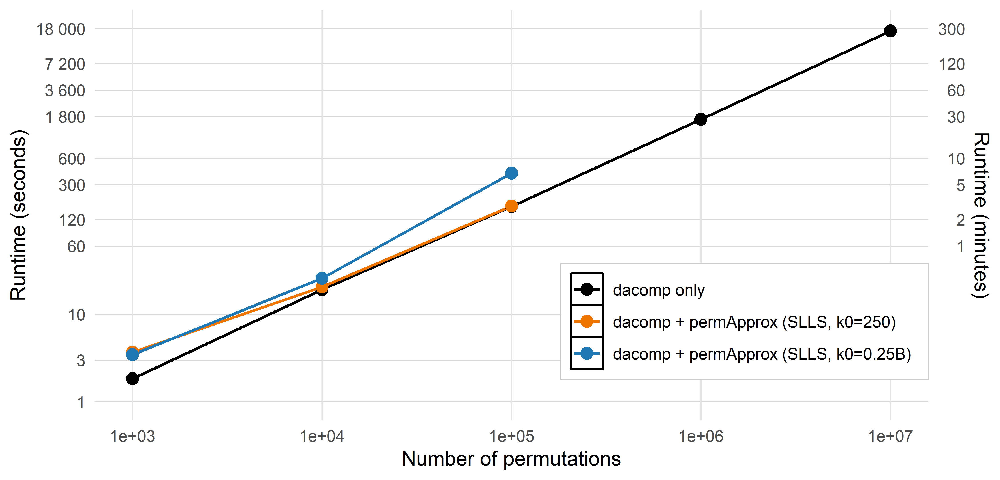

Runtime comparison: dacomp vs dacomp + permApprox
================
Compiled at 2026-02-02 17:48:26 UTC

``` r
here::i_am(paste0(params$name, ".Rmd"), uuid = "fa8ffc8b-3c10-4a20-ac8d-56f5f6784817")
```

This notebook benchmarks runtime for:

1.  **dacomp only** (permutation testing + DS-FDR),

2.  **dacomp + permApprox** (adds tail approximation on top of dacomp’s
    permutation statistics),

    - permApprox constrained GPD with **SLLS** constraint and **exceed0
      = 250**
    - permApprox constrained GPD with **SLLS** constraint and **exceed0
      = 0.25** (run only for 1e3 and 1e4)

For the combined methods, we report **total runtime = dacomp runtime +
permApprox runtime**, using the same permutation statistics matrix
returned by dacomp.

## CPU info

## Packages

    ## [conflicted] Will prefer dplyr::count over any other package.
    ## [conflicted] Will prefer dplyr::filter over any other package.
    ## [conflicted] Will prefer dplyr::select over any other package.
    ## [conflicted] Will prefer dplyr::slice over any other package.
    ## [conflicted] Will prefer stats::var over any other package.

## Directories & data

    ## Warning in path_source("PASTURE_data", "bact_2m_genus.rds"): PASTURE_data is not previous to 03_micro_diff_abund_runtime

## Minimal preprocessing

    ## [1] 697 118

    ## y_groups
    ## non-EBF     EBF 
    ##     212     485

## Reference selection (dacomp)

    ## [1] 93

## Runtime benchmarking

### Helper functions

### Measure runtimes

    ## # A tibble: 11 × 5
    ##    line                                 method              setting               n_perm elapsed_s_total
    ##    <chr>                                <chr>               <chr>                  <dbl>           <dbl>
    ##  1 dacomp only                          dacomp              dacomp                  1000            1.84
    ##  2 dacomp only                          dacomp              dacomp                 10000           19.1 
    ##  3 dacomp only                          dacomp              dacomp                100000          169.  
    ##  4 dacomp only                          dacomp              dacomp               1000000         1663.  
    ##  5 dacomp + permApprox (SLLS, k0=250)   dacomp + permApprox SLLS, exceed0 = 250     1000            3.69
    ##  6 dacomp + permApprox (SLLS, k0=250)   dacomp + permApprox SLLS, exceed0 = 250    10000           20.5 
    ##  7 dacomp + permApprox (SLLS, k0=250)   dacomp + permApprox SLLS, exceed0 = 250   100000          171.  
    ##  8 dacomp + permApprox (SLLS, k0=250)   dacomp + permApprox SLLS, exceed0 = 250  1000000         1669.  
    ##  9 dacomp + permApprox (SLLS, k0=0.25B) dacomp + permApprox SLLS, exceed0 = 0.25    1000            3.46
    ## 10 dacomp + permApprox (SLLS, k0=0.25B) dacomp + permApprox SLLS, exceed0 = 0.25   10000           25.7 
    ## 11 dacomp + permApprox (SLLS, k0=0.25B) dacomp + permApprox SLLS, exceed0 = 0.25  100000          407.

## Add 1e07

We add from another script the 1e07 permutations case.

    ## # A tibble: 5 × 2
    ##    nr_perm  elapsed
    ##      <dbl>    <dbl>
    ## 1     1000     1.84
    ## 2    10000    16.6 
    ## 3   100000   151.  
    ## 4  1000000  1650.  
    ## 5 10000000 16984.

| line                                 | n_perm | elapsed_s | elapsed_min | elapsed_h |
|:-------------------------------------|-------:|----------:|------------:|----------:|
| dacomp only                          |  1e+03 |      1.84 |        0.03 |     0.001 |
| dacomp only                          |  1e+04 |     19.06 |        0.32 |     0.005 |
| dacomp only                          |  1e+05 |    169.21 |        2.82 |     0.047 |
| dacomp only                          |  1e+06 |   1663.48 |       27.72 |     0.462 |
| dacomp only                          |  1e+07 |  16984.33 |      283.07 |     4.718 |
| dacomp + permApprox (SLLS, k0=250)   |  1e+03 |      3.69 |        0.06 |     0.001 |
| dacomp + permApprox (SLLS, k0=250)   |  1e+04 |     20.51 |        0.34 |     0.006 |
| dacomp + permApprox (SLLS, k0=250)   |  1e+05 |    171.43 |        2.86 |     0.048 |
| dacomp + permApprox (SLLS, k0=0.25B) |  1e+03 |      3.46 |        0.06 |     0.001 |
| dacomp + permApprox (SLLS, k0=0.25B) |  1e+04 |     25.67 |        0.43 |     0.007 |
| dacomp + permApprox (SLLS, k0=0.25B) |  1e+05 |    407.11 |        6.79 |     0.113 |

## Plot

    ## # A tibble: 11 × 5
    ##    line                                   n_perm elapsed_s elapsed_min elapsed_h
    ##    <fct>                                   <dbl>     <dbl>       <dbl>     <dbl>
    ##  1 dacomp only                              1000      1.84        0.03     0.001
    ##  2 dacomp only                             10000     19.1         0.32     0.005
    ##  3 dacomp only                            100000    169.          2.82     0.047
    ##  4 dacomp only                           1000000   1663.         27.7      0.462
    ##  5 dacomp only                          10000000  16984.        283.       4.72 
    ##  6 dacomp + permApprox (SLLS, k0=250)       1000      3.69        0.06     0.001
    ##  7 dacomp + permApprox (SLLS, k0=250)      10000     20.5         0.34     0.006
    ##  8 dacomp + permApprox (SLLS, k0=250)     100000    171.          2.86     0.048
    ##  9 dacomp + permApprox (SLLS, k0=0.25B)     1000      3.46        0.06     0.001
    ## 10 dacomp + permApprox (SLLS, k0=0.25B)    10000     25.7         0.43     0.007
    ## 11 dacomp + permApprox (SLLS, k0=0.25B)   100000    407.          6.79     0.113

    ## Warning: The `trans` argument of `sec_axis()` is deprecated as of ggplot2 3.5.0.
    ## ℹ Please use the `transform` argument instead.
    ## This warning is displayed once every 8 hours.
    ## Call `lifecycle::last_lifecycle_warnings()` to see where this warning was generated.

<!-- -->
