Two-sample t-test - Try different epsilon factors
================
Compiled at 2026-02-02 19:00:51 UTC

``` r
here::i_am(paste0(params$name, ".Rmd"), uuid = "8e44924a-ef1f-49be-8525-758bc60311e2")
```

In **permApprox**, permutation $p$-values are obtained by fitting a GPD
to the tail of permutation test statistics. When the fitted shape is
negative ($\hat\xi<0$), the GPD has a finite upper support. To **avoid
zero or overly small $p$-values**, we impose the constraint that the
**evaluation point** lies inside the support by requiring

$$
t_{\text{obs}}+\varepsilon \;<\; s_{\text{GPD}},
$$

where $\varepsilon>0$ is a small, data-dependent buffer.

In this script we compare the **unconstrained fit** (no $\varepsilon$,
baseline) to **constrained GPD fitting** with
$\varepsilon = c\,|t_{\text{obs}}|$ (fixed factor benchmark).

We also examine **where** to apply the constraint in a multiple-testing
setting: (a) **per-test** (each statistic gets its own constraint)
versus (b) **global** (constraint with respect to the **maximum**
observed statistic).

## Data Simulation

We simulate two groups from normal distributions with increasing effect
sizes (difference in means).

The parameters are set as follows:

- Sample size per group: 100  
- Number of tests: 1000  
- Effect sizes (difference in mean): 0 0.5 1 1.5 2  
- Standard deviation: 1  
- Tests per effect size: d=0: 200, d=0.5: 200, d=1: 200, d=1.5: 200,
  d=2: 200

The observed $t$-statistic is calculated as

$$
t_{\text{obs}} = \frac{\bar{x}_1 - \bar{x}_2}
{\sqrt{\frac{s_1^2 + s_2^2}{n}}}
$$

where  
- $\bar{x}_1$ and $\bar{x}_2$ are the sample means,  
- $s_1^2$ and $s_2^2$ are the sample variances, and  
- $n$ is the sample size in each group.

## Histograms

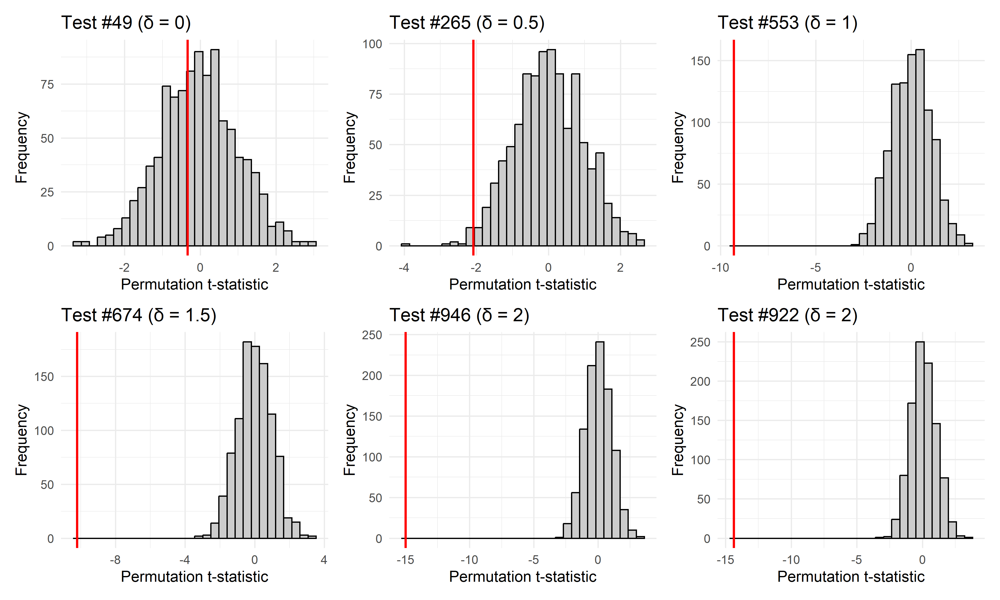<!-- -->

## Unconstrained GPD fit

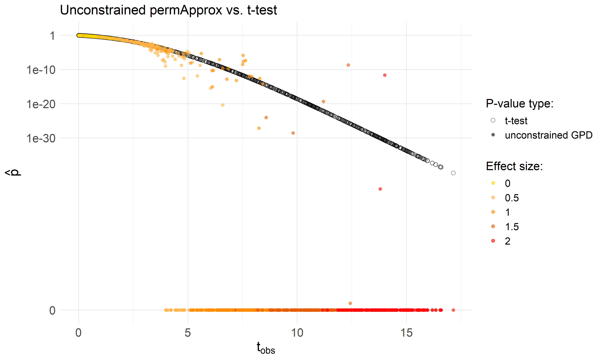<!-- -->

| idx | effect_size | obs_stats |   p_ttest | gpd_fit | p_unconstr |      shape |
|----:|:------------|----------:|----------:|:--------|-----------:|-----------:|
| 300 | 0.5         | 3.7533163 | 0.0002293 | TRUE    |  0.0001408 | -0.1848526 |
| 301 | 0.5         | 4.1351419 | 0.0000524 | TRUE    |  0.0000496 | -0.1644548 |
| 302 | 0.5         | 4.9909915 | 0.0000013 | TRUE    |  0.0000192 | -0.0650841 |
| 303 | 0.5         | 3.0784449 | 0.0023759 | TRUE    |  0.0017345 | -0.1107638 |
| 304 | 0.5         | 1.4951842 | 0.1364585 | TRUE    |  0.1340248 | -0.1809155 |
| 305 | 0.5         | 3.5864134 | 0.0004224 | TRUE    |  0.0005104 | -0.1613838 |
| 306 | 0.5         | 4.6445023 | 0.0000062 | TRUE    |  0.0000000 | -0.1774438 |
| 307 | 0.5         | 0.2154756 | 0.8296183 | FALSE   |  0.8101898 |  0.0000000 |
| 308 | 0.5         | 2.9500086 | 0.0035606 | TRUE    |  0.0027036 | -0.2237050 |
| 309 | 0.5         | 2.5341117 | 0.0120474 | TRUE    |  0.0096823 | -0.2188208 |
| 310 | 0.5         | 3.7957526 | 0.0001956 | TRUE    |  0.0000324 | -0.1725565 |
| 311 | 0.5         | 3.5819102 | 0.0004293 | TRUE    |  0.0001331 | -0.2036677 |
| 312 | 0.5         | 3.2893016 | 0.0011887 | TRUE    |  0.0006839 | -0.2058972 |
| 313 | 0.5         | 4.4642714 | 0.0000135 | TRUE    |  0.0000000 | -0.1959784 |
| 314 | 0.5         | 5.2082674 | 0.0000005 | TRUE    |  0.0000000 | -0.1167138 |
| 315 | 0.5         | 2.4370665 | 0.0156905 | TRUE    |  0.0160453 | -0.2154500 |
| 316 | 0.5         | 5.4358728 | 0.0000002 | TRUE    |  0.0000000 | -0.1285336 |
| 317 | 0.5         | 5.6778130 | 0.0000000 | TRUE    |  0.0000000 | -0.2108514 |
| 318 | 0.5         | 2.0162890 | 0.0451209 | TRUE    |  0.0495496 | -0.1775710 |
| 319 | 0.5         | 3.6052458 | 0.0003946 | TRUE    |  0.0002843 | -0.1458075 |
| 320 | 0.5         | 4.0887983 | 0.0000630 | TRUE    |  0.0000000 | -0.2056131 |
| 321 | 0.5         | 4.2149780 | 0.0000380 | TRUE    |  0.0000000 | -0.1936030 |
| 322 | 0.5         | 3.3656875 | 0.0009170 | TRUE    |  0.0031373 | -0.0293440 |
| 323 | 0.5         | 3.5111907 | 0.0005524 | TRUE    |  0.0000074 | -0.2533532 |
| 324 | 0.5         | 3.4034374 | 0.0008053 | TRUE    |  0.0011295 | -0.1433343 |
| 325 | 0.5         | 2.9633605 | 0.0034161 | TRUE    |  0.0037587 | -0.2253980 |
| 326 | 0.5         | 1.3237714 | 0.1871053 | TRUE    |  0.1824870 | -0.1306216 |
| 327 | 0.5         | 4.1130458 | 0.0000572 | TRUE    |  0.0000050 | -0.1735330 |
| 328 | 0.5         | 1.7795358 | 0.0766859 | TRUE    |  0.0786844 | -0.2079360 |
| 329 | 0.5         | 4.8387069 | 0.0000026 | TRUE    |  0.0000004 | -0.1458427 |
| 330 | 0.5         | 4.2464541 | 0.0000334 | TRUE    |  0.0000202 | -0.1577826 |

As expected, the unconstraint fit may lead to zero p-values if the
fitted GPD shape parameter is negative.

## Constrained GPD fit (vary eps-factor)

We now fit with the constraint that $t_{obs} + \varepsilon$ must lie in
the GPD support, where $\varepsilon = \varepsilon_{fact}*t_{obs}$.

The epsilon factor $\varepsilon_{fact}$ is varied from 0 to 0.5.

### Epsilon = 0

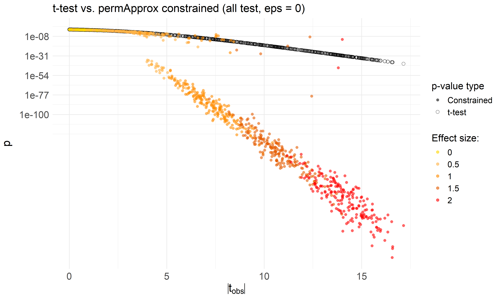<!-- -->

With the constrained fitting but without an epsilon (i.e.,
$\varepsilon = 0$), the approximated p-values are far too small.

### Positive epsilon

    ## 
    ## eps= 0.001 : 2.921777e-99

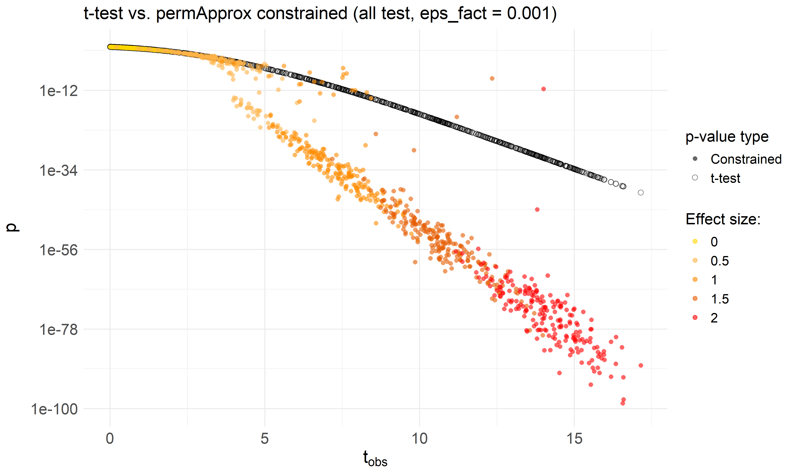<!-- -->

    ## 
    ## eps= 0.01 : 4.631119e-67

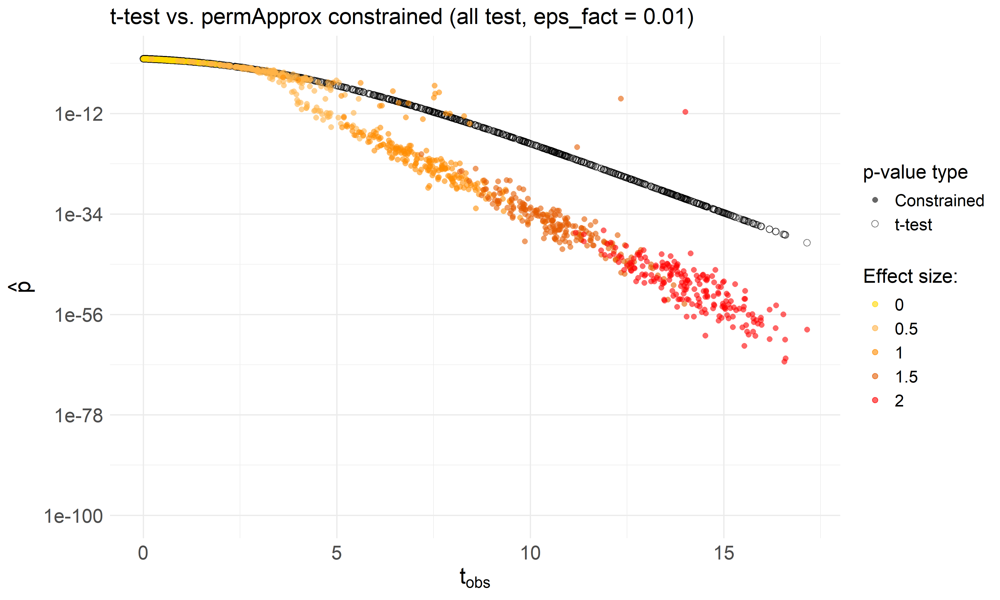<!-- -->

    ## 
    ## eps= 0.1 : 2.167327e-38

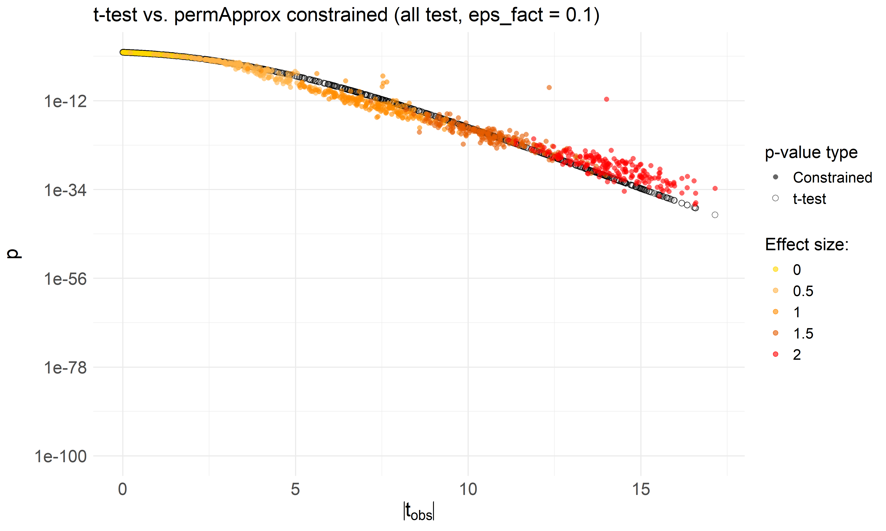<!-- -->

    ## 
    ## eps= 0.2 : 1.379949e-31

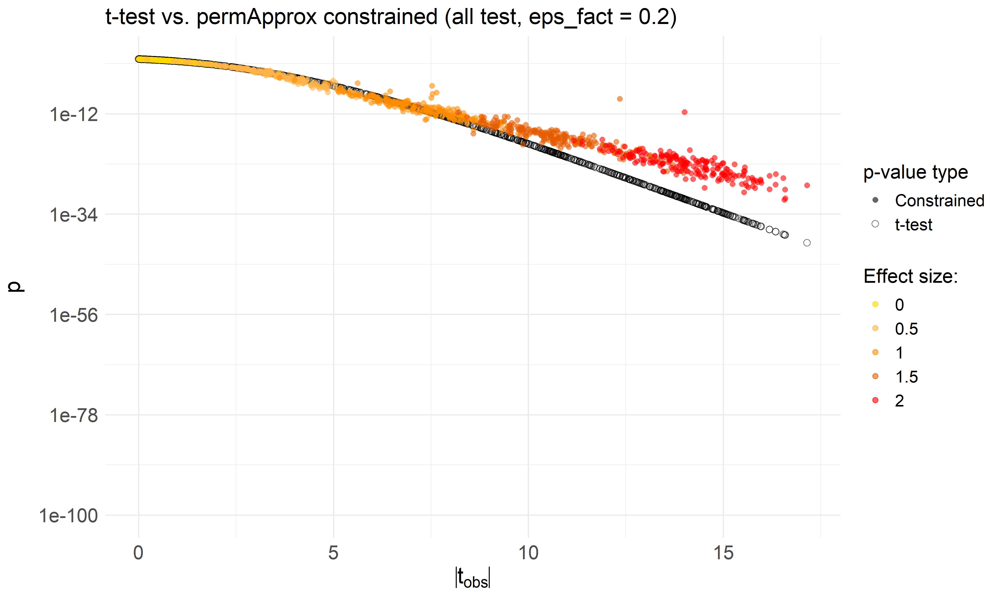<!-- -->

    ## 
    ## eps= 0.3 : 3.247757e-28

<!-- -->

    ## 
    ## eps= 0.4 : 4.01741e-26

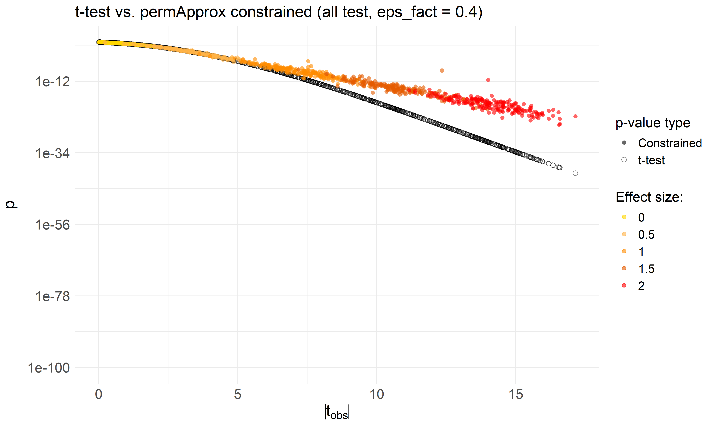<!-- -->

    ## 
    ## eps= 0.5 : 1.124893e-24

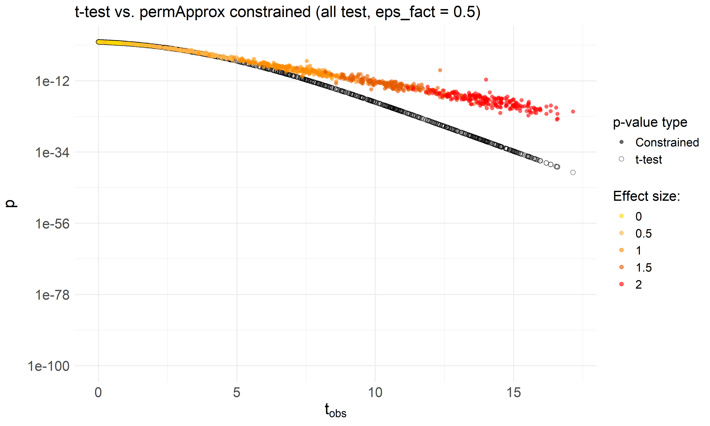<!-- -->

An epsilon factor of 0.1 would be a good choice for this setting.

## Constrained GPD fit (max only)

To be more conservative, we here apply the constraint to the maximum
test statistic only.

    ## 
    ## eps= 0 : 1.780619e-231

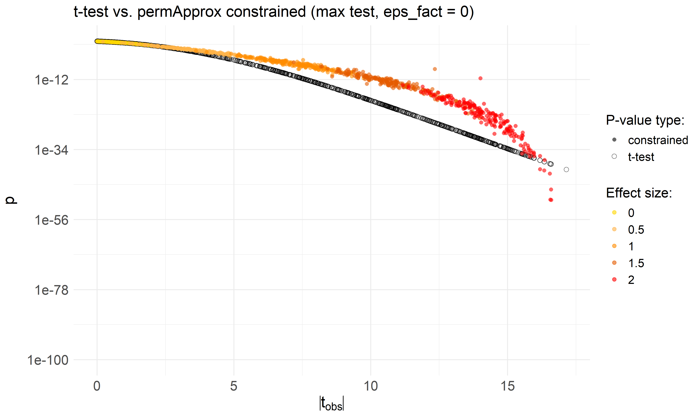<!-- -->

    ## 
    ## eps= 0.001 : 8.69105e-89

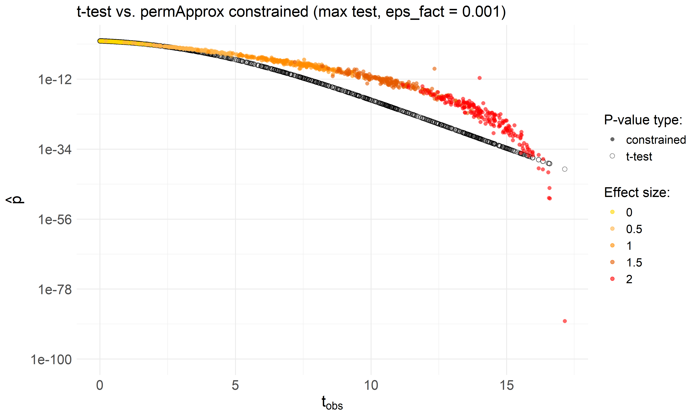<!-- -->

    ## 
    ## eps= 0.01 : 4.743073e-60

<!-- -->

    ## 
    ## eps= 0.1 : 2.948105e-35

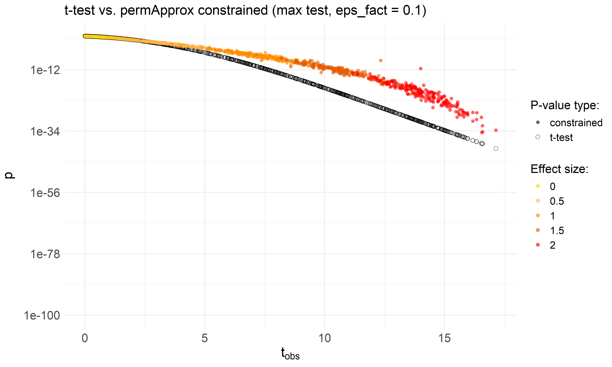<!-- -->

    ## 
    ## eps= 0.2 : 3.61076e-30

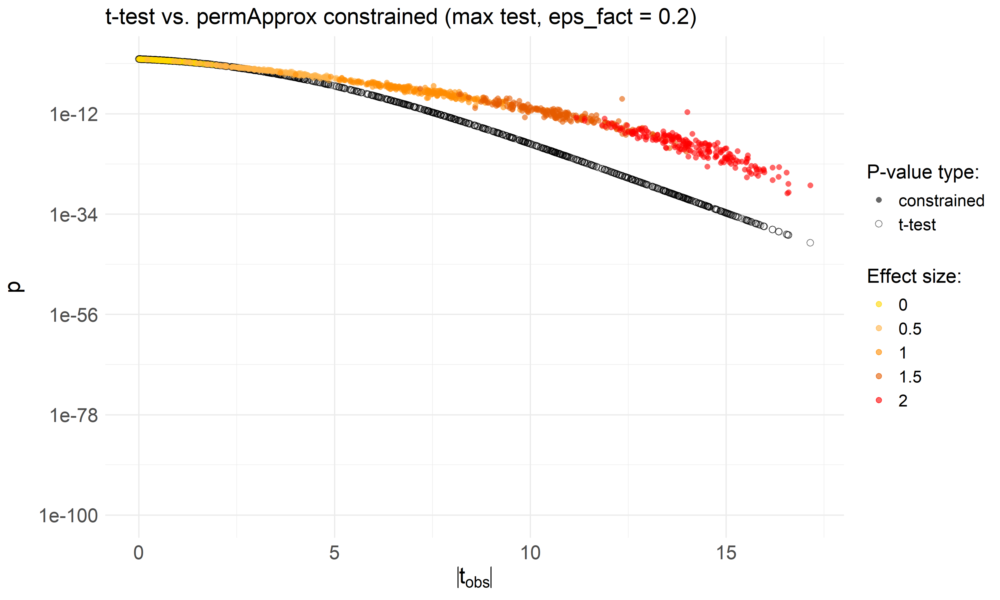<!-- -->

    ## 
    ## eps= 0.3 : 2.268986e-27

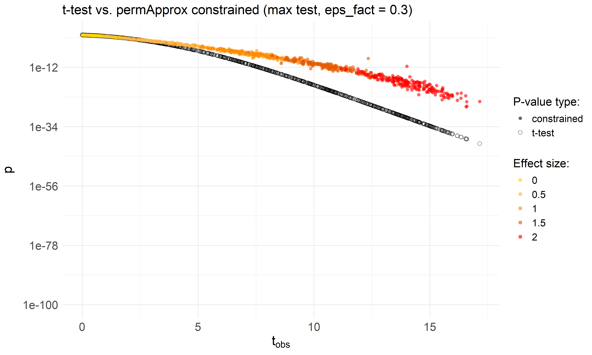<!-- -->

    ## 
    ## eps= 0.4 : 1.492731e-25

<!-- -->

    ## 
    ## eps= 0.5 : 2.920449e-24

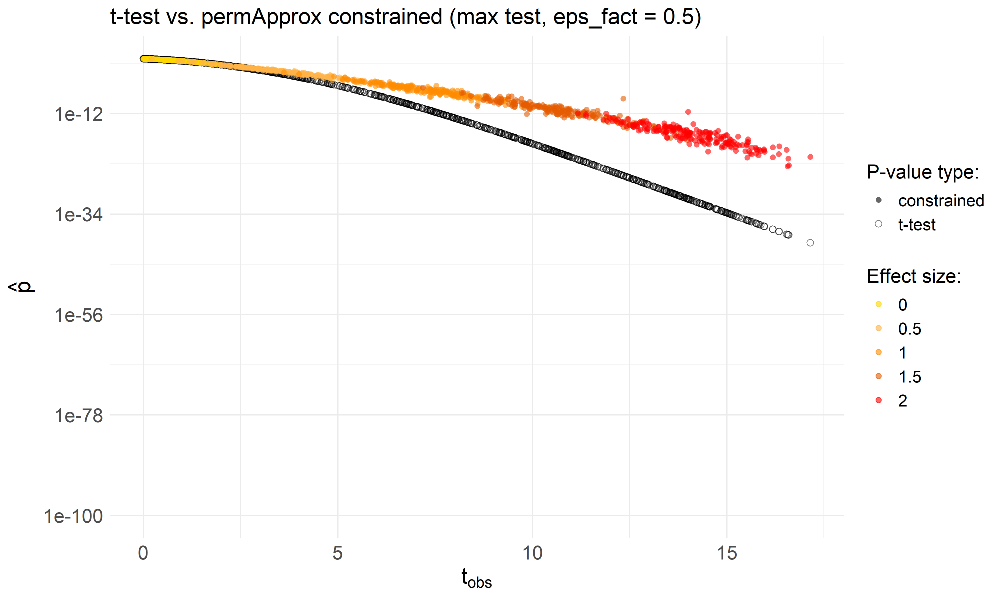<!-- -->

Applying the constraint to the maximum test statistic only seems to be
conservative across all epsilon factors. We will have to find out how
this approach performs for different sample sizes.

## Unconstrained vs. constrained p-values

We now compare the unconstrained p-values with the constrained ones for
eps_fact = 0.1 to see if we could imply the optimal epsilon from the
unconstrained p-values.

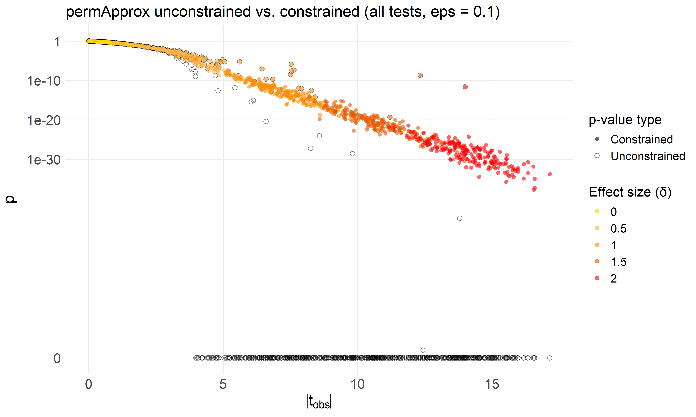<!-- -->

## Unconstrained vs. constrained p-values (non-zeros only)

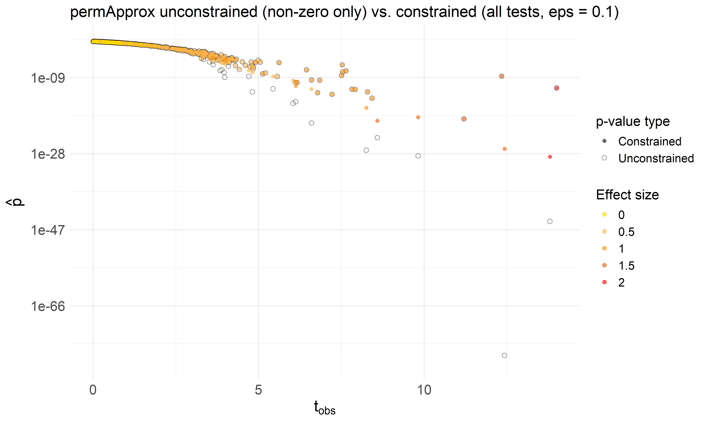<!-- -->

It would be difficult to find the optimal epsilon by comparing
unconstrained and constrained p-values as the unconstraint p-values have
a much higher variation than the ones fitted with constraint.

## Constraint needed vs. not needed

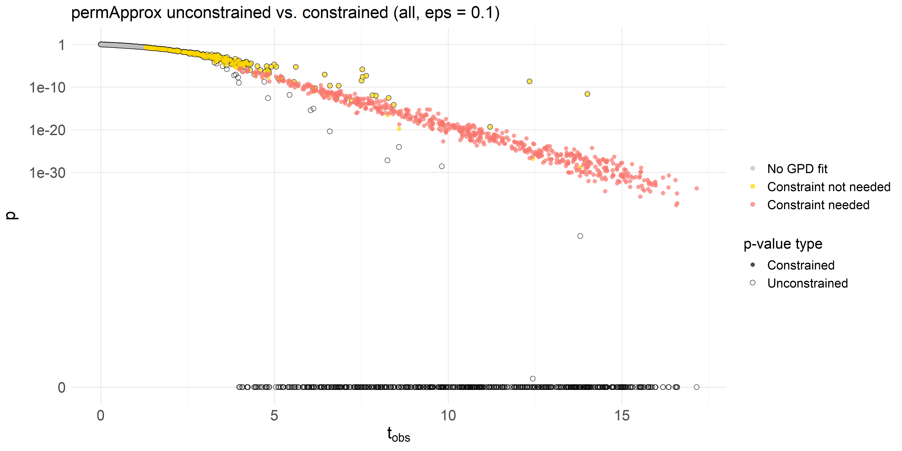<!-- -->

In the next script, we will apply different epsilon rules to simulated
data of various sample sizes. Our goal is to find an epsilon rule
applicable to all types of test statistics and works well across
different sample sizes.

## Files written

These files have been written to the target directory,
`data/02_eps_trials`:

    ## # A tibble: 20 × 4
    ##    path                               type         size modification_time  
    ##    <fs::path>                         <fct> <fs::bytes> <dttm>             
    ##  1 obs_t_stats_n100.rds               file        7.54K 2025-08-01 17:13:48
    ##  2 permapprox_constr_all_eps0.001.rds file      816.09K 2025-10-31 09:43:30
    ##  3 permapprox_constr_all_eps0.01.rds  file      815.82K 2025-10-31 09:44:28
    ##  4 permapprox_constr_all_eps0.1.rds   file      815.58K 2025-10-31 09:45:26
    ##  5 permapprox_constr_all_eps0.2.rds   file      815.63K 2025-10-31 09:46:24
    ##  6 permapprox_constr_all_eps0.3.rds   file      815.53K 2025-10-31 09:47:23
    ##  7 permapprox_constr_all_eps0.4.rds   file      815.44K 2025-10-31 09:48:22
    ##  8 permapprox_constr_all_eps0.5.rds   file      815.37K 2025-10-31 09:49:21
    ##  9 permapprox_constr_all_eps0.rds     file      810.07K 2025-10-31 09:42:32
    ## 10 permapprox_constr_max_eps0.001.rds file       815.5K 2025-11-02 11:20:58
    ## 11 permapprox_constr_max_eps0.01.rds  file      815.52K 2025-11-02 11:21:57
    ## 12 permapprox_constr_max_eps0.1.rds   file      815.34K 2025-11-02 11:22:57
    ## 13 permapprox_constr_max_eps0.2.rds   file      815.52K 2025-11-02 11:23:56
    ## 14 permapprox_constr_max_eps0.3.rds   file      815.38K 2025-11-02 11:24:57
    ## 15 permapprox_constr_max_eps0.4.rds   file      815.45K 2025-11-02 11:25:57
    ## 16 permapprox_constr_max_eps0.5.rds   file       815.4K 2025-11-02 11:26:56
    ## 17 permapprox_constr_max_eps0.rds     file      809.22K 2025-11-02 11:19:59
    ## 18 permapprox_unconstr.rds            file      796.15K 2025-10-31 09:39:56
    ## 19 perm_t_stats_n100.rds              file        7.32M 2025-08-05 07:19:59
    ## 20 pval_ttest_n100.rds                file        7.72K 2025-08-01 17:13:49
