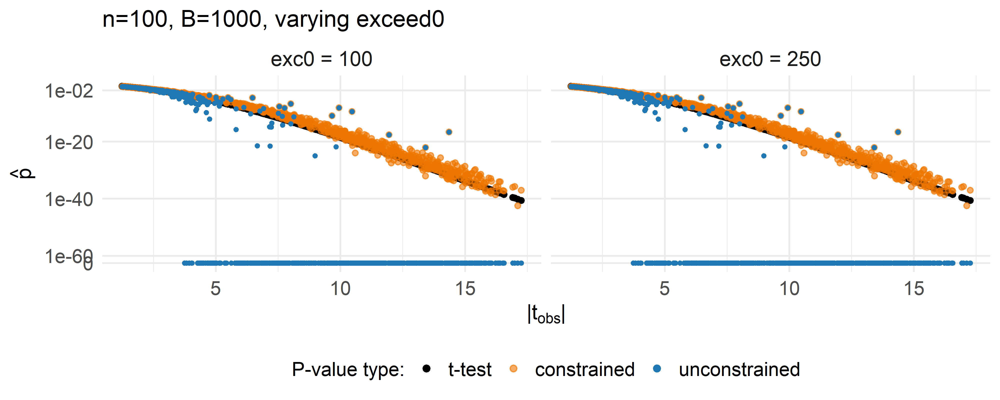
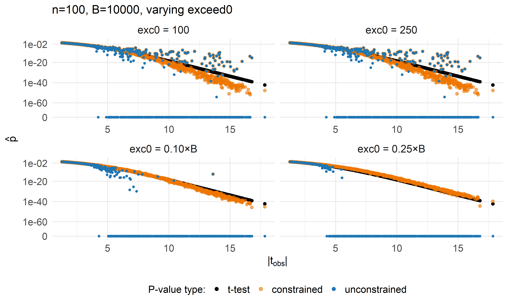
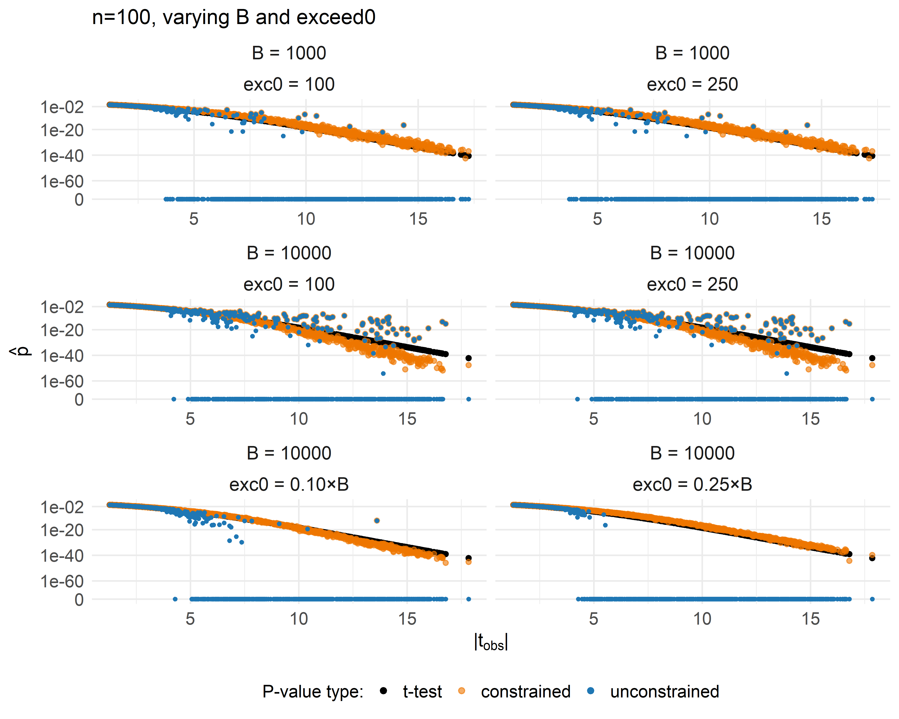
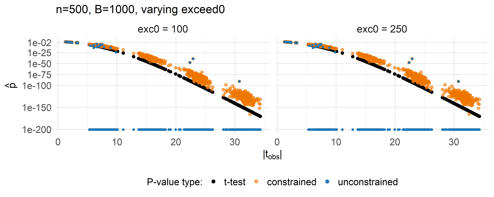
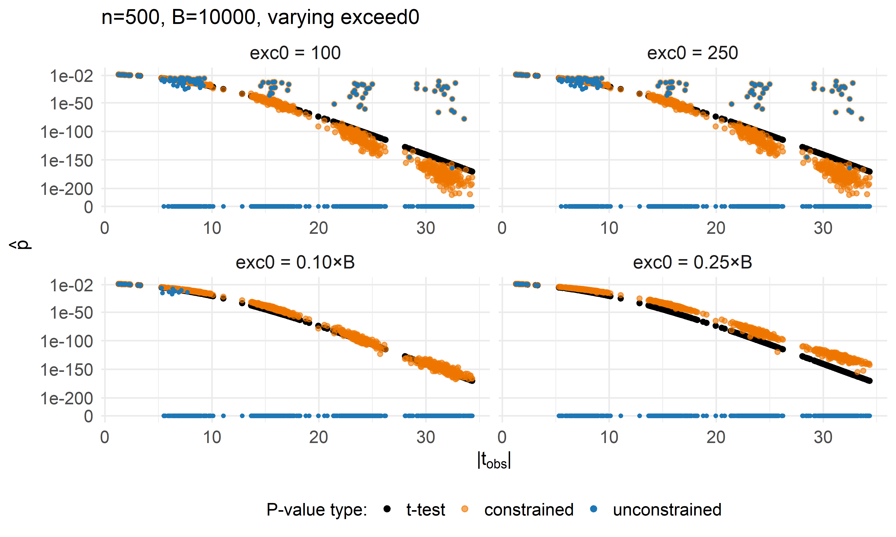
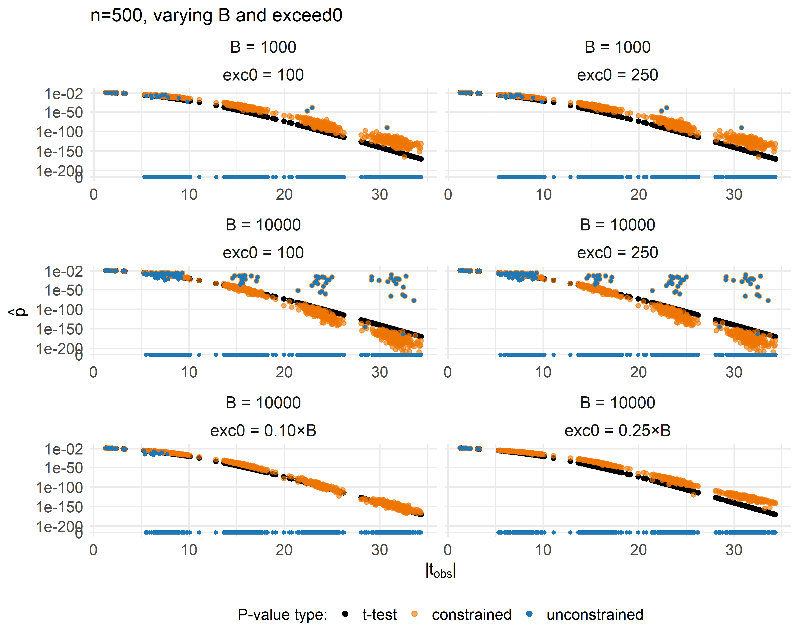

Two-sample t-test - Exceedances & Permutations (SLLS vs. unconstrained)
================
Compiled at 2025-12-19 11:29:02 UTC

In this script we extend the exceedance study to **iterate over the
number of permutations** `B` *and* the starting exceedances `exceed0`.
We compare **unconstrained** vs. **constrained (SLLS rule)** GPD fits
against the **Student’s t-test**.

# Design

    ## # A tibble: 16 × 3
    ##    n_per_group     B exceed0
    ##          <dbl> <dbl>   <dbl>
    ##  1         100  1000  100   
    ##  2         100  1000  250   
    ##  3         100  1000    0.25
    ##  4         100  1000    0.1 
    ##  5         100 10000  100   
    ##  6         100 10000  250   
    ##  7         100 10000    0.25
    ##  8         100 10000    0.1 
    ##  9         500  1000  100   
    ## 10         500  1000  250   
    ## 11         500  1000    0.25
    ## 12         500  1000    0.1 
    ## 13         500 10000  100   
    ## 14         500 10000  250   
    ## 15         500 10000    0.25
    ## 16         500 10000    0.1

> Notes:
>
> - If `exceed0 < 1`, we treat it as a **proportion of B** (e.g.,
>   `0.25 → ceiling(0.25*B)`); otherwise it’s used as a fixed integer.
> - We never trim the tail to fewer exceedances than requested if the
>   observed statistic already sits in the tail (honoring your earlier
>   preference).

# Simulation (once per $n, B$)

# Helpers for filenames & exceed0 handling

# permApprox runs

We compute both **unconstrained** and **constrained (SLLS)** $p$-values
for every scenario. All results are saved per-scenario and then
**combined safely** afterward.

# Safe combination of results

    ## Rows: 16,000
    ## Columns: 14
    ## $ idx             <int> 1, 2, 3, 4, 5, 6, 7, 8, 9, 10, 11, 12, 13, 14, 15, 16, 17, 18, 19, 20, 21, 22, 23, 24, 25, 26, 27, 28, 29, 30, 31,…
    ## $ n_per_group     <dbl> 100, 100, 100, 100, 100, 100, 100, 100, 100, 100, 100, 100, 100, 100, 100, 100, 100, 100, 100, 100, 100, 100, 100,…
    ## $ B               <dbl> 1000, 1000, 1000, 1000, 1000, 1000, 1000, 1000, 1000, 1000, 1000, 1000, 1000, 1000, 1000, 1000, 1000, 1000, 1000, …
    ## $ exceed0         <dbl> 100, 100, 100, 100, 100, 100, 100, 100, 100, 100, 100, 100, 100, 100, 100, 100, 100, 100, 100, 100, 100, 100, 100,…
    ## $ effect_size     <fct> 0, 0, 0, 0, 0, 0, 0, 0, 0, 0, 0, 0, 0, 0, 0, 0, 0, 0, 0, 0, 0, 0, 0, 0, 0, 0, 0, 0, 0, 0, 0, 0, 0, 0, 0, 0, 0, 0, …
    ## $ obs_stats       <dbl> 1.77510602, 0.79146246, 0.28877193, 0.42159967, 0.19398409, 2.01015579, 1.35911850, 0.52324811, 0.43124734, 0.0930…
    ## $ p_ttest         <dbl> 0.07741668, 0.42962127, 0.77305801, 0.67377460, 0.84638721, 0.04577170, 0.17565509, 0.60138669, 0.66675769, 0.9259…
    ## $ p_unconstr      <dbl> 0.092977568, 0.446553447, 0.756243756, 0.675324675, 0.840159840, 0.055031637, 0.174130501, 0.595404595, 0.65634365…
    ## $ p_constr        <dbl> 0.090255794, 0.446553447, 0.756243756, 0.675324675, 0.840159840, 0.055031637, 0.173764313, 0.595404595, 0.65634365…
    ## $ method_constr   <chr> "gpd", "empirical", "empirical", "empirical", "empirical", "gpd", "gpd", "empirical", "empirical", "empirical", "g…
    ## $ method_unconstr <chr> "gpd", "empirical", "empirical", "empirical", "empirical", "gpd", "gpd", "empirical", "empirical", "empirical", "g…
    ## $ gpd_un_fit      <lgl> TRUE, FALSE, FALSE, FALSE, FALSE, TRUE, TRUE, FALSE, FALSE, FALSE, TRUE, FALSE, FALSE, FALSE, FALSE, FALSE, FALSE,…
    ## $ gpd_con_fit     <lgl> TRUE, FALSE, FALSE, FALSE, FALSE, TRUE, TRUE, FALSE, FALSE, FALSE, TRUE, FALSE, FALSE, FALSE, FALSE, FALSE, FALSE,…
    ## $ epsilon         <dbl> 3.886243, 0.000000, 0.000000, 0.000000, 0.000000, 3.768250, 3.749139, 0.000000, 0.000000, 0.000000, 3.633045, 0.00…

# Plotting

## n = 100

### n=100, B=1000, varying exceed0

<!-- -->

### n=100, B=10000, varying exceed0

<!-- -->

### n=100, varying B and exceed0

<!-- -->

## n = 500

### n=500, B=1000, varying exceed0

<!-- -->

### n=500, B=10000, varying exceed0

<!-- -->

### n=500, varying B and exceed0

<!-- -->

# Zero counts

| n_per_group |     B | exceed0 | zeros_ttest | zeros_unconstr | zeros_constr |
|------------:|------:|--------:|------------:|---------------:|-------------:|
|         100 |  1000 |    0.10 |           0 |            605 |            0 |
|         100 |  1000 |    0.25 |           0 |            605 |            0 |
|         100 |  1000 |  100.00 |           0 |            605 |            0 |
|         100 |  1000 |  250.00 |           0 |            605 |            0 |
|         100 | 10000 |    0.10 |           0 |            573 |            0 |
|         100 | 10000 |    0.25 |           0 |            622 |            0 |
|         100 | 10000 |  100.00 |           0 |            452 |            0 |
|         100 | 10000 |  250.00 |           0 |            452 |            0 |
|         500 |  1000 |    0.10 |           0 |            785 |            0 |
|         500 |  1000 |    0.25 |           0 |            785 |            0 |
|         500 |  1000 |  100.00 |           0 |            785 |            0 |
|         500 |  1000 |  250.00 |           0 |            785 |            0 |
|         500 | 10000 |    0.10 |           0 |            790 |            0 |
|         500 | 10000 |    0.25 |           0 |            800 |            0 |
|         500 | 10000 |  100.00 |           0 |            693 |            0 |
|         500 | 10000 |  250.00 |           0 |            693 |            0 |

# Files written

    ## # A tibble: 44 × 4
    ##    path                                       type         size modification_time  
    ##    <fs::path>                                 <fct> <fs::bytes> <dttm>             
    ##  1 obs_t_stats_n100_B1000.rds                 file        7.54K 2025-10-01 08:58:46
    ##  2 obs_t_stats_n100_B10000.rds                file        7.54K 2025-10-01 09:01:59
    ##  3 obs_t_stats_n500_B1000.rds                 file         7.5K 2025-10-01 09:02:42
    ##  4 obs_t_stats_n500_B10000.rds                file         7.5K 2025-10-01 09:08:41
    ##  5 permapprox_constr_n100_B10000_ex100.rds    file      960.88K 2025-11-04 10:38:09
    ##  6 permapprox_constr_n100_B10000_ex250.rds    file      960.87K 2025-11-04 10:38:09
    ##  7 permapprox_constr_n100_B10000_exp01000.rds file        3.12M 2025-11-04 10:38:09
    ##  8 permapprox_constr_n100_B10000_exp02500.rds file        7.49M 2025-11-04 10:38:09
    ##  9 permapprox_constr_n100_B1000_ex100.rds     file      829.75K 2025-11-04 10:38:09
    ## 10 permapprox_constr_n100_B1000_ex250.rds     file      829.74K 2025-11-04 10:38:34
    ## # ℹ 34 more rows

\`\`\`
