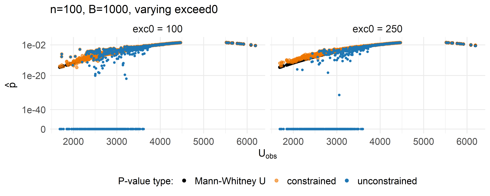
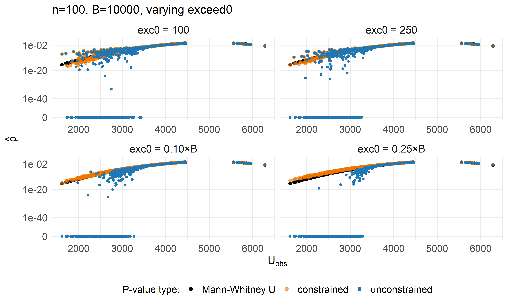
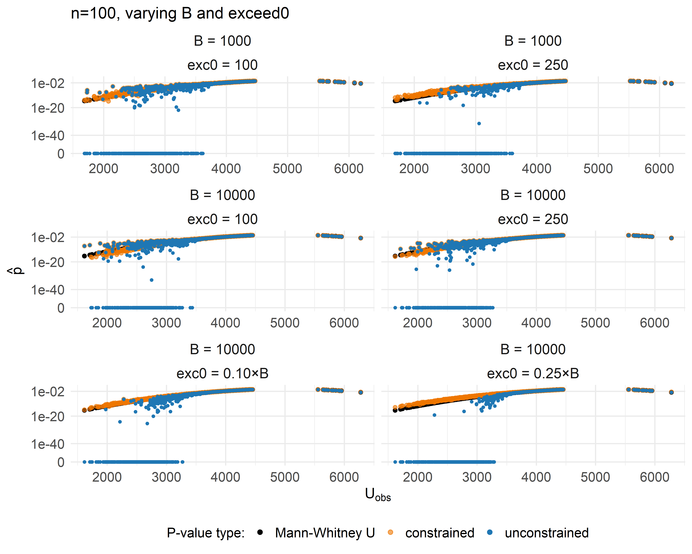
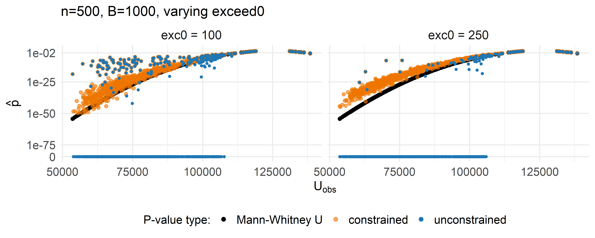
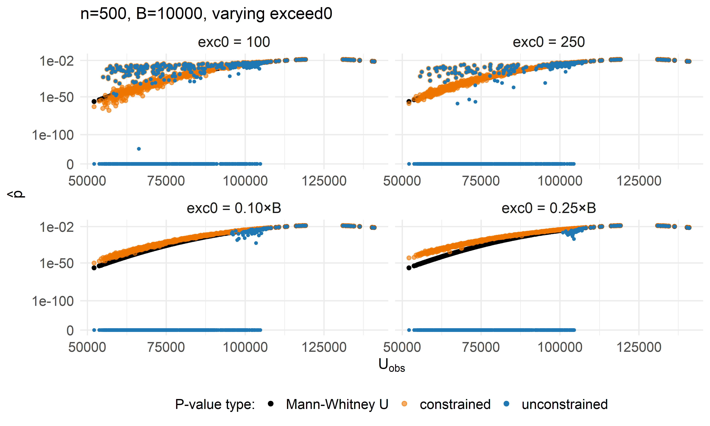
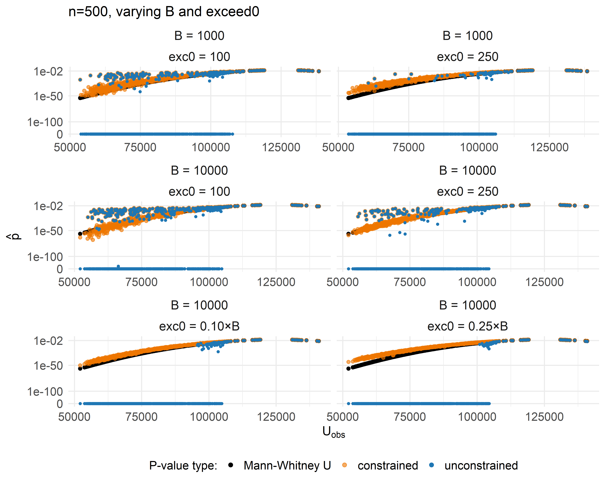

Mann–Whitney U - Exceedances & Permutations (SLLS vs. unconstrained)
================
Compiled at 2025-12-19 14:41:58 UTC

In this script we extend the exceedance study to **iterate over the
number of permutations** `B` *and* the starting exceedances `exceed0`.
We compare **unconstrained** vs. **constrained (SLLS rule)** GPD fits
against the **Mann–Whitney U** reference.

## Design

    ## # A tibble: 16 × 3
    ##    n_per_group     B exceed0
    ##          <dbl> <dbl>   <dbl>
    ##  1         100  1000  100   
    ##  2         100  1000  250   
    ##  3         100  1000    0.25
    ##  4         100  1000    0.1 
    ##  5         100 10000  100   
    ##  6         100 10000  250   
    ##  7         100 10000    0.25
    ##  8         100 10000    0.1 
    ##  9         500  1000  100   
    ## 10         500  1000  250   
    ## 11         500  1000    0.25
    ## 12         500  1000    0.1 
    ## 13         500 10000  100   
    ## 14         500 10000  250   
    ## 15         500 10000    0.25
    ## 16         500 10000    0.1

> Notes:
>
> - If `exceed0 < 1`, we treat it as a **proportion of B** (e.g.,
>   `0.25 → ceiling(0.25*B)`); otherwise it’s used as a fixed integer.
> - We never trim the tail to fewer exceedances than requested if the
>   observed statistic already sits in the tail.

## Simulation (once per $n, B$)

## Helpers for filenames & exceed0 handling

## permApprox runs

We compute both **unconstrained** and **constrained (SLLS)** $p$-values
for every scenario. All results are saved per-scenario and then
**combined safely** afterward.

## Safe combination of results

    ## Rows: 16,000
    ## Columns: 14
    ## $ idx             <int> 1, 2, 3, 4, 5, 6, 7, 8, 9, 10, 11, 12, 13, 14, 15, 16, 17, 18, 19, 20, 21, 22, 23, 24, 25, 26, 27, 28, 29, 30, 31, …
    ## $ n_per_group     <dbl> 100, 100, 100, 100, 100, 100, 100, 100, 100, 100, 100, 100, 100, 100, 100, 100, 100, 100, 100, 100, 100, 100, 100, …
    ## $ B               <dbl> 1000, 1000, 1000, 1000, 1000, 1000, 1000, 1000, 1000, 1000, 1000, 1000, 1000, 1000, 1000, 1000, 1000, 1000, 1000, 1…
    ## $ exceed0         <dbl> 100, 100, 100, 100, 100, 100, 100, 100, 100, 100, 100, 100, 100, 100, 100, 100, 100, 100, 100, 100, 100, 100, 100, …
    ## $ effect_size     <fct> 0, 0, 0, 0, 0, 0, 0, 0, 0, 0, 0, 0, 0, 0, 0, 0, 0, 0, 0, 0, 0, 0, 0, 0, 0, 0, 0, 0, 0, 0, 0, 0, 0, 0, 0, 0, 0, 0, 0…
    ## $ obs_stats       <dbl> 5774, 4466, 5308, 5574, 5322, 4516, 5452, 5214, 5443, 5079, 4821, 5053, 4913, 5138, 5453, 4719, 4909, 5193, 5351, 5…
    ## $ p_U_asympt      <dbl> 0.05859992, 0.19197129, 0.45171209, 0.16076443, 0.43141580, 0.23696762, 0.26941455, 0.60105413, 0.27906538, 0.84693…
    ## $ p_unconstr      <dbl> 0.05371292, 0.18727386, 0.45054945, 0.17815274, 0.41158841, 0.25074925, 0.24375624, 0.60539461, 0.28571429, 0.81918…
    ## $ p_constr        <dbl> 0.05203422, 0.18727386, 0.45054945, 0.17815274, 0.41158841, 0.25074925, 0.24375624, 0.60539461, 0.28571429, 0.81918…
    ## $ method_constr   <chr> "gpd", "gpd", "empirical", "gpd", "empirical", "empirical", "empirical", "empirical", "empirical", "empirical", "em…
    ## $ method_unconstr <chr> "gpd", "gpd", "empirical", "gpd", "empirical", "empirical", "empirical", "empirical", "empirical", "empirical", "em…
    ## $ gpd_un_fit      <lgl> TRUE, TRUE, FALSE, TRUE, FALSE, FALSE, FALSE, FALSE, FALSE, FALSE, FALSE, FALSE, FALSE, FALSE, FALSE, FALSE, FALSE,…
    ## $ gpd_con_fit     <lgl> TRUE, TRUE, FALSE, TRUE, FALSE, FALSE, FALSE, FALSE, FALSE, FALSE, FALSE, FALSE, FALSE, FALSE, FALSE, FALSE, FALSE,…
    ## $ epsilon         <dbl> 1368.391, 1461.166, 0.000, 1513.638, 0.000, 0.000, 0.000, 0.000, 0.000, 0.000, 0.000, 0.000, 0.000, 0.000, 0.000, 0…

## Plotting

### n = 100

#### n=100, B=1000, varying exceed0

<!-- -->

#### n=100, B=10000, varying exceed0

<!-- -->

#### n=100, varying B and exceed0

<!-- -->

### n = 500

#### n=500, B=1000, varying exceed0

<!-- -->

#### n=500, B=10000, varying exceed0

<!-- -->

#### n=500, varying B and exceed0

<!-- -->

## Zero counts

| n_per_group |     B | exceed0 | zeros_U_asympt | zeros_unconstr | zeros_constr |
|------------:|------:|--------:|---------------:|---------------:|-------------:|
|         100 |  1000 |    0.10 |              0 |            330 |            0 |
|         100 |  1000 |    0.25 |              0 |            416 |            0 |
|         100 |  1000 |  100.00 |              0 |            330 |            0 |
|         100 |  1000 |  250.00 |              0 |            416 |            0 |
|         100 | 10000 |    0.10 |              0 |            326 |            0 |
|         100 | 10000 |    0.25 |              0 |            426 |            0 |
|         100 | 10000 |  100.00 |              0 |            239 |            0 |
|         100 | 10000 |  250.00 |              0 |            236 |            0 |
|         500 |  1000 |    0.10 |              0 |            612 |            0 |
|         500 |  1000 |    0.25 |              0 |            735 |            0 |
|         500 |  1000 |  100.00 |              0 |            612 |            0 |
|         500 |  1000 |  250.00 |              0 |            735 |            0 |
|         500 | 10000 |    0.10 |              0 |            719 |            0 |
|         500 | 10000 |    0.25 |              0 |            758 |            0 |
|         500 | 10000 |  100.00 |              0 |            505 |            0 |
|         500 | 10000 |  250.00 |              0 |            586 |            0 |

## How often are the approximated p-values smaller?

| n | B_perm | exc0 | n_tests | \# smaller (unconstr) | \# smaller (constr) | % smaller (unconstr) | % smaller (constr) |
|---:|---:|---:|---:|---:|---:|:---|:---|
| 100 | 1000 | 0.10 | 1000 | 673 | 384 | 67.3% | 38.4% |
| 100 | 1000 | 0.25 | 1000 | 750 | 206 | 75.0% | 20.6% |
| 100 | 1000 | 100.00 | 1000 | 673 | 384 | 67.3% | 38.4% |
| 100 | 1000 | 250.00 | 1000 | 750 | 206 | 75.0% | 20.6% |
| 100 | 10000 | 0.10 | 1000 | 749 | 244 | 74.9% | 24.4% |
| 100 | 10000 | 0.25 | 1000 | 785 | 137 | 78.5% | 13.7% |
| 100 | 10000 | 100.00 | 1000 | 622 | 544 | 62.2% | 54.4% |
| 100 | 10000 | 250.00 | 1000 | 647 | 543 | 64.7% | 54.3% |
| 500 | 1000 | 0.10 | 1000 | 758 | 166 | 75.8% | 16.6% |
| 500 | 1000 | 0.25 | 1000 | 868 | 109 | 86.8% | 10.9% |
| 500 | 1000 | 100.00 | 1000 | 758 | 166 | 75.8% | 16.6% |
| 500 | 1000 | 250.00 | 1000 | 868 | 109 | 86.8% | 10.9% |
| 500 | 10000 | 0.10 | 1000 | 891 | 108 | 89.1% | 10.8% |
| 500 | 10000 | 0.25 | 1000 | 905 | 104 | 90.5% | 10.4% |
| 500 | 10000 | 100.00 | 1000 | 678 | 454 | 67.8% | 45.4% |
| 500 | 10000 | 250.00 | 1000 | 765 | 313 | 76.5% | 31.3% |

Counts and shares of approximated p-values smaller than Mann-Whitney U
p-values.

## Files written

    ## # A tibble: 44 × 4
    ##    path                                       type         size modification_time  
    ##    <fs::path>                                 <fct> <fs::bytes> <dttm>             
    ##  1 obs_U_stats_n100_B1000.rds                 file        2.42K 2025-10-02 05:19:12
    ##  2 obs_U_stats_n100_B10000.rds                file        2.42K 2025-10-02 05:20:11
    ##  3 obs_U_stats_n500_B1000.rds                 file        3.04K 2025-10-02 05:20:40
    ##  4 obs_U_stats_n500_B10000.rds                file        3.03K 2025-10-02 05:23:08
    ##  5 permapprox_constr_n100_B10000_ex100.rds    file      228.25K 2025-10-02 05:34:30
    ##  6 permapprox_constr_n100_B10000_ex250.rds    file      354.63K 2025-10-02 05:36:39
    ##  7 permapprox_constr_n100_B10000_exp01000.rds file      921.76K 2025-10-02 05:45:01
    ##  8 permapprox_constr_n100_B10000_exp02500.rds file        2.09M 2025-10-02 05:42:17
    ##  9 permapprox_constr_n100_B1000_ex100.rds     file      159.18K 2025-10-02 05:26:33
    ## 10 permapprox_constr_n100_B1000_ex250.rds     file      302.47K 2025-10-02 05:28:30
    ## # ℹ 34 more rows
