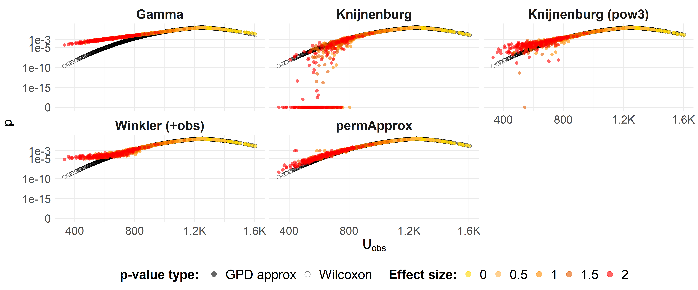
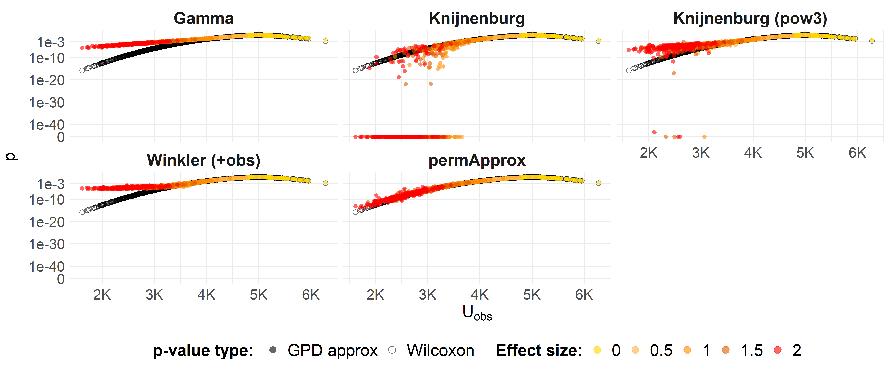
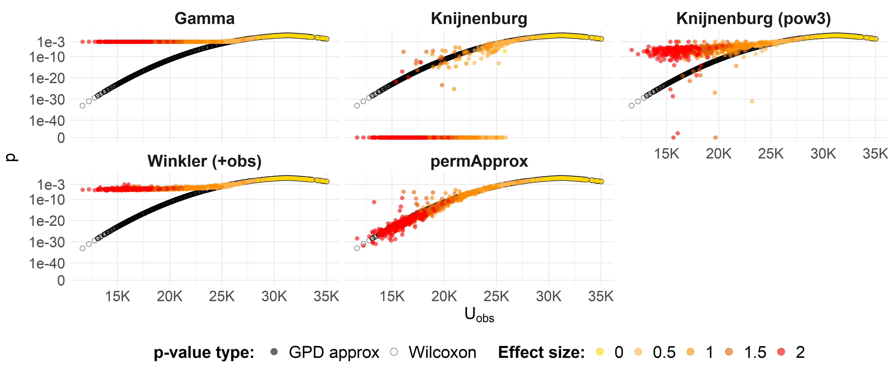
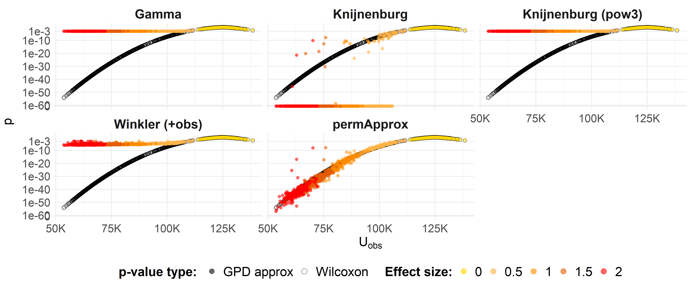
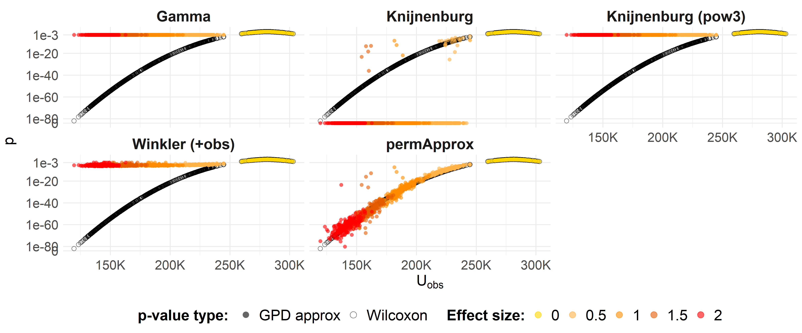
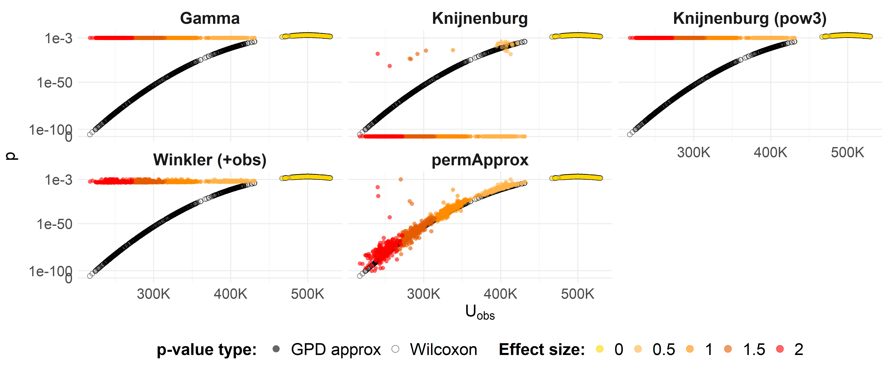
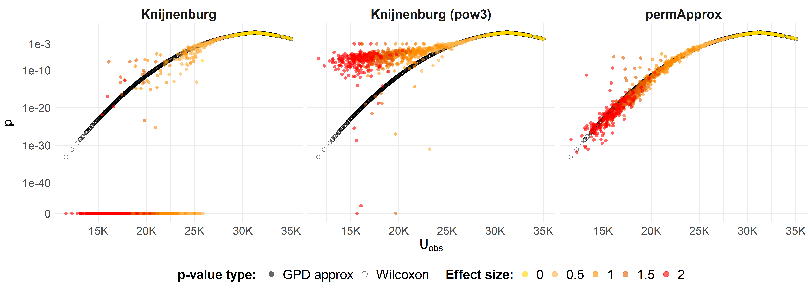
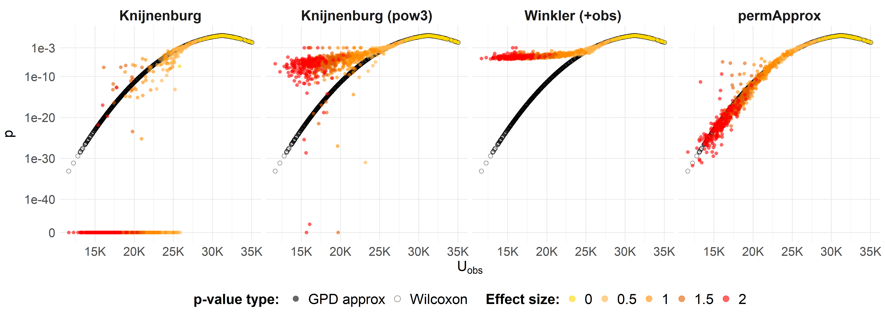

Wilcoxon (Mann–Whitney U) on exponential data — Compare p-value
approximation methods
================
Compiled at 2026-02-02 19:13:27 UTC

``` r
here::i_am(paste0(params$name, ".Rmd"), uuid = "8c251fa3-8abd-4ca9-bec7-dd848ebb5a2d")
```

## Packages & paths

## Load permApprox functions (+ SLLS)

## Global design

## Methods to compare

## Engines (compact)

## Compute and combine

## Rename methods

## Plot helper (log breaks) and plotter

## Plots

<!-- --><!-- --><!-- --><!-- --><!-- --><!-- -->

### n = 250

<!-- -->

### n = 250, three methods

<!-- -->

### n = 250, four methods

<!-- -->
