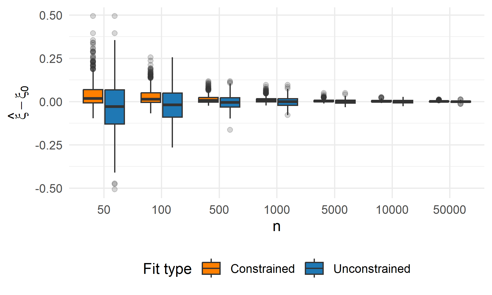
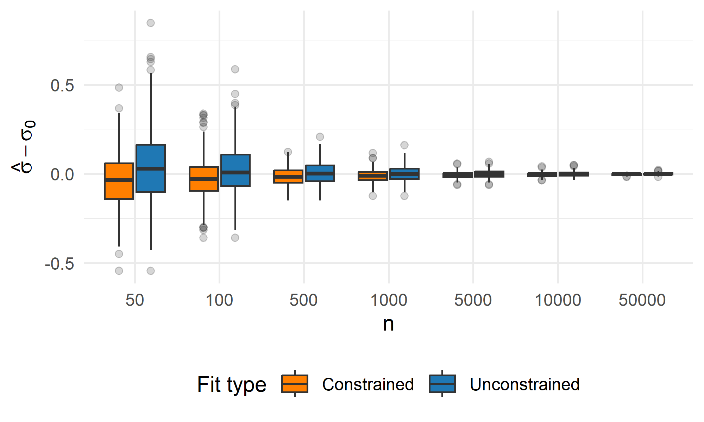
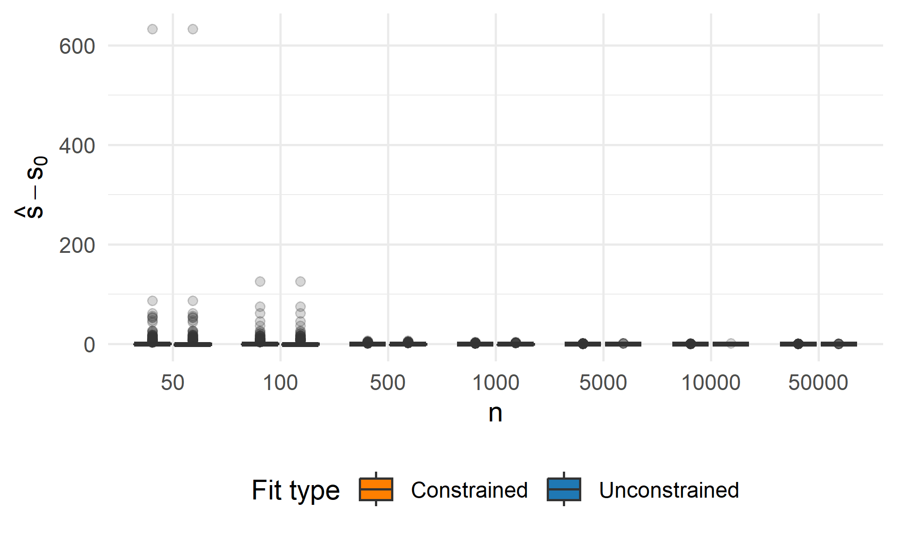
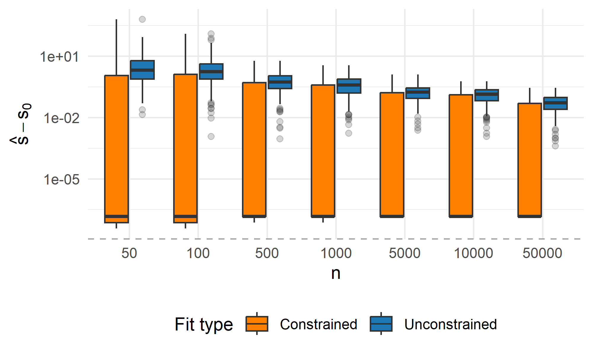
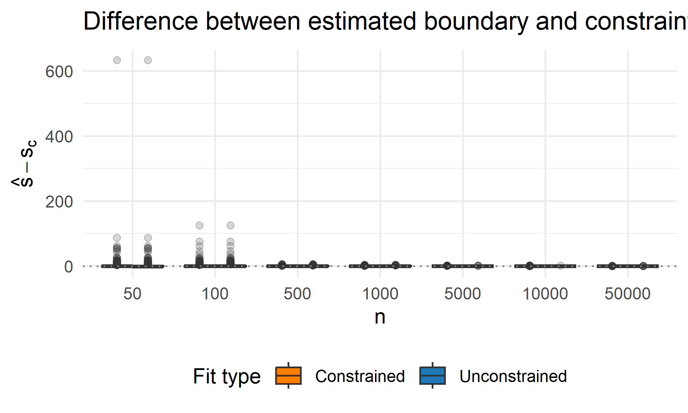
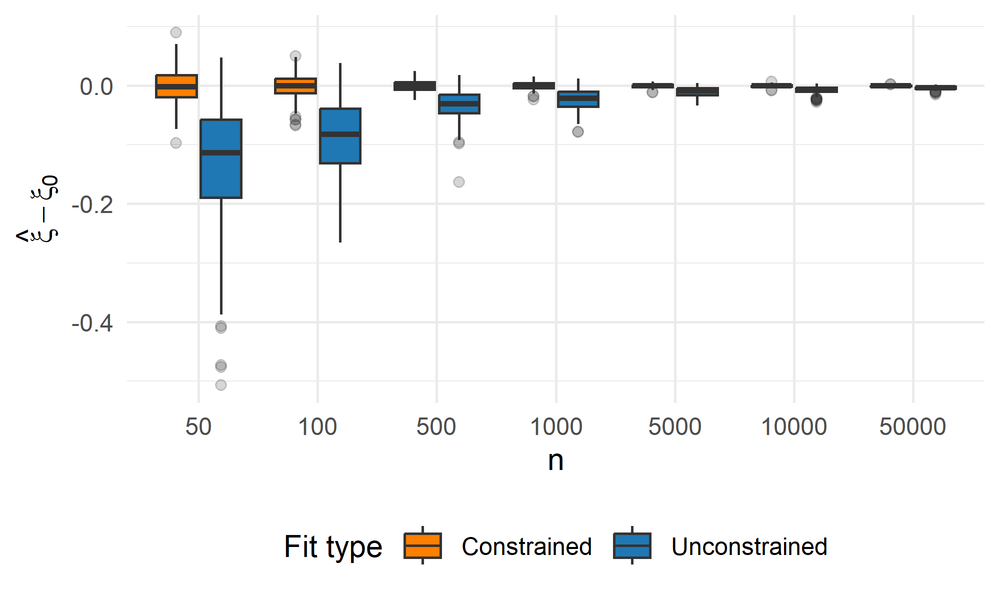
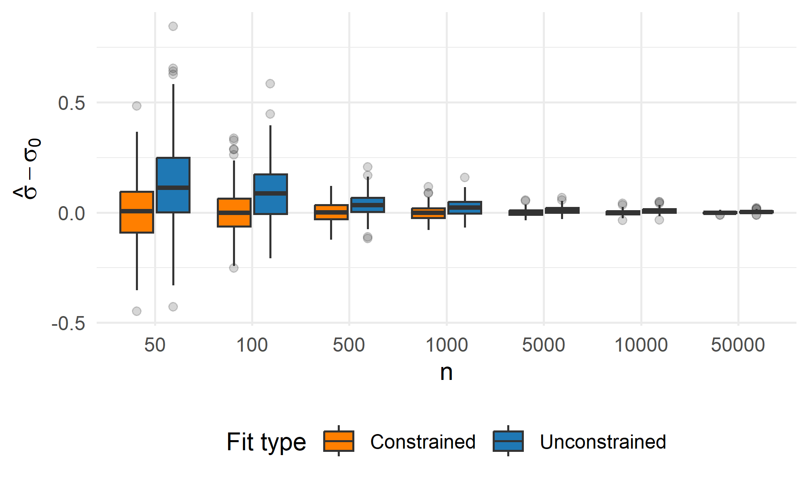
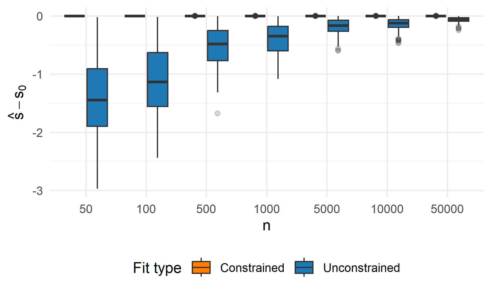
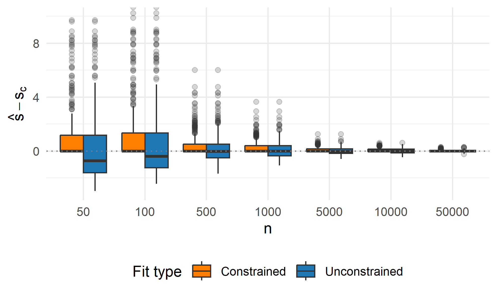

Simulation study: Asymptotic behavior of constrained GPD estimation
under boundary misspecification
================
Compiled at 2025-12-19 15:09:08 UTC

This simulation study investigates the behavior of constrained GPD
parameter estimation with a fixed shape parameter and a fixed support
constraint $s_c$. As the sample size increases, the maximum observed
value approaches the true boundary, reducing the degree of
misspecification induced by the constraint. We analyze how this
convergence affects estimation accuracy across different GPD fitting
methods.

## Define parameters

    ## Shape: -0.2 
    ## Scale:  1 
    ## Boundary:  5 
    ## Support constraint:  5 
    ## Method:  LME 
    ## Sample sizes:  50 100 200 500 1000 5000 10000 50000 
    ## Repetitions:  500

## Setting

    ## # A tibble: 6 × 5
    ##       n shape scale bound constraint
    ##   <dbl> <dbl> <dbl> <dbl>      <dbl>
    ## 1    50  -0.2     1     5          5
    ## 2   100  -0.2     1     5          5
    ## 3   200  -0.2     1     5          5
    ## 4   500  -0.2     1     5          5
    ## 5  1000  -0.2     1     5          5
    ## 6  5000  -0.2     1     5          5

    ## Number of settings:  8

## Perform estimations

## Combine results

## Results table

| constraint | data_bound | data_shape | data_scale | n | method | data_max | constr_active | shape_uc | scale_uc | bound_uc | dgpd_uc | shape_c | scale_c | bound_c | dgpd_c | repetition |
|---:|---:|---:|---:|---:|:---|---:|:---|---:|---:|---:|---:|---:|---:|---:|---:|---:|
| 5 | 5 | -0.2 | 1 | 100 | LME | 2.797217 | TRUE | -0.3688044 | 1.2028908 | 3.261595 | 0.0000000 | -0.2081276 | 1.0406382 | 5.000000 | 0.0000000 | 1 |
| 5 | 5 | -0.2 | 1 | 100 | LME | 3.287688 | TRUE | -0.1814405 | 0.8948506 | 4.931923 | 0.0000000 | -0.1784315 | 0.8921575 | 5.000000 | 0.0000000 | 2 |
| 5 | 5 | -0.2 | 1 | 100 | LME | 3.721647 | FALSE | -0.1459588 | 1.0376655 | 7.109302 | 0.0007876 | -0.1459588 | 1.0376655 | 7.109302 | 0.0007876 | 3 |
| 5 | 5 | -0.2 | 1 | 100 | LME | 2.986269 | TRUE | -0.2305967 | 1.0155872 | 4.404171 | 0.0000000 | -0.1965893 | 0.9829463 | 5.000000 | 0.0000000 | 4 |
| 5 | 5 | -0.2 | 1 | 100 | LME | 3.491750 | FALSE | -0.1190841 | 0.9623550 | 8.081306 | 0.0008299 | -0.1190841 | 0.9623550 | 8.081306 | 0.0008299 | 5 |
| 5 | 5 | -0.2 | 1 | 100 | LME | 3.629381 | FALSE | -0.1785131 | 1.0279428 | 5.758361 | 0.0000864 | -0.1785131 | 1.0279428 | 5.758361 | 0.0000864 | 6 |
| 5 | 5 | -0.2 | 1 | 100 | LME | 3.040663 | TRUE | -0.3152565 | 1.1469850 | 3.638260 | 0.0000000 | -0.2075962 | 1.0379809 | 5.000000 | 0.0000000 | 7 |
| 5 | 5 | -0.2 | 1 | 100 | LME | 2.939923 | TRUE | -0.4247962 | 1.3188701 | 3.104712 | 0.0000000 | -0.2190024 | 1.0950121 | 5.000000 | 0.0000000 | 8 |
| 5 | 5 | -0.2 | 1 | 100 | LME | 3.483642 | FALSE | -0.1477785 | 0.9206470 | 6.229914 | 0.0000939 | -0.1477785 | 0.9206470 | 6.229914 | 0.0000939 | 9 |
| 5 | 5 | -0.2 | 1 | 100 | LME | 2.756514 | TRUE | -0.2163082 | 0.9978583 | 4.613133 | 0.0000000 | -0.1957265 | 0.9786326 | 5.000000 | 0.0000000 | 10 |
| 5 | 5 | -0.2 | 1 | 100 | LME | 2.907593 | TRUE | -0.2487210 | 0.9744594 | 3.917881 | 0.0000000 | -0.1830057 | 0.9150287 | 5.000000 | 0.0000000 | 11 |
| 5 | 5 | -0.2 | 1 | 100 | LME | 2.909163 | TRUE | -0.3944247 | 1.2587382 | 3.191327 | 0.0000000 | -0.2132834 | 1.0664172 | 5.000000 | 0.0000000 | 12 |
| 5 | 5 | -0.2 | 1 | 100 | LME | 3.422151 | FALSE | -0.1917722 | 1.0628111 | 5.542049 | 0.0000523 | -0.1917722 | 1.0628110 | 5.542049 | 0.0000523 | 13 |
| 5 | 5 | -0.2 | 1 | 100 | LME | 2.966782 | TRUE | -0.2721273 | 1.1105264 | 4.080908 | 0.0000000 | -0.2097217 | 1.0486083 | 5.000000 | 0.0000000 | 14 |
| 5 | 5 | -0.2 | 1 | 100 | LME | 3.146482 | NA | 0.0555642 | 0.7184866 | NA | NA | 0.0555642 | 0.7184866 | NA | NA | 15 |
| 5 | 5 | -0.2 | 1 | 100 | LME | 2.498217 | TRUE | -0.3176228 | 0.9885816 | 3.112439 | 0.0000000 | -0.1736366 | 0.8681828 | 5.000000 | 0.0000000 | 16 |
| 5 | 5 | -0.2 | 1 | 100 | LME | 3.195013 | TRUE | -0.1874468 | 0.8986123 | 4.793958 | 0.0000000 | -0.1780610 | 0.8903048 | 5.000000 | 0.0000000 | 17 |
| 5 | 5 | -0.2 | 1 | 100 | LME | 3.685176 | FALSE | -0.0792554 | 0.9385478 | 11.842061 | 0.0018189 | -0.0792554 | 0.9385478 | 11.842061 | 0.0018189 | 18 |
| 5 | 5 | -0.2 | 1 | 100 | LME | 2.732176 | TRUE | -0.2314245 | 0.9133005 | 3.946430 | 0.0000000 | -0.1727895 | 0.8639475 | 5.000000 | 0.0000000 | 19 |
| 5 | 5 | -0.2 | 1 | 100 | LME | 3.601136 | TRUE | -0.2970169 | 1.1137002 | 3.749619 | 0.0000000 | -0.1994192 | 0.9970959 | 5.000000 | 0.0000000 | 20 |

## Plots

### Shape error

Difference between the estimated shape $\hat{\xi}$ and the true shape
used for data generation $\xi_0$.

<!-- -->

### Scale error

Difference between the estimated scale $\hat{\sigma}$ and the true scale
used for data generation $\sigma_0$.

<!-- -->

### Boundary error

Difference between the estimated support boundary
$\hat{s} = \frac{-\hat{\sigma}}{\hat{\xi}}$ and the boundary that
results from the true parameters used for data generation
$s_0=\frac{-\sigma_0}{\xi_0}$.

<!-- -->

### Boundary error (log scale)

Same as before but on log scale.

<!-- -->

### Difference between boundary and constraint

Difference between the estimated boundary
$\hat{s} = \frac{-\hat{\sigma}}{\hat{\xi}}$ and the support constraint
(here **5**).

<!-- -->

## Plots (constraint active)

In the following plots the results are filtered so that only replicates
are used where the constraint is active.

The constraint is active if the unconstraint fit would lead to a
boundary below the constraint.

### Shape error

Difference between the estimated shape $\hat{\xi}$ and the true shape
used for data generation $\xi_0$.

<!-- -->

### Scale error

Difference between the estimated scale $\hat{\sigma}$ and the true scale
used for data generation $\sigma_0$.

<!-- -->

### Boundary error

Difference between the estimated boundary
$\hat{s} = \frac{-\hat{\sigma}}{\hat{\xi}}$ and the boundary that
results from the true parameters used for data generation
$s_0 = \frac{-\sigma_0}{\xi_0}$.

<!-- -->

### Difference between boundary and constraint

Difference between the estimated boundary
$\hat{s} = \frac{-\hat{\sigma}}{\hat{\xi}}$ and the support constraint
(here **5**).

<!-- -->

<!-- -->

## Files written

These files have been written to the target directory,
`data/03_asymptotic`:

    ## # A tibble: 8 × 4
    ##   path                   type         size modification_time  
    ##   <fs::path>             <fct> <fs::bytes> <dttm>             
    ## 1 shape--0.2_n-100.RDS   file          31K 2025-11-05 09:55:56
    ## 2 shape--0.2_n-1000.RDS  file          31K 2025-11-05 09:56:00
    ## 3 shape--0.2_n-10000.RDS file        30.6K 2025-11-05 09:56:39
    ## 4 shape--0.2_n-200.RDS   file        31.1K 2025-11-05 09:55:57
    ## 5 shape--0.2_n-50.RDS    file        30.4K 2025-11-05 09:55:56
    ## 6 shape--0.2_n-500.RDS   file          31K 2025-11-05 09:55:58
    ## 7 shape--0.2_n-5000.RDS  file        30.6K 2025-11-05 09:56:17
    ## 8 shape--0.2_n-50000.RDS file        30.2K 2025-11-05 09:59:40
