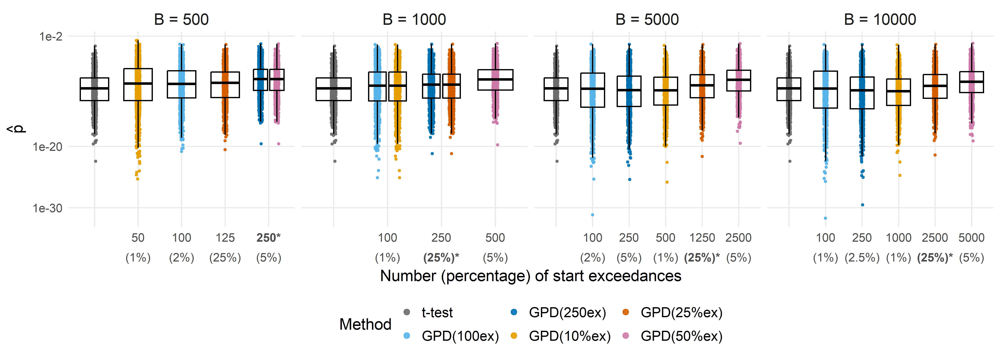
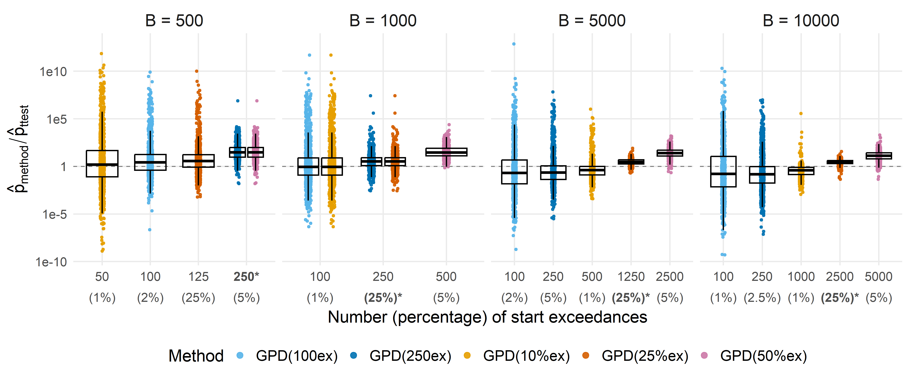
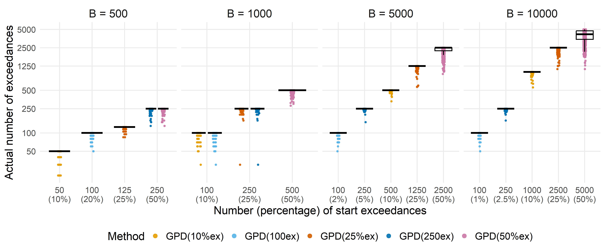

Assess the optimal number of starting exceedances
================
Compiled at 2025-12-19 15:46:16 UTC

## Load permApprox functions

## Method registry, file helpers, and per-method runner

### General method registry

### Engines

### Output path builders

## Compute p-values and save

## Collect & reshape

## P-value plots

### Colors

### Plot function

### P-values

<!-- -->

### Ratios (approximated vs. t-test)

<!-- -->

## nExceed plots

<!-- -->

## Files written

These files have been written to the target directory,
`data/03_nexceed`:

    ## # A tibble: 1 × 4
    ##   path       type             size modification_time  
    ##   <fs::path> <fct>     <fs::bytes> <dttm>             
    ## 1 accuracy   directory           0 2025-12-18 14:08:36
