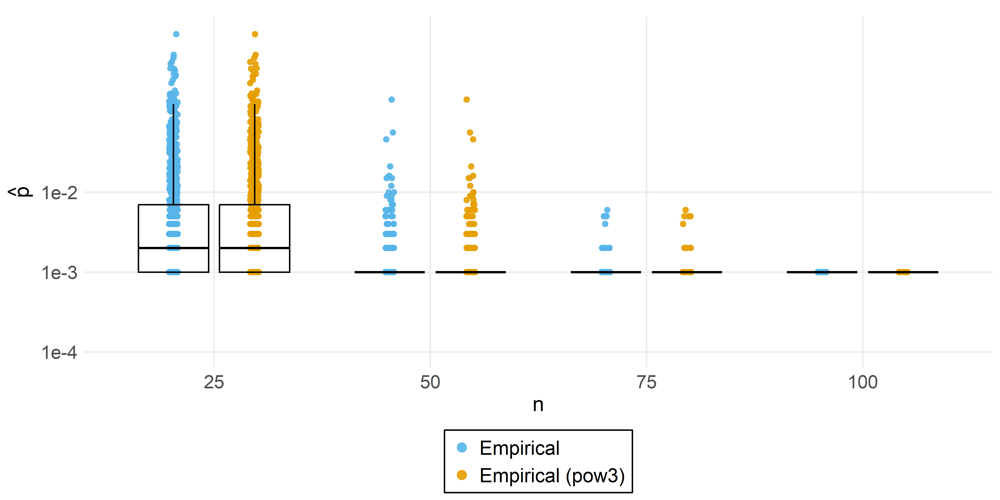
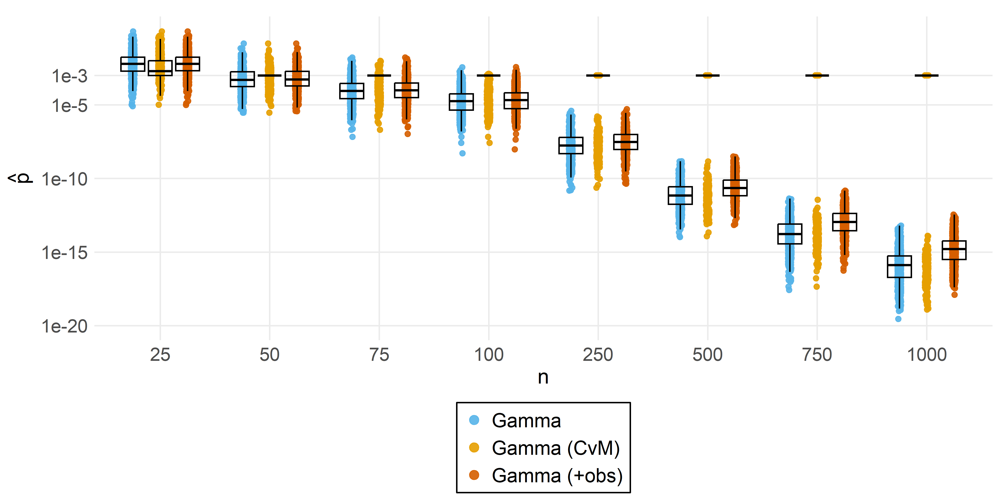
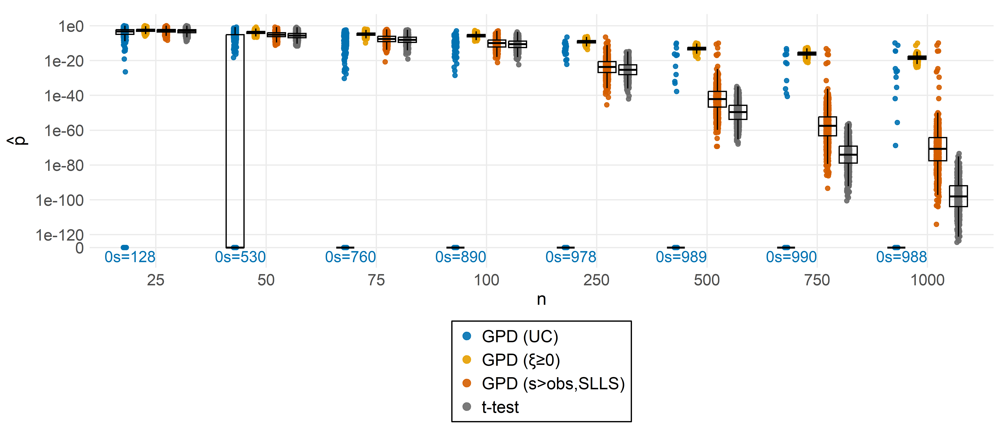
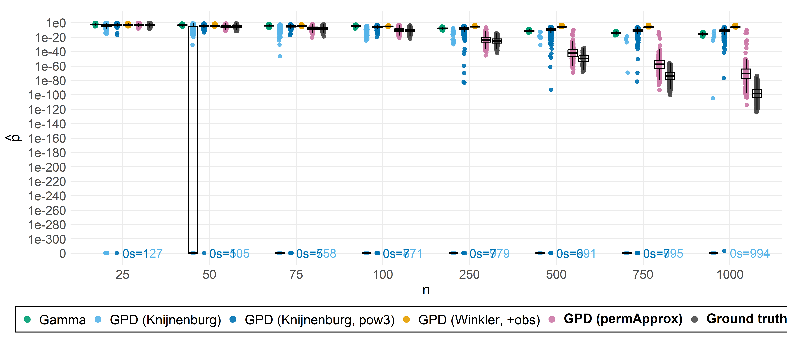
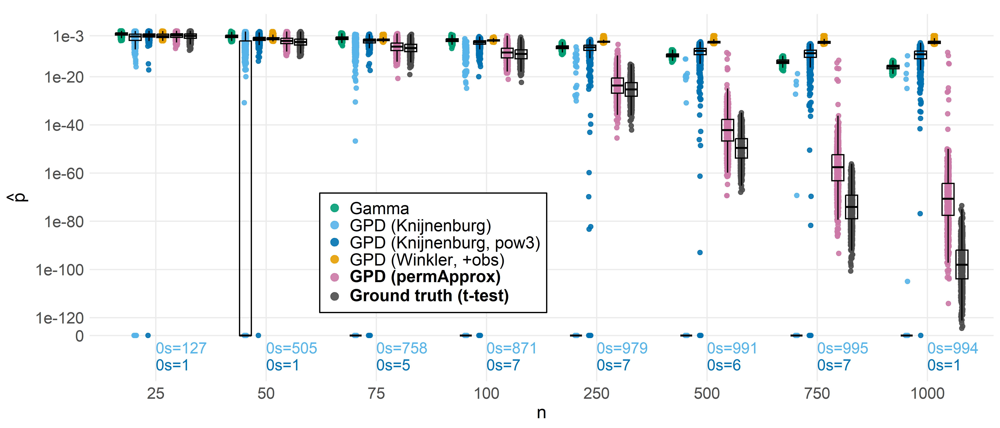
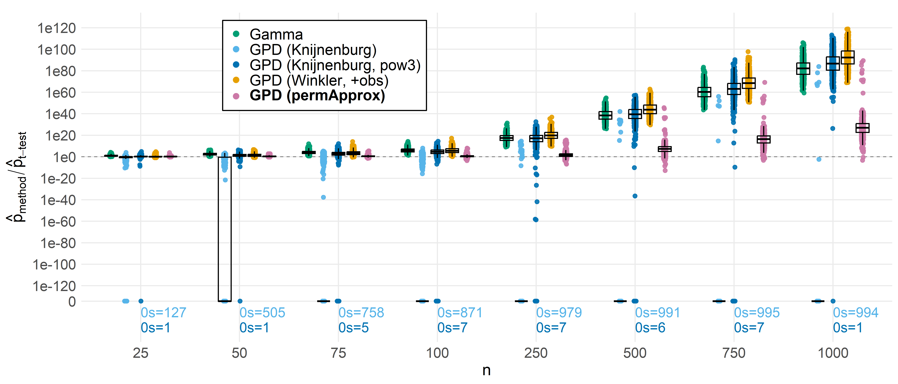
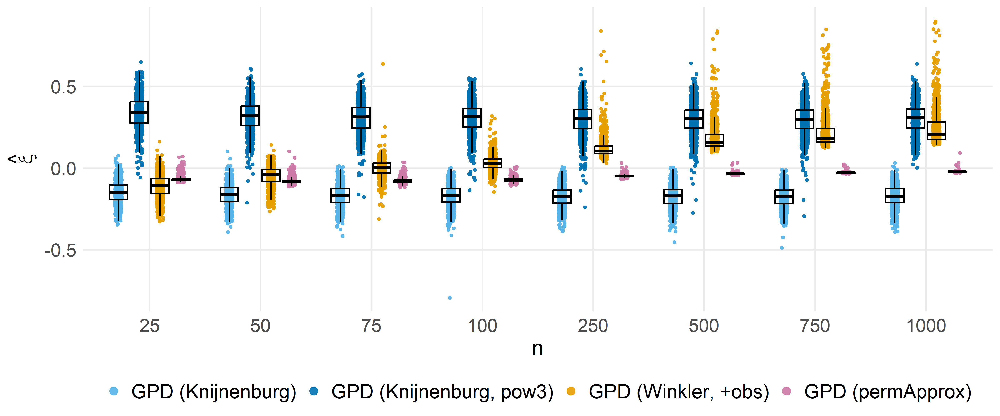
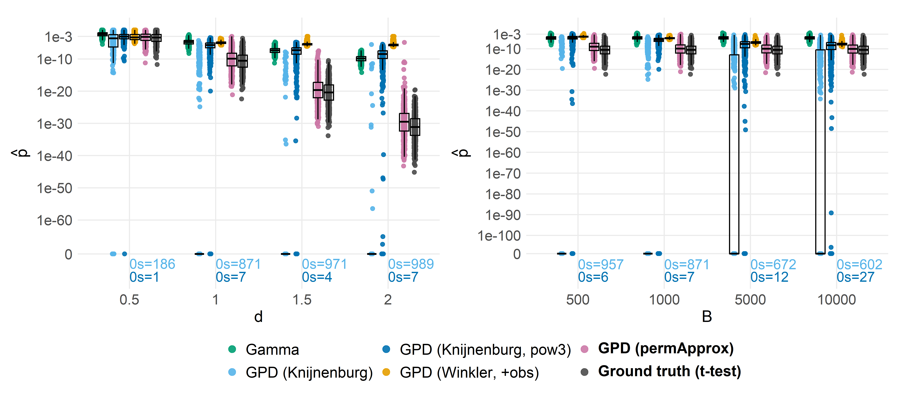
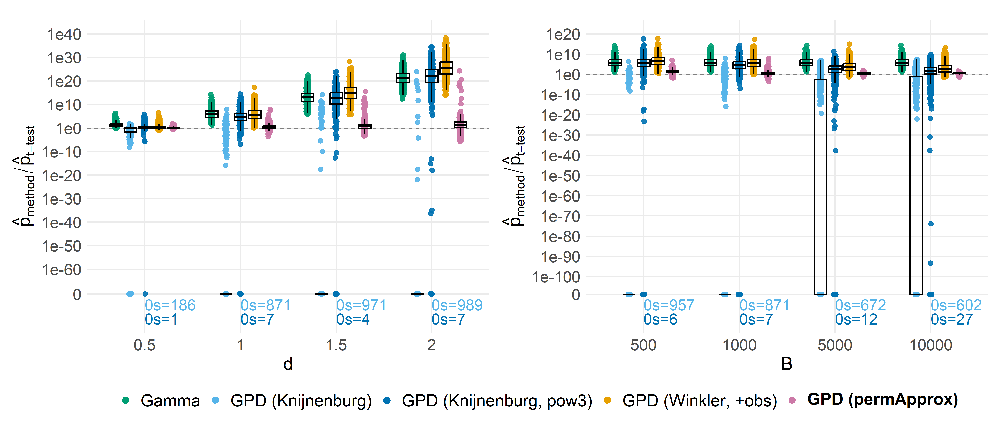

Accuracy and error-rate study - Compare p-value approximation methods
================
Compiled at 2025-12-19 15:52:42 UTC

## Load permApprox functions

## Method registry, file helpers, and per-method runner

### Relabeling helper

### Method registry

Methods, we will consider in this study:

- **t-test**: Student’s t-test (considered as ground truth).
- **Empirical**: Empirical p-values.
- **Empirical (pow3)**: Empirical p-values where the test statistics are
  raised to the power 3 (just to double-check the implementation).
- **Gamma**: Gamma approximation of the complete permutation
  distribution, as suggested by *Winkler et al.* (2016).
- **Gamma (+obs)**: Gamma approximation where the observed test
  statistic is included in the null distribution (*Winkler et al.*,
  2016).
- **Gamma (CvM)**: Gamma approximation with Cramér-von Mises (CvM)
  goodness-of-fit test.
- **GPD (Knijnen)**: GPD approximation as suggested by *Knijnenburg et
  al. (2009)*:
  - GPD parameter estimation with one-parameter maximum likelihood
    estimation.
  - Threshold: Failure to reject (FTR), starting with 250 exceedances.
- **GPD (Knijnen, pow3)**: Like GPD(KB), but all test statistics are
  raised to the power 3 before GPD approximation, as suggested by
  Knijnenburg et al. (2009).
- **GPD (Winkler, +obs)**: Like GPD(KB), but $t_{obs}$ is included in
  the permutation distribution, as suggested by *Winkler et al.* (2016).
- **GPD (pApprox, UC)**: GPD approximation with permApprox as follows:
  - GPD parameter estimation using Likelihood-Moment-Estimation (LME).
  - Unconstrained (UC) parameter estimation.
  - Threshold: Robust failure to reject (robFTR), starting with 25%
    exceedances.
- **GPD(pApprox, ξ≥0)**: GPD approximation with permApprox as follows:
  - GPD parameter estimation with one-parameter maximum likelihood
    estimation.
  - Constraint: The shape parameter $\xi$ must be non-negative.
  - Threshold: Robust failure to reject (robFTR), starting with 25%
    exceedances.
- **GPD (pApprox, s\>obs)**: Our proposed GPD approximation:
  - GPD parameter estimation using Likelihood-Moment-Estimation (LME).
  - Constraint: The support boundary $s$ must lie above the observed
    test statistic.
  - Threshold: Robust failure to reject (robFTR), starting with 25%
    exceedances.

For comparability, we use a **fitting threshold of 0.1** in all Gamma
and GPD approximation settings, which is two times the classical
$\alpha$ level of 0.05. That means, the fit is done if the empirical
p-value is smaller than 0.1.

### Engines

### Output path builders

## ACCURACY

### Compute p-values and save

### Collect & reshape

### Plotting helper

### Colors

### Empirical p-values (power transformation)

<!-- -->

    ## All empirical p-values with power 1 are equal to those with power 3:  TRUE

We won’t consider the two methods for empirical p-values in the
following plots anymore.

### Gamma approximation (compare three approaches)

Here, we compare three Gamma approximation approaches:

- **Gamma**: Observed test statistic is NOT included in the null
  distribution.
- **Gamma (+obs)**: Observed test statistic is included in the null
  distribution.
- **Gamma (CvM)**: Gamma approximation with Goodness-of-Fit test. If it
  fails, empirical p-values are used.

<!-- -->

If the observed test statistics are included in the null distribution,
the p-values are more conservative (as expected). For most of the tests,
the GoF test fails so that the empirical p-values would be used. Even so
the GoF test fails, the approximated p-values are acceptable.

We will consider only the Gamma approximation without GoF test and
without including $t_{obs}$ in the following.

### permApprox methods

Here, we compare three permApprox approaches. All methods use LME for
parameter fitting, robFTR for threshold detection (starting with 0.25B,
but at least 250 exceedances).

- **GPD (UC)**: Unconstrained fit.
- **GPD (ξ≥0)**: Constrained fit: Shape parameter must be non-negative.
- **GPD (s\>obs)**: Constrained fit: Observed test statistic must be
  within GPD support ($s > t_{obs}+\varepsilon$), using the SLLS epsilon
  rule.

<!-- -->

Fitting with the constraint of a non-negative shape parameter avoids
zeros reliably, but is also ovarly conservative, especially for large
sample sizes.

### Filter and rename

### By sample size (n)

#### P-values

<!-- -->

We replace the single extremely small p-value by zero to improve the
plot.

    ## # A tibble: 1 × 8
    ##   study        n     d     B   rep test_idx method                       pval
    ##   <chr>    <int> <dbl> <int> <int>    <int> <fct>                       <dbl>
    ## 1 accuracy  1000     1  1000   478        1 GPD (Knijnenburg, pow3) 2.28e-317

<!-- -->

#### Ratios (method vs. t-test)

Ratios ($p_{method}$ / $p_{ttest}$) for non-zero p-values, with sample
size on the x axis.

<!-- -->

#### Shape estimates

<!-- -->

### P-values by d and B

<!-- -->

### Ratios by d and B

<!-- -->

### Table: Zeros and times where method p-value \< t-test p-value

|    n | method                  | zeros | zeros (%) | \< t-test | \< t-test (%) | total |
|-----:|:------------------------|------:|:----------|----------:|:--------------|------:|
|   25 | Gamma                   |     0 | 0.0%      |        17 | 1.7%          |  1000 |
|   25 | GPD (Knijnenburg)       |   127 | 12.7%     |       633 | 63.3%         |  1000 |
|   25 | GPD (Knijnenburg, pow3) |     1 | 0.1%      |       324 | 32.4%         |  1000 |
|   25 | GPD (Winkler, +obs)     |     0 | 0.0%      |       347 | 34.7%         |  1000 |
|   25 | GPD (permApprox)        |     0 | 0.0%      |       137 | 13.7%         |  1000 |
|   50 | Gamma                   |     0 | 0.0%      |         0 | 0.0%          |  1000 |
|   50 | GPD (Knijnenburg)       |   505 | 50.5%     |       825 | 82.5%         |  1000 |
|   50 | GPD (Knijnenburg, pow3) |     1 | 0.1%      |        95 | 9.5%          |  1000 |
|   50 | GPD (Winkler, +obs)     |     0 | 0.0%      |        83 | 8.3%          |  1000 |
|   50 | GPD (permApprox)        |     0 | 0.0%      |        93 | 9.3%          |  1000 |
|   75 | Gamma                   |     0 | 0.0%      |         0 | 0.0%          |  1000 |
|   75 | GPD (Knijnenburg)       |   758 | 75.8%     |       916 | 91.6%         |  1000 |
|   75 | GPD (Knijnenburg, pow3) |     5 | 0.5%      |        37 | 3.7%          |  1000 |
|   75 | GPD (Winkler, +obs)     |     0 | 0.0%      |        11 | 1.1%          |  1000 |
|   75 | GPD (permApprox)        |     0 | 0.0%      |       176 | 17.6%         |  1000 |
|  100 | Gamma                   |     0 | 0.0%      |         0 | 0.0%          |  1000 |
|  100 | GPD (Knijnenburg)       |   871 | 87.1%     |       942 | 94.2%         |  1000 |
|  100 | GPD (Knijnenburg, pow3) |     7 | 0.7%      |        24 | 2.4%          |  1000 |
|  100 | GPD (Winkler, +obs)     |     0 | 0.0%      |         0 | 0.0%          |  1000 |
|  100 | GPD (permApprox)        |     0 | 0.0%      |       214 | 21.4%         |  1000 |
|  250 | Gamma                   |     0 | 0.0%      |         0 | 0.0%          |  1000 |
|  250 | GPD (Knijnenburg)       |   979 | 97.9%     |       982 | 98.2%         |  1000 |
|  250 | GPD (Knijnenburg, pow3) |     7 | 0.7%      |        16 | 1.6%          |  1000 |
|  250 | GPD (Winkler, +obs)     |     0 | 0.0%      |         0 | 0.0%          |  1000 |
|  250 | GPD (permApprox)        |     0 | 0.0%      |       192 | 19.2%         |  1000 |
|  500 | Gamma                   |     0 | 0.0%      |         0 | 0.0%          |  1000 |
|  500 | GPD (Knijnenburg)       |   991 | 99.1%     |       991 | 99.1%         |  1000 |
|  500 | GPD (Knijnenburg, pow3) |     6 | 0.6%      |         8 | 0.8%          |  1000 |
|  500 | GPD (Winkler, +obs)     |     0 | 0.0%      |         0 | 0.0%          |  1000 |
|  500 | GPD (permApprox)        |     0 | 0.0%      |        31 | 3.1%          |  1000 |
|  750 | Gamma                   |     0 | 0.0%      |         0 | 0.0%          |  1000 |
|  750 | GPD (Knijnenburg)       |   995 | 99.5%     |       995 | 99.5%         |  1000 |
|  750 | GPD (Knijnenburg, pow3) |     7 | 0.7%      |         8 | 0.8%          |  1000 |
|  750 | GPD (Winkler, +obs)     |     0 | 0.0%      |         0 | 0.0%          |  1000 |
|  750 | GPD (permApprox)        |     0 | 0.0%      |         7 | 0.7%          |  1000 |
| 1000 | Gamma                   |     0 | 0.0%      |         0 | 0.0%          |  1000 |
| 1000 | GPD (Knijnenburg)       |   994 | 99.4%     |       995 | 99.5%         |  1000 |
| 1000 | GPD (Knijnenburg, pow3) |     1 | 0.1%      |         1 | 0.1%          |  1000 |
| 1000 | GPD (Winkler, +obs)     |     0 | 0.0%      |         0 | 0.0%          |  1000 |
| 1000 | GPD (permApprox)        |     0 | 0.0%      |         2 | 0.2%          |  1000 |

### Table: Accuracy metrics

<table class=" lightable-classic" style="color: black; font-family: &quot;Arial Narrow&quot;, &quot;Source Sans Pro&quot;, sans-serif; width: auto !important; margin-left: auto; margin-right: auto;">

<caption>

Accuracy vs. t-test by n (d=1, B=1000).
</caption>

<thead>

<tr>

<th style="text-align:right;">

n
</th>

<th style="text-align:left;">

method
</th>

<th style="text-align:right;">

N
</th>

<th style="text-align:left;">

bias
</th>

<th style="text-align:left;">

sd
</th>

<th style="text-align:left;">

rmse
</th>

<th style="text-align:left;">

cor_spear
</th>

<th style="text-align:right;">

N_pos
</th>

</tr>

</thead>

<tbody>

<tr>

<td style="text-align:right;">

25
</td>

<td style="text-align:left;">

Gamma
</td>

<td style="text-align:right;">

1000
</td>

<td style="text-align:left;">

6.24e-03
</td>

<td style="text-align:left;">

6.00e-03
</td>

<td style="text-align:left;">

8.65e-03
</td>

<td style="text-align:left;">

0.994
</td>

<td style="text-align:right;">

1000
</td>

</tr>

<tr>

<td style="text-align:right;">

25
</td>

<td style="text-align:left;">

GPD (Winkler, +obs)
</td>

<td style="text-align:right;">

1000
</td>

<td style="text-align:left;">

3.25e-04
</td>

<td style="text-align:left;">

3.30e-03
</td>

<td style="text-align:left;">

3.31e-03
</td>

<td style="text-align:left;">

0.954
</td>

<td style="text-align:right;">

1000
</td>

</tr>

<tr>

<td style="text-align:right;">

25
</td>

<td style="text-align:left;">

GPD (Knijnenburg)
</td>

<td style="text-align:right;">

1000
</td>

<td style="text-align:left;">

9.44e-05
</td>

<td style="text-align:left;">

3.30e-03
</td>

<td style="text-align:left;">

3.30e-03
</td>

<td style="text-align:left;">

0.940
</td>

<td style="text-align:right;">

873
</td>

</tr>

<tr>

<td style="text-align:right;">

25
</td>

<td style="text-align:left;">

GPD (Knijnenburg, pow3)
</td>

<td style="text-align:right;">

1000
</td>

<td style="text-align:left;">

6.75e-05
</td>

<td style="text-align:left;">

3.38e-03
</td>

<td style="text-align:left;">

3.38e-03
</td>

<td style="text-align:left;">

0.955
</td>

<td style="text-align:right;">

999
</td>

</tr>

<tr>

<td style="text-align:right;">

25
</td>

<td style="text-align:left;">

GPD (permApprox)
</td>

<td style="text-align:right;">

1000
</td>

<td style="text-align:left;">

6.85e-04
</td>

<td style="text-align:left;">

3.27e-03
</td>

<td style="text-align:left;">

3.34e-03
</td>

<td style="text-align:left;">

0.991
</td>

<td style="text-align:right;">

1000
</td>

</tr>

<tr>

<td style="text-align:right;">

50
</td>

<td style="text-align:left;">

Gamma
</td>

<td style="text-align:right;">

1000
</td>

<td style="text-align:left;">

1.57e-03
</td>

<td style="text-align:left;">

2.74e-03
</td>

<td style="text-align:left;">

3.15e-03
</td>

<td style="text-align:left;">

0.986
</td>

<td style="text-align:right;">

1000
</td>

</tr>

<tr>

<td style="text-align:right;">

50
</td>

<td style="text-align:left;">

GPD (Winkler, +obs)
</td>

<td style="text-align:right;">

1000
</td>

<td style="text-align:left;">

9.88e-05
</td>

<td style="text-align:left;">

6.36e-04
</td>

<td style="text-align:left;">

6.43e-04
</td>

<td style="text-align:left;">

0.815
</td>

<td style="text-align:right;">

1000
</td>

</tr>

<tr>

<td style="text-align:right;">

50
</td>

<td style="text-align:left;">

GPD (Knijnenburg)
</td>

<td style="text-align:right;">

1000
</td>

<td style="text-align:left;">

8.03e-06
</td>

<td style="text-align:left;">

6.20e-04
</td>

<td style="text-align:left;">

6.20e-04
</td>

<td style="text-align:left;">

0.644
</td>

<td style="text-align:right;">

495
</td>

</tr>

<tr>

<td style="text-align:right;">

50
</td>

<td style="text-align:left;">

GPD (Knijnenburg, pow3)
</td>

<td style="text-align:right;">

1000
</td>

<td style="text-align:left;">

1.44e-04
</td>

<td style="text-align:left;">

6.19e-04
</td>

<td style="text-align:left;">

6.35e-04
</td>

<td style="text-align:left;">

0.777
</td>

<td style="text-align:right;">

999
</td>

</tr>

<tr>

<td style="text-align:right;">

50
</td>

<td style="text-align:left;">

GPD (permApprox)
</td>

<td style="text-align:right;">

1000
</td>

<td style="text-align:left;">

1.30e-04
</td>

<td style="text-align:left;">

6.10e-04
</td>

<td style="text-align:left;">

6.23e-04
</td>

<td style="text-align:left;">

0.967
</td>

<td style="text-align:right;">

1000
</td>

</tr>

<tr>

<td style="text-align:right;">

75
</td>

<td style="text-align:left;">

Gamma
</td>

<td style="text-align:right;">

1000
</td>

<td style="text-align:left;">

3.65e-04
</td>

<td style="text-align:left;">

9.71e-04
</td>

<td style="text-align:left;">

1.04e-03
</td>

<td style="text-align:left;">

0.978
</td>

<td style="text-align:right;">

1000
</td>

</tr>

<tr>

<td style="text-align:right;">

75
</td>

<td style="text-align:left;">

GPD (Winkler, +obs)
</td>

<td style="text-align:right;">

1000
</td>

<td style="text-align:left;">

3.30e-05
</td>

<td style="text-align:left;">

9.69e-05
</td>

<td style="text-align:left;">

1.02e-04
</td>

<td style="text-align:left;">

0.698
</td>

<td style="text-align:right;">

1000
</td>

</tr>

<tr>

<td style="text-align:right;">

75
</td>

<td style="text-align:left;">

GPD (Knijnenburg)
</td>

<td style="text-align:right;">

1000
</td>

<td style="text-align:left;">

-2.31e-06
</td>

<td style="text-align:left;">

8.46e-05
</td>

<td style="text-align:left;">

8.45e-05
</td>

<td style="text-align:left;">

0.382
</td>

<td style="text-align:right;">

242
</td>

</tr>

<tr>

<td style="text-align:right;">

75
</td>

<td style="text-align:left;">

GPD (Knijnenburg, pow3)
</td>

<td style="text-align:right;">

1000
</td>

<td style="text-align:left;">

4.62e-05
</td>

<td style="text-align:left;">

1.38e-04
</td>

<td style="text-align:left;">

1.45e-04
</td>

<td style="text-align:left;">

0.661
</td>

<td style="text-align:right;">

995
</td>

</tr>

<tr>

<td style="text-align:right;">

75
</td>

<td style="text-align:left;">

GPD (permApprox)
</td>

<td style="text-align:right;">

1000
</td>

<td style="text-align:left;">

1.79e-05
</td>

<td style="text-align:left;">

1.69e-04
</td>

<td style="text-align:left;">

1.70e-04
</td>

<td style="text-align:left;">

0.957
</td>

<td style="text-align:right;">

1000
</td>

</tr>

<tr>

<td style="text-align:right;">

100
</td>

<td style="text-align:left;">

Gamma
</td>

<td style="text-align:right;">

1000
</td>

<td style="text-align:left;">

7.63e-05
</td>

<td style="text-align:left;">

2.06e-04
</td>

<td style="text-align:left;">

2.20e-04
</td>

<td style="text-align:left;">

0.973
</td>

<td style="text-align:right;">

1000
</td>

</tr>

<tr>

<td style="text-align:right;">

100
</td>

<td style="text-align:left;">

GPD (Winkler, +obs)
</td>

<td style="text-align:right;">

1000
</td>

<td style="text-align:left;">

1.60e-05
</td>

<td style="text-align:left;">

1.74e-05
</td>

<td style="text-align:left;">

2.37e-05
</td>

<td style="text-align:left;">

0.594
</td>

<td style="text-align:right;">

1000
</td>

</tr>

<tr>

<td style="text-align:right;">

100
</td>

<td style="text-align:left;">

GPD (Knijnenburg)
</td>

<td style="text-align:right;">

1000
</td>

<td style="text-align:left;">

-3.65e-07
</td>

<td style="text-align:left;">

6.68e-06
</td>

<td style="text-align:left;">

6.68e-06
</td>

<td style="text-align:left;">

0.234
</td>

<td style="text-align:right;">

129
</td>

</tr>

<tr>

<td style="text-align:right;">

100
</td>

<td style="text-align:left;">

GPD (Knijnenburg, pow3)
</td>

<td style="text-align:right;">

1000
</td>

<td style="text-align:left;">

1.15e-05
</td>

<td style="text-align:left;">

3.00e-05
</td>

<td style="text-align:left;">

3.22e-05
</td>

<td style="text-align:left;">

0.545
</td>

<td style="text-align:right;">

993
</td>

</tr>

<tr>

<td style="text-align:right;">

100
</td>

<td style="text-align:left;">

GPD (permApprox)
</td>

<td style="text-align:right;">

1000
</td>

<td style="text-align:left;">

1.62e-06
</td>

<td style="text-align:left;">

3.26e-05
</td>

<td style="text-align:left;">

3.26e-05
</td>

<td style="text-align:left;">

0.949
</td>

<td style="text-align:right;">

1000
</td>

</tr>

<tr>

<td style="text-align:right;">

250
</td>

<td style="text-align:left;">

Gamma
</td>

<td style="text-align:right;">

1000
</td>

<td style="text-align:left;">

9.03e-08
</td>

<td style="text-align:left;">

2.75e-07
</td>

<td style="text-align:left;">

2.89e-07
</td>

<td style="text-align:left;">

0.921
</td>

<td style="text-align:right;">

1000
</td>

</tr>

<tr>

<td style="text-align:right;">

250
</td>

<td style="text-align:left;">

GPD (Winkler, +obs)
</td>

<td style="text-align:right;">

1000
</td>

<td style="text-align:left;">

9.64e-06
</td>

<td style="text-align:left;">

6.37e-05
</td>

<td style="text-align:left;">

6.44e-05
</td>

<td style="text-align:left;">

0.307
</td>

<td style="text-align:right;">

1000
</td>

</tr>

<tr>

<td style="text-align:right;">

250
</td>

<td style="text-align:left;">

GPD (Knijnenburg)
</td>

<td style="text-align:right;">

1000
</td>

<td style="text-align:left;">

2.19e-11
</td>

<td style="text-align:left;">

6.63e-10
</td>

<td style="text-align:left;">

6.63e-10
</td>

<td style="text-align:left;">

0.048
</td>

<td style="text-align:right;">

21
</td>

</tr>

<tr>

<td style="text-align:right;">

250
</td>

<td style="text-align:left;">

GPD (Knijnenburg, pow3)
</td>

<td style="text-align:right;">

1000
</td>

<td style="text-align:left;">

2.64e-07
</td>

<td style="text-align:left;">

1.15e-06
</td>

<td style="text-align:left;">

1.18e-06
</td>

<td style="text-align:left;">

0.230
</td>

<td style="text-align:right;">

993
</td>

</tr>

<tr>

<td style="text-align:right;">

250
</td>

<td style="text-align:left;">

GPD (permApprox)
</td>

<td style="text-align:right;">

1000
</td>

<td style="text-align:left;">

2.54e-10
</td>

<td style="text-align:left;">

7.97e-09
</td>

<td style="text-align:left;">

7.97e-09
</td>

<td style="text-align:left;">

0.902
</td>

<td style="text-align:right;">

1000
</td>

</tr>

<tr>

<td style="text-align:right;">

500
</td>

<td style="text-align:left;">

Gamma
</td>

<td style="text-align:right;">

1000
</td>

<td style="text-align:left;">

3.94e-11
</td>

<td style="text-align:left;">

1.14e-10
</td>

<td style="text-align:left;">

1.20e-10
</td>

<td style="text-align:left;">

0.845
</td>

<td style="text-align:right;">

1000
</td>

</tr>

<tr>

<td style="text-align:right;">

500
</td>

<td style="text-align:left;">

GPD (Winkler, +obs)
</td>

<td style="text-align:right;">

1000
</td>

<td style="text-align:left;">

1.52e-05
</td>

<td style="text-align:left;">

9.97e-05
</td>

<td style="text-align:left;">

1.01e-04
</td>

<td style="text-align:left;">

0.063
</td>

<td style="text-align:right;">

1000
</td>

</tr>

<tr>

<td style="text-align:right;">

500
</td>

<td style="text-align:left;">

GPD (Knijnenburg)
</td>

<td style="text-align:right;">

1000
</td>

<td style="text-align:left;">

4.04e-16
</td>

<td style="text-align:left;">

9.03e-15
</td>

<td style="text-align:left;">

9.03e-15
</td>

<td style="text-align:left;">

-0.013
</td>

<td style="text-align:right;">

9
</td>

</tr>

<tr>

<td style="text-align:right;">

500
</td>

<td style="text-align:left;">

GPD (Knijnenburg, pow3)
</td>

<td style="text-align:right;">

1000
</td>

<td style="text-align:left;">

2.11e-08
</td>

<td style="text-align:left;">

1.25e-07
</td>

<td style="text-align:left;">

1.27e-07
</td>

<td style="text-align:left;">

0.178
</td>

<td style="text-align:right;">

994
</td>

</tr>

<tr>

<td style="text-align:right;">

500
</td>

<td style="text-align:left;">

GPD (permApprox)
</td>

<td style="text-align:right;">

1000
</td>

<td style="text-align:left;">

1.12e-13
</td>

<td style="text-align:left;">

2.91e-12
</td>

<td style="text-align:left;">

2.91e-12
</td>

<td style="text-align:left;">

0.829
</td>

<td style="text-align:right;">

1000
</td>

</tr>

<tr>

<td style="text-align:right;">

750
</td>

<td style="text-align:left;">

Gamma
</td>

<td style="text-align:right;">

1000
</td>

<td style="text-align:left;">

1.09e-13
</td>

<td style="text-align:left;">

3.17e-13
</td>

<td style="text-align:left;">

3.35e-13
</td>

<td style="text-align:left;">

0.821
</td>

<td style="text-align:right;">

1000
</td>

</tr>

<tr>

<td style="text-align:right;">

750
</td>

<td style="text-align:left;">

GPD (Winkler, +obs)
</td>

<td style="text-align:right;">

1000
</td>

<td style="text-align:left;">

2.87e-05
</td>

<td style="text-align:left;">

1.50e-04
</td>

<td style="text-align:left;">

1.52e-04
</td>

<td style="text-align:left;">

0.049
</td>

<td style="text-align:right;">

1000
</td>

</tr>

<tr>

<td style="text-align:right;">

750
</td>

<td style="text-align:left;">

GPD (Knijnenburg)
</td>

<td style="text-align:right;">

1000
</td>

<td style="text-align:left;">

1.62e-22
</td>

<td style="text-align:left;">

5.11e-21
</td>

<td style="text-align:left;">

5.11e-21
</td>

<td style="text-align:left;">

-0.009
</td>

<td style="text-align:right;">

5
</td>

</tr>

<tr>

<td style="text-align:right;">

750
</td>

<td style="text-align:left;">

GPD (Knijnenburg, pow3)
</td>

<td style="text-align:right;">

1000
</td>

<td style="text-align:left;">

5.57e-09
</td>

<td style="text-align:left;">

2.88e-08
</td>

<td style="text-align:left;">

2.93e-08
</td>

<td style="text-align:left;">

0.096
</td>

<td style="text-align:right;">

993
</td>

</tr>

<tr>

<td style="text-align:right;">

750
</td>

<td style="text-align:left;">

GPD (permApprox)
</td>

<td style="text-align:right;">

1000
</td>

<td style="text-align:left;">

6.92e-17
</td>

<td style="text-align:left;">

2.02e-15
</td>

<td style="text-align:left;">

2.02e-15
</td>

<td style="text-align:left;">

0.779
</td>

<td style="text-align:right;">

1000
</td>

</tr>

<tr>

<td style="text-align:right;">

1000
</td>

<td style="text-align:left;">

Gamma
</td>

<td style="text-align:right;">

1000
</td>

<td style="text-align:left;">

1.26e-15
</td>

<td style="text-align:left;">

4.45e-15
</td>

<td style="text-align:left;">

4.62e-15
</td>

<td style="text-align:left;">

0.747
</td>

<td style="text-align:right;">

1000
</td>

</tr>

<tr>

<td style="text-align:right;">

1000
</td>

<td style="text-align:left;">

GPD (Winkler, +obs)
</td>

<td style="text-align:right;">

1000
</td>

<td style="text-align:left;">

4.65e-05
</td>

<td style="text-align:left;">

1.97e-04
</td>

<td style="text-align:left;">

2.03e-04
</td>

<td style="text-align:left;">

0.014
</td>

<td style="text-align:right;">

1000
</td>

</tr>

<tr>

<td style="text-align:right;">

1000
</td>

<td style="text-align:left;">

GPD (Knijnenburg)
</td>

<td style="text-align:right;">

1000
</td>

<td style="text-align:left;">

4.51e-15
</td>

<td style="text-align:left;">

1.43e-13
</td>

<td style="text-align:left;">

1.43e-13
</td>

<td style="text-align:left;">

0.047
</td>

<td style="text-align:right;">

6
</td>

</tr>

<tr>

<td style="text-align:right;">

1000
</td>

<td style="text-align:left;">

GPD (Knijnenburg, pow3)
</td>

<td style="text-align:right;">

1000
</td>

<td style="text-align:left;">

3.47e-09
</td>

<td style="text-align:left;">

3.42e-08
</td>

<td style="text-align:left;">

3.44e-08
</td>

<td style="text-align:left;">

0.090
</td>

<td style="text-align:right;">

999
</td>

</tr>

<tr>

<td style="text-align:right;">

1000
</td>

<td style="text-align:left;">

GPD (permApprox)
</td>

<td style="text-align:right;">

1000
</td>

<td style="text-align:left;">

1.23e-13
</td>

<td style="text-align:left;">

3.75e-12
</td>

<td style="text-align:left;">

3.75e-12
</td>

<td style="text-align:left;">

0.761
</td>

<td style="text-align:right;">

1000
</td>

</tr>

</tbody>

</table>

<table class=" lightable-classic" style="color: black; font-family: &quot;Arial Narrow&quot;, &quot;Source Sans Pro&quot;, sans-serif; width: auto !important; margin-left: auto; margin-right: auto;">

<caption>

Accuracy vs. t-test across all settings.
</caption>

<thead>

<tr>

<th style="text-align:right;">

n
</th>

<th style="text-align:right;">

d
</th>

<th style="text-align:right;">

B
</th>

<th style="text-align:left;">

method
</th>

<th style="text-align:right;">

N
</th>

<th style="text-align:left;">

bias
</th>

<th style="text-align:left;">

sd
</th>

<th style="text-align:left;">

rmse
</th>

<th style="text-align:left;">

cor_spear
</th>

<th style="text-align:right;">

N_pos
</th>

</tr>

</thead>

<tbody>

<tr>

<td style="text-align:right;">

25
</td>

<td style="text-align:right;">

1.0
</td>

<td style="text-align:right;">

1000
</td>

<td style="text-align:left;">

Gamma
</td>

<td style="text-align:right;">

1000
</td>

<td style="text-align:left;">

6.24e-03
</td>

<td style="text-align:left;">

6.00e-03
</td>

<td style="text-align:left;">

8.65e-03
</td>

<td style="text-align:left;">

0.994
</td>

<td style="text-align:right;">

1000
</td>

</tr>

<tr>

<td style="text-align:right;">

25
</td>

<td style="text-align:right;">

1.0
</td>

<td style="text-align:right;">

1000
</td>

<td style="text-align:left;">

GPD (Winkler, +obs)
</td>

<td style="text-align:right;">

1000
</td>

<td style="text-align:left;">

3.25e-04
</td>

<td style="text-align:left;">

3.30e-03
</td>

<td style="text-align:left;">

3.31e-03
</td>

<td style="text-align:left;">

0.954
</td>

<td style="text-align:right;">

1000
</td>

</tr>

<tr>

<td style="text-align:right;">

25
</td>

<td style="text-align:right;">

1.0
</td>

<td style="text-align:right;">

1000
</td>

<td style="text-align:left;">

GPD (Knijnenburg)
</td>

<td style="text-align:right;">

1000
</td>

<td style="text-align:left;">

9.44e-05
</td>

<td style="text-align:left;">

3.30e-03
</td>

<td style="text-align:left;">

3.30e-03
</td>

<td style="text-align:left;">

0.940
</td>

<td style="text-align:right;">

873
</td>

</tr>

<tr>

<td style="text-align:right;">

25
</td>

<td style="text-align:right;">

1.0
</td>

<td style="text-align:right;">

1000
</td>

<td style="text-align:left;">

GPD (Knijnenburg, pow3)
</td>

<td style="text-align:right;">

1000
</td>

<td style="text-align:left;">

6.75e-05
</td>

<td style="text-align:left;">

3.38e-03
</td>

<td style="text-align:left;">

3.38e-03
</td>

<td style="text-align:left;">

0.955
</td>

<td style="text-align:right;">

999
</td>

</tr>

<tr>

<td style="text-align:right;">

25
</td>

<td style="text-align:right;">

1.0
</td>

<td style="text-align:right;">

1000
</td>

<td style="text-align:left;">

GPD (permApprox)
</td>

<td style="text-align:right;">

1000
</td>

<td style="text-align:left;">

6.85e-04
</td>

<td style="text-align:left;">

3.27e-03
</td>

<td style="text-align:left;">

3.34e-03
</td>

<td style="text-align:left;">

0.991
</td>

<td style="text-align:right;">

1000
</td>

</tr>

<tr>

<td style="text-align:right;">

50
</td>

<td style="text-align:right;">

1.0
</td>

<td style="text-align:right;">

1000
</td>

<td style="text-align:left;">

Gamma
</td>

<td style="text-align:right;">

1000
</td>

<td style="text-align:left;">

1.57e-03
</td>

<td style="text-align:left;">

2.74e-03
</td>

<td style="text-align:left;">

3.15e-03
</td>

<td style="text-align:left;">

0.986
</td>

<td style="text-align:right;">

1000
</td>

</tr>

<tr>

<td style="text-align:right;">

50
</td>

<td style="text-align:right;">

1.0
</td>

<td style="text-align:right;">

1000
</td>

<td style="text-align:left;">

GPD (Winkler, +obs)
</td>

<td style="text-align:right;">

1000
</td>

<td style="text-align:left;">

9.88e-05
</td>

<td style="text-align:left;">

6.36e-04
</td>

<td style="text-align:left;">

6.43e-04
</td>

<td style="text-align:left;">

0.815
</td>

<td style="text-align:right;">

1000
</td>

</tr>

<tr>

<td style="text-align:right;">

50
</td>

<td style="text-align:right;">

1.0
</td>

<td style="text-align:right;">

1000
</td>

<td style="text-align:left;">

GPD (Knijnenburg)
</td>

<td style="text-align:right;">

1000
</td>

<td style="text-align:left;">

8.03e-06
</td>

<td style="text-align:left;">

6.20e-04
</td>

<td style="text-align:left;">

6.20e-04
</td>

<td style="text-align:left;">

0.644
</td>

<td style="text-align:right;">

495
</td>

</tr>

<tr>

<td style="text-align:right;">

50
</td>

<td style="text-align:right;">

1.0
</td>

<td style="text-align:right;">

1000
</td>

<td style="text-align:left;">

GPD (Knijnenburg, pow3)
</td>

<td style="text-align:right;">

1000
</td>

<td style="text-align:left;">

1.44e-04
</td>

<td style="text-align:left;">

6.19e-04
</td>

<td style="text-align:left;">

6.35e-04
</td>

<td style="text-align:left;">

0.777
</td>

<td style="text-align:right;">

999
</td>

</tr>

<tr>

<td style="text-align:right;">

50
</td>

<td style="text-align:right;">

1.0
</td>

<td style="text-align:right;">

1000
</td>

<td style="text-align:left;">

GPD (permApprox)
</td>

<td style="text-align:right;">

1000
</td>

<td style="text-align:left;">

1.30e-04
</td>

<td style="text-align:left;">

6.10e-04
</td>

<td style="text-align:left;">

6.23e-04
</td>

<td style="text-align:left;">

0.967
</td>

<td style="text-align:right;">

1000
</td>

</tr>

<tr>

<td style="text-align:right;">

75
</td>

<td style="text-align:right;">

1.0
</td>

<td style="text-align:right;">

1000
</td>

<td style="text-align:left;">

Gamma
</td>

<td style="text-align:right;">

1000
</td>

<td style="text-align:left;">

3.65e-04
</td>

<td style="text-align:left;">

9.71e-04
</td>

<td style="text-align:left;">

1.04e-03
</td>

<td style="text-align:left;">

0.978
</td>

<td style="text-align:right;">

1000
</td>

</tr>

<tr>

<td style="text-align:right;">

75
</td>

<td style="text-align:right;">

1.0
</td>

<td style="text-align:right;">

1000
</td>

<td style="text-align:left;">

GPD (Winkler, +obs)
</td>

<td style="text-align:right;">

1000
</td>

<td style="text-align:left;">

3.30e-05
</td>

<td style="text-align:left;">

9.69e-05
</td>

<td style="text-align:left;">

1.02e-04
</td>

<td style="text-align:left;">

0.698
</td>

<td style="text-align:right;">

1000
</td>

</tr>

<tr>

<td style="text-align:right;">

75
</td>

<td style="text-align:right;">

1.0
</td>

<td style="text-align:right;">

1000
</td>

<td style="text-align:left;">

GPD (Knijnenburg)
</td>

<td style="text-align:right;">

1000
</td>

<td style="text-align:left;">

-2.31e-06
</td>

<td style="text-align:left;">

8.46e-05
</td>

<td style="text-align:left;">

8.45e-05
</td>

<td style="text-align:left;">

0.382
</td>

<td style="text-align:right;">

242
</td>

</tr>

<tr>

<td style="text-align:right;">

75
</td>

<td style="text-align:right;">

1.0
</td>

<td style="text-align:right;">

1000
</td>

<td style="text-align:left;">

GPD (Knijnenburg, pow3)
</td>

<td style="text-align:right;">

1000
</td>

<td style="text-align:left;">

4.62e-05
</td>

<td style="text-align:left;">

1.38e-04
</td>

<td style="text-align:left;">

1.45e-04
</td>

<td style="text-align:left;">

0.661
</td>

<td style="text-align:right;">

995
</td>

</tr>

<tr>

<td style="text-align:right;">

75
</td>

<td style="text-align:right;">

1.0
</td>

<td style="text-align:right;">

1000
</td>

<td style="text-align:left;">

GPD (permApprox)
</td>

<td style="text-align:right;">

1000
</td>

<td style="text-align:left;">

1.79e-05
</td>

<td style="text-align:left;">

1.69e-04
</td>

<td style="text-align:left;">

1.70e-04
</td>

<td style="text-align:left;">

0.957
</td>

<td style="text-align:right;">

1000
</td>

</tr>

<tr>

<td style="text-align:right;">

100
</td>

<td style="text-align:right;">

0.5
</td>

<td style="text-align:right;">

1000
</td>

<td style="text-align:left;">

Gamma
</td>

<td style="text-align:right;">

1000
</td>

<td style="text-align:left;">

6.57e-03
</td>

<td style="text-align:left;">

6.14e-03
</td>

<td style="text-align:left;">

8.99e-03
</td>

<td style="text-align:left;">

0.994
</td>

<td style="text-align:right;">

1000
</td>

</tr>

<tr>

<td style="text-align:right;">

100
</td>

<td style="text-align:right;">

0.5
</td>

<td style="text-align:right;">

1000
</td>

<td style="text-align:left;">

GPD (Winkler, +obs)
</td>

<td style="text-align:right;">

1000
</td>

<td style="text-align:left;">

4.85e-04
</td>

<td style="text-align:left;">

3.03e-03
</td>

<td style="text-align:left;">

3.07e-03
</td>

<td style="text-align:left;">

0.956
</td>

<td style="text-align:right;">

1000
</td>

</tr>

<tr>

<td style="text-align:right;">

100
</td>

<td style="text-align:right;">

0.5
</td>

<td style="text-align:right;">

1000
</td>

<td style="text-align:left;">

GPD (Knijnenburg)
</td>

<td style="text-align:right;">

1000
</td>

<td style="text-align:left;">

2.72e-04
</td>

<td style="text-align:left;">

3.04e-03
</td>

<td style="text-align:left;">

3.05e-03
</td>

<td style="text-align:left;">

0.939
</td>

<td style="text-align:right;">

814
</td>

</tr>

<tr>

<td style="text-align:right;">

100
</td>

<td style="text-align:right;">

0.5
</td>

<td style="text-align:right;">

1000
</td>

<td style="text-align:left;">

GPD (Knijnenburg, pow3)
</td>

<td style="text-align:right;">

1000
</td>

<td style="text-align:left;">

2.85e-04
</td>

<td style="text-align:left;">

3.04e-03
</td>

<td style="text-align:left;">

3.05e-03
</td>

<td style="text-align:left;">

0.954
</td>

<td style="text-align:right;">

999
</td>

</tr>

<tr>

<td style="text-align:right;">

100
</td>

<td style="text-align:right;">

0.5
</td>

<td style="text-align:right;">

1000
</td>

<td style="text-align:left;">

GPD (permApprox)
</td>

<td style="text-align:right;">

1000
</td>

<td style="text-align:left;">

6.41e-04
</td>

<td style="text-align:left;">

2.92e-03
</td>

<td style="text-align:left;">

2.99e-03
</td>

<td style="text-align:left;">

0.991
</td>

<td style="text-align:right;">

1000
</td>

</tr>

<tr>

<td style="text-align:right;">

100
</td>

<td style="text-align:right;">

1.0
</td>

<td style="text-align:right;">

500
</td>

<td style="text-align:left;">

Gamma
</td>

<td style="text-align:right;">

1000
</td>

<td style="text-align:left;">

7.74e-05
</td>

<td style="text-align:left;">

2.06e-04
</td>

<td style="text-align:left;">

2.20e-04
</td>

<td style="text-align:left;">

0.951
</td>

<td style="text-align:right;">

1000
</td>

</tr>

<tr>

<td style="text-align:right;">

100
</td>

<td style="text-align:right;">

1.0
</td>

<td style="text-align:right;">

500
</td>

<td style="text-align:left;">

GPD (Winkler, +obs)
</td>

<td style="text-align:right;">

1000
</td>

<td style="text-align:left;">

8.57e-05
</td>

<td style="text-align:left;">

9.08e-05
</td>

<td style="text-align:left;">

1.25e-04
</td>

<td style="text-align:left;">

0.506
</td>

<td style="text-align:right;">

1000
</td>

</tr>

<tr>

<td style="text-align:right;">

100
</td>

<td style="text-align:right;">

1.0
</td>

<td style="text-align:right;">

500
</td>

<td style="text-align:left;">

GPD (Knijnenburg)
</td>

<td style="text-align:right;">

1000
</td>

<td style="text-align:left;">

-3.37e-07
</td>

<td style="text-align:left;">

6.79e-06
</td>

<td style="text-align:left;">

6.80e-06
</td>

<td style="text-align:left;">

0.165
</td>

<td style="text-align:right;">

43
</td>

</tr>

<tr>

<td style="text-align:right;">

100
</td>

<td style="text-align:right;">

1.0
</td>

<td style="text-align:right;">

500
</td>

<td style="text-align:left;">

GPD (Knijnenburg, pow3)
</td>

<td style="text-align:right;">

1000
</td>

<td style="text-align:left;">

7.25e-05
</td>

<td style="text-align:left;">

1.41e-04
</td>

<td style="text-align:left;">

1.59e-04
</td>

<td style="text-align:left;">

0.477
</td>

<td style="text-align:right;">

994
</td>

</tr>

<tr>

<td style="text-align:right;">

100
</td>

<td style="text-align:right;">

1.0
</td>

<td style="text-align:right;">

500
</td>

<td style="text-align:left;">

GPD (permApprox)
</td>

<td style="text-align:right;">

1000
</td>

<td style="text-align:left;">

1.54e-06
</td>

<td style="text-align:left;">

1.31e-05
</td>

<td style="text-align:left;">

1.32e-05
</td>

<td style="text-align:left;">

0.952
</td>

<td style="text-align:right;">

1000
</td>

</tr>

<tr>

<td style="text-align:right;">

100
</td>

<td style="text-align:right;">

1.0
</td>

<td style="text-align:right;">

1000
</td>

<td style="text-align:left;">

Gamma
</td>

<td style="text-align:right;">

1000
</td>

<td style="text-align:left;">

7.63e-05
</td>

<td style="text-align:left;">

2.06e-04
</td>

<td style="text-align:left;">

2.20e-04
</td>

<td style="text-align:left;">

0.973
</td>

<td style="text-align:right;">

1000
</td>

</tr>

<tr>

<td style="text-align:right;">

100
</td>

<td style="text-align:right;">

1.0
</td>

<td style="text-align:right;">

1000
</td>

<td style="text-align:left;">

GPD (Winkler, +obs)
</td>

<td style="text-align:right;">

1000
</td>

<td style="text-align:left;">

1.60e-05
</td>

<td style="text-align:left;">

1.74e-05
</td>

<td style="text-align:left;">

2.37e-05
</td>

<td style="text-align:left;">

0.594
</td>

<td style="text-align:right;">

1000
</td>

</tr>

<tr>

<td style="text-align:right;">

100
</td>

<td style="text-align:right;">

1.0
</td>

<td style="text-align:right;">

1000
</td>

<td style="text-align:left;">

GPD (Knijnenburg)
</td>

<td style="text-align:right;">

1000
</td>

<td style="text-align:left;">

-3.65e-07
</td>

<td style="text-align:left;">

6.68e-06
</td>

<td style="text-align:left;">

6.68e-06
</td>

<td style="text-align:left;">

0.234
</td>

<td style="text-align:right;">

129
</td>

</tr>

<tr>

<td style="text-align:right;">

100
</td>

<td style="text-align:right;">

1.0
</td>

<td style="text-align:right;">

1000
</td>

<td style="text-align:left;">

GPD (Knijnenburg, pow3)
</td>

<td style="text-align:right;">

1000
</td>

<td style="text-align:left;">

1.15e-05
</td>

<td style="text-align:left;">

3.00e-05
</td>

<td style="text-align:left;">

3.22e-05
</td>

<td style="text-align:left;">

0.545
</td>

<td style="text-align:right;">

993
</td>

</tr>

<tr>

<td style="text-align:right;">

100
</td>

<td style="text-align:right;">

1.0
</td>

<td style="text-align:right;">

1000
</td>

<td style="text-align:left;">

GPD (permApprox)
</td>

<td style="text-align:right;">

1000
</td>

<td style="text-align:left;">

1.62e-06
</td>

<td style="text-align:left;">

3.26e-05
</td>

<td style="text-align:left;">

3.26e-05
</td>

<td style="text-align:left;">

0.949
</td>

<td style="text-align:right;">

1000
</td>

</tr>

<tr>

<td style="text-align:right;">

100
</td>

<td style="text-align:right;">

1.0
</td>

<td style="text-align:right;">

5000
</td>

<td style="text-align:left;">

Gamma
</td>

<td style="text-align:right;">

1000
</td>

<td style="text-align:left;">

7.38e-05
</td>

<td style="text-align:left;">

2.03e-04
</td>

<td style="text-align:left;">

2.15e-04
</td>

<td style="text-align:left;">

0.995
</td>

<td style="text-align:right;">

1000
</td>

</tr>

<tr>

<td style="text-align:right;">

100
</td>

<td style="text-align:right;">

1.0
</td>

<td style="text-align:right;">

5000
</td>

<td style="text-align:left;">

GPD (Winkler, +obs)
</td>

<td style="text-align:right;">

1000
</td>

<td style="text-align:left;">

1.08e-07
</td>

<td style="text-align:left;">

1.44e-06
</td>

<td style="text-align:left;">

1.44e-06
</td>

<td style="text-align:left;">

0.650
</td>

<td style="text-align:right;">

1000
</td>

</tr>

<tr>

<td style="text-align:right;">

100
</td>

<td style="text-align:right;">

1.0
</td>

<td style="text-align:right;">

5000
</td>

<td style="text-align:left;">

GPD (Knijnenburg)
</td>

<td style="text-align:right;">

1000
</td>

<td style="text-align:left;">

1.02e-07
</td>

<td style="text-align:left;">

4.19e-06
</td>

<td style="text-align:left;">

4.19e-06
</td>

<td style="text-align:left;">

0.320
</td>

<td style="text-align:right;">

328
</td>

</tr>

<tr>

<td style="text-align:right;">

100
</td>

<td style="text-align:right;">

1.0
</td>

<td style="text-align:right;">

5000
</td>

<td style="text-align:left;">

GPD (Knijnenburg, pow3)
</td>

<td style="text-align:right;">

1000
</td>

<td style="text-align:left;">

1.23e-06
</td>

<td style="text-align:left;">

1.13e-05
</td>

<td style="text-align:left;">

1.13e-05
</td>

<td style="text-align:left;">

0.535
</td>

<td style="text-align:right;">

988
</td>

</tr>

<tr>

<td style="text-align:right;">

100
</td>

<td style="text-align:right;">

1.0
</td>

<td style="text-align:right;">

5000
</td>

<td style="text-align:left;">

GPD (permApprox)
</td>

<td style="text-align:right;">

1000
</td>

<td style="text-align:left;">

5.16e-07
</td>

<td style="text-align:left;">

6.22e-06
</td>

<td style="text-align:left;">

6.24e-06
</td>

<td style="text-align:left;">

0.992
</td>

<td style="text-align:right;">

1000
</td>

</tr>

<tr>

<td style="text-align:right;">

100
</td>

<td style="text-align:right;">

1.0
</td>

<td style="text-align:right;">

10000
</td>

<td style="text-align:left;">

Gamma
</td>

<td style="text-align:right;">

1000
</td>

<td style="text-align:left;">

7.40e-05
</td>

<td style="text-align:left;">

2.10e-04
</td>

<td style="text-align:left;">

2.22e-04
</td>

<td style="text-align:left;">

0.997
</td>

<td style="text-align:right;">

1000
</td>

</tr>

<tr>

<td style="text-align:right;">

100
</td>

<td style="text-align:right;">

1.0
</td>

<td style="text-align:right;">

10000
</td>

<td style="text-align:left;">

GPD (Winkler, +obs)
</td>

<td style="text-align:right;">

1000
</td>

<td style="text-align:left;">

-1.07e-07
</td>

<td style="text-align:left;">

1.65e-06
</td>

<td style="text-align:left;">

1.65e-06
</td>

<td style="text-align:left;">

0.660
</td>

<td style="text-align:right;">

1000
</td>

</tr>

<tr>

<td style="text-align:right;">

100
</td>

<td style="text-align:right;">

1.0
</td>

<td style="text-align:right;">

10000
</td>

<td style="text-align:left;">

GPD (Knijnenburg)
</td>

<td style="text-align:right;">

1000
</td>

<td style="text-align:left;">

4.03e-08
</td>

<td style="text-align:left;">

3.24e-06
</td>

<td style="text-align:left;">

3.24e-06
</td>

<td style="text-align:left;">

0.353
</td>

<td style="text-align:right;">

398
</td>

</tr>

<tr>

<td style="text-align:right;">

100
</td>

<td style="text-align:right;">

1.0
</td>

<td style="text-align:right;">

10000
</td>

<td style="text-align:left;">

GPD (Knijnenburg, pow3)
</td>

<td style="text-align:right;">

1000
</td>

<td style="text-align:left;">

4.89e-07
</td>

<td style="text-align:left;">

4.85e-06
</td>

<td style="text-align:left;">

4.87e-06
</td>

<td style="text-align:left;">

0.571
</td>

<td style="text-align:right;">

973
</td>

</tr>

<tr>

<td style="text-align:right;">

100
</td>

<td style="text-align:right;">

1.0
</td>

<td style="text-align:right;">

10000
</td>

<td style="text-align:left;">

GPD (permApprox)
</td>

<td style="text-align:right;">

1000
</td>

<td style="text-align:left;">

5.48e-07
</td>

<td style="text-align:left;">

7.31e-06
</td>

<td style="text-align:left;">

7.33e-06
</td>

<td style="text-align:left;">

0.995
</td>

<td style="text-align:right;">

1000
</td>

</tr>

<tr>

<td style="text-align:right;">

100
</td>

<td style="text-align:right;">

1.5
</td>

<td style="text-align:right;">

1000
</td>

<td style="text-align:left;">

Gamma
</td>

<td style="text-align:right;">

1000
</td>

<td style="text-align:left;">

2.76e-07
</td>

<td style="text-align:left;">

9.54e-07
</td>

<td style="text-align:left;">

9.93e-07
</td>

<td style="text-align:left;">

0.946
</td>

<td style="text-align:right;">

1000
</td>

</tr>

<tr>

<td style="text-align:right;">

100
</td>

<td style="text-align:right;">

1.5
</td>

<td style="text-align:right;">

1000
</td>

<td style="text-align:left;">

GPD (Winkler, +obs)
</td>

<td style="text-align:right;">

1000
</td>

<td style="text-align:left;">

9.55e-06
</td>

<td style="text-align:left;">

5.65e-05
</td>

<td style="text-align:left;">

5.73e-05
</td>

<td style="text-align:left;">

0.280
</td>

<td style="text-align:right;">

1000
</td>

</tr>

<tr>

<td style="text-align:right;">

100
</td>

<td style="text-align:right;">

1.5
</td>

<td style="text-align:right;">

1000
</td>

<td style="text-align:left;">

GPD (Knijnenburg)
</td>

<td style="text-align:right;">

1000
</td>

<td style="text-align:left;">

2.44e-11
</td>

<td style="text-align:left;">

5.14e-10
</td>

<td style="text-align:left;">

5.14e-10
</td>

<td style="text-align:left;">

0.039
</td>

<td style="text-align:right;">

29
</td>

</tr>

<tr>

<td style="text-align:right;">

100
</td>

<td style="text-align:right;">

1.5
</td>

<td style="text-align:right;">

1000
</td>

<td style="text-align:left;">

GPD (Knijnenburg, pow3)
</td>

<td style="text-align:right;">

1000
</td>

<td style="text-align:left;">

4.80e-07
</td>

<td style="text-align:left;">

1.45e-06
</td>

<td style="text-align:left;">

1.53e-06
</td>

<td style="text-align:left;">

0.269
</td>

<td style="text-align:right;">

996
</td>

</tr>

<tr>

<td style="text-align:right;">

100
</td>

<td style="text-align:right;">

1.5
</td>

<td style="text-align:right;">

1000
</td>

<td style="text-align:left;">

GPD (permApprox)
</td>

<td style="text-align:right;">

1000
</td>

<td style="text-align:left;">

8.50e-11
</td>

<td style="text-align:left;">

1.45e-09
</td>

<td style="text-align:left;">

1.45e-09
</td>

<td style="text-align:left;">

0.901
</td>

<td style="text-align:right;">

1000
</td>

</tr>

<tr>

<td style="text-align:right;">

100
</td>

<td style="text-align:right;">

2.0
</td>

<td style="text-align:right;">

1000
</td>

<td style="text-align:left;">

Gamma
</td>

<td style="text-align:right;">

1000
</td>

<td style="text-align:left;">

1.11e-09
</td>

<td style="text-align:left;">

3.95e-09
</td>

<td style="text-align:left;">

4.10e-09
</td>

<td style="text-align:left;">

0.915
</td>

<td style="text-align:right;">

1000
</td>

</tr>

<tr>

<td style="text-align:right;">

100
</td>

<td style="text-align:right;">

2.0
</td>

<td style="text-align:right;">

1000
</td>

<td style="text-align:left;">

GPD (Winkler, +obs)
</td>

<td style="text-align:right;">

1000
</td>

<td style="text-align:left;">

1.08e-05
</td>

<td style="text-align:left;">

7.76e-05
</td>

<td style="text-align:left;">

7.83e-05
</td>

<td style="text-align:left;">

0.137
</td>

<td style="text-align:right;">

1000
</td>

</tr>

<tr>

<td style="text-align:right;">

100
</td>

<td style="text-align:right;">

2.0
</td>

<td style="text-align:right;">

1000
</td>

<td style="text-align:left;">

GPD (Knijnenburg)
</td>

<td style="text-align:right;">

1000
</td>

<td style="text-align:left;">

2.90e-09
</td>

<td style="text-align:left;">

9.18e-08
</td>

<td style="text-align:left;">

9.18e-08
</td>

<td style="text-align:left;">

0.003
</td>

<td style="text-align:right;">

11
</td>

</tr>

<tr>

<td style="text-align:right;">

100
</td>

<td style="text-align:right;">

2.0
</td>

<td style="text-align:right;">

1000
</td>

<td style="text-align:left;">

GPD (Knijnenburg, pow3)
</td>

<td style="text-align:right;">

1000
</td>

<td style="text-align:left;">

5.87e-08
</td>

<td style="text-align:left;">

1.94e-07
</td>

<td style="text-align:left;">

2.02e-07
</td>

<td style="text-align:left;">

0.231
</td>

<td style="text-align:right;">

993
</td>

</tr>

<tr>

<td style="text-align:right;">

100
</td>

<td style="text-align:right;">

2.0
</td>

<td style="text-align:right;">

1000
</td>

<td style="text-align:left;">

GPD (permApprox)
</td>

<td style="text-align:right;">

1000
</td>

<td style="text-align:left;">

1.26e-08
</td>

<td style="text-align:left;">

4.00e-07
</td>

<td style="text-align:left;">

4.00e-07
</td>

<td style="text-align:left;">

0.880
</td>

<td style="text-align:right;">

1000
</td>

</tr>

<tr>

<td style="text-align:right;">

250
</td>

<td style="text-align:right;">

1.0
</td>

<td style="text-align:right;">

1000
</td>

<td style="text-align:left;">

Gamma
</td>

<td style="text-align:right;">

1000
</td>

<td style="text-align:left;">

9.03e-08
</td>

<td style="text-align:left;">

2.75e-07
</td>

<td style="text-align:left;">

2.89e-07
</td>

<td style="text-align:left;">

0.921
</td>

<td style="text-align:right;">

1000
</td>

</tr>

<tr>

<td style="text-align:right;">

250
</td>

<td style="text-align:right;">

1.0
</td>

<td style="text-align:right;">

1000
</td>

<td style="text-align:left;">

GPD (Winkler, +obs)
</td>

<td style="text-align:right;">

1000
</td>

<td style="text-align:left;">

9.64e-06
</td>

<td style="text-align:left;">

6.37e-05
</td>

<td style="text-align:left;">

6.44e-05
</td>

<td style="text-align:left;">

0.307
</td>

<td style="text-align:right;">

1000
</td>

</tr>

<tr>

<td style="text-align:right;">

250
</td>

<td style="text-align:right;">

1.0
</td>

<td style="text-align:right;">

1000
</td>

<td style="text-align:left;">

GPD (Knijnenburg)
</td>

<td style="text-align:right;">

1000
</td>

<td style="text-align:left;">

2.19e-11
</td>

<td style="text-align:left;">

6.63e-10
</td>

<td style="text-align:left;">

6.63e-10
</td>

<td style="text-align:left;">

0.048
</td>

<td style="text-align:right;">

21
</td>

</tr>

<tr>

<td style="text-align:right;">

250
</td>

<td style="text-align:right;">

1.0
</td>

<td style="text-align:right;">

1000
</td>

<td style="text-align:left;">

GPD (Knijnenburg, pow3)
</td>

<td style="text-align:right;">

1000
</td>

<td style="text-align:left;">

2.64e-07
</td>

<td style="text-align:left;">

1.15e-06
</td>

<td style="text-align:left;">

1.18e-06
</td>

<td style="text-align:left;">

0.230
</td>

<td style="text-align:right;">

993
</td>

</tr>

<tr>

<td style="text-align:right;">

250
</td>

<td style="text-align:right;">

1.0
</td>

<td style="text-align:right;">

1000
</td>

<td style="text-align:left;">

GPD (permApprox)
</td>

<td style="text-align:right;">

1000
</td>

<td style="text-align:left;">

2.54e-10
</td>

<td style="text-align:left;">

7.97e-09
</td>

<td style="text-align:left;">

7.97e-09
</td>

<td style="text-align:left;">

0.902
</td>

<td style="text-align:right;">

1000
</td>

</tr>

<tr>

<td style="text-align:right;">

500
</td>

<td style="text-align:right;">

1.0
</td>

<td style="text-align:right;">

1000
</td>

<td style="text-align:left;">

Gamma
</td>

<td style="text-align:right;">

1000
</td>

<td style="text-align:left;">

3.94e-11
</td>

<td style="text-align:left;">

1.14e-10
</td>

<td style="text-align:left;">

1.20e-10
</td>

<td style="text-align:left;">

0.845
</td>

<td style="text-align:right;">

1000
</td>

</tr>

<tr>

<td style="text-align:right;">

500
</td>

<td style="text-align:right;">

1.0
</td>

<td style="text-align:right;">

1000
</td>

<td style="text-align:left;">

GPD (Winkler, +obs)
</td>

<td style="text-align:right;">

1000
</td>

<td style="text-align:left;">

1.52e-05
</td>

<td style="text-align:left;">

9.97e-05
</td>

<td style="text-align:left;">

1.01e-04
</td>

<td style="text-align:left;">

0.063
</td>

<td style="text-align:right;">

1000
</td>

</tr>

<tr>

<td style="text-align:right;">

500
</td>

<td style="text-align:right;">

1.0
</td>

<td style="text-align:right;">

1000
</td>

<td style="text-align:left;">

GPD (Knijnenburg)
</td>

<td style="text-align:right;">

1000
</td>

<td style="text-align:left;">

4.04e-16
</td>

<td style="text-align:left;">

9.03e-15
</td>

<td style="text-align:left;">

9.03e-15
</td>

<td style="text-align:left;">

-0.013
</td>

<td style="text-align:right;">

9
</td>

</tr>

<tr>

<td style="text-align:right;">

500
</td>

<td style="text-align:right;">

1.0
</td>

<td style="text-align:right;">

1000
</td>

<td style="text-align:left;">

GPD (Knijnenburg, pow3)
</td>

<td style="text-align:right;">

1000
</td>

<td style="text-align:left;">

2.11e-08
</td>

<td style="text-align:left;">

1.25e-07
</td>

<td style="text-align:left;">

1.27e-07
</td>

<td style="text-align:left;">

0.178
</td>

<td style="text-align:right;">

994
</td>

</tr>

<tr>

<td style="text-align:right;">

500
</td>

<td style="text-align:right;">

1.0
</td>

<td style="text-align:right;">

1000
</td>

<td style="text-align:left;">

GPD (permApprox)
</td>

<td style="text-align:right;">

1000
</td>

<td style="text-align:left;">

1.12e-13
</td>

<td style="text-align:left;">

2.91e-12
</td>

<td style="text-align:left;">

2.91e-12
</td>

<td style="text-align:left;">

0.829
</td>

<td style="text-align:right;">

1000
</td>

</tr>

<tr>

<td style="text-align:right;">

750
</td>

<td style="text-align:right;">

1.0
</td>

<td style="text-align:right;">

1000
</td>

<td style="text-align:left;">

Gamma
</td>

<td style="text-align:right;">

1000
</td>

<td style="text-align:left;">

1.09e-13
</td>

<td style="text-align:left;">

3.17e-13
</td>

<td style="text-align:left;">

3.35e-13
</td>

<td style="text-align:left;">

0.821
</td>

<td style="text-align:right;">

1000
</td>

</tr>

<tr>

<td style="text-align:right;">

750
</td>

<td style="text-align:right;">

1.0
</td>

<td style="text-align:right;">

1000
</td>

<td style="text-align:left;">

GPD (Winkler, +obs)
</td>

<td style="text-align:right;">

1000
</td>

<td style="text-align:left;">

2.87e-05
</td>

<td style="text-align:left;">

1.50e-04
</td>

<td style="text-align:left;">

1.52e-04
</td>

<td style="text-align:left;">

0.049
</td>

<td style="text-align:right;">

1000
</td>

</tr>

<tr>

<td style="text-align:right;">

750
</td>

<td style="text-align:right;">

1.0
</td>

<td style="text-align:right;">

1000
</td>

<td style="text-align:left;">

GPD (Knijnenburg)
</td>

<td style="text-align:right;">

1000
</td>

<td style="text-align:left;">

1.62e-22
</td>

<td style="text-align:left;">

5.11e-21
</td>

<td style="text-align:left;">

5.11e-21
</td>

<td style="text-align:left;">

-0.009
</td>

<td style="text-align:right;">

5
</td>

</tr>

<tr>

<td style="text-align:right;">

750
</td>

<td style="text-align:right;">

1.0
</td>

<td style="text-align:right;">

1000
</td>

<td style="text-align:left;">

GPD (Knijnenburg, pow3)
</td>

<td style="text-align:right;">

1000
</td>

<td style="text-align:left;">

5.57e-09
</td>

<td style="text-align:left;">

2.88e-08
</td>

<td style="text-align:left;">

2.93e-08
</td>

<td style="text-align:left;">

0.096
</td>

<td style="text-align:right;">

993
</td>

</tr>

<tr>

<td style="text-align:right;">

750
</td>

<td style="text-align:right;">

1.0
</td>

<td style="text-align:right;">

1000
</td>

<td style="text-align:left;">

GPD (permApprox)
</td>

<td style="text-align:right;">

1000
</td>

<td style="text-align:left;">

6.92e-17
</td>

<td style="text-align:left;">

2.02e-15
</td>

<td style="text-align:left;">

2.02e-15
</td>

<td style="text-align:left;">

0.779
</td>

<td style="text-align:right;">

1000
</td>

</tr>

<tr>

<td style="text-align:right;">

1000
</td>

<td style="text-align:right;">

1.0
</td>

<td style="text-align:right;">

1000
</td>

<td style="text-align:left;">

Gamma
</td>

<td style="text-align:right;">

1000
</td>

<td style="text-align:left;">

1.26e-15
</td>

<td style="text-align:left;">

4.45e-15
</td>

<td style="text-align:left;">

4.62e-15
</td>

<td style="text-align:left;">

0.747
</td>

<td style="text-align:right;">

1000
</td>

</tr>

<tr>

<td style="text-align:right;">

1000
</td>

<td style="text-align:right;">

1.0
</td>

<td style="text-align:right;">

1000
</td>

<td style="text-align:left;">

GPD (Winkler, +obs)
</td>

<td style="text-align:right;">

1000
</td>

<td style="text-align:left;">

4.65e-05
</td>

<td style="text-align:left;">

1.97e-04
</td>

<td style="text-align:left;">

2.03e-04
</td>

<td style="text-align:left;">

0.014
</td>

<td style="text-align:right;">

1000
</td>

</tr>

<tr>

<td style="text-align:right;">

1000
</td>

<td style="text-align:right;">

1.0
</td>

<td style="text-align:right;">

1000
</td>

<td style="text-align:left;">

GPD (Knijnenburg)
</td>

<td style="text-align:right;">

1000
</td>

<td style="text-align:left;">

4.51e-15
</td>

<td style="text-align:left;">

1.43e-13
</td>

<td style="text-align:left;">

1.43e-13
</td>

<td style="text-align:left;">

0.047
</td>

<td style="text-align:right;">

6
</td>

</tr>

<tr>

<td style="text-align:right;">

1000
</td>

<td style="text-align:right;">

1.0
</td>

<td style="text-align:right;">

1000
</td>

<td style="text-align:left;">

GPD (Knijnenburg, pow3)
</td>

<td style="text-align:right;">

1000
</td>

<td style="text-align:left;">

3.47e-09
</td>

<td style="text-align:left;">

3.42e-08
</td>

<td style="text-align:left;">

3.44e-08
</td>

<td style="text-align:left;">

0.090
</td>

<td style="text-align:right;">

999
</td>

</tr>

<tr>

<td style="text-align:right;">

1000
</td>

<td style="text-align:right;">

1.0
</td>

<td style="text-align:right;">

1000
</td>

<td style="text-align:left;">

GPD (permApprox)
</td>

<td style="text-align:right;">

1000
</td>

<td style="text-align:left;">

1.23e-13
</td>

<td style="text-align:left;">

3.75e-12
</td>

<td style="text-align:left;">

3.75e-12
</td>

<td style="text-align:left;">

0.761
</td>

<td style="text-align:right;">

1000
</td>

</tr>

</tbody>

</table>

## Files written

These files have been written to the target directory,
`data/05_p_approx_methods`:

    ## # A tibble: 1 × 4
    ##   path       type             size modification_time  
    ##   <fs::path> <fct>     <fs::bytes> <dttm>             
    ## 1 accuracy   directory           0 2025-12-18 14:08:38
